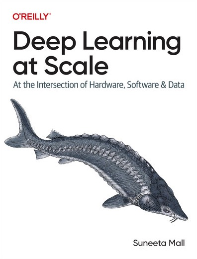

# Suneeta Mall

**ML/AI Engineering Leader | Women in AI 2025 Award Winner | Author of Deep Learning @ Scale [O'Reilly]**

Leading breakthrough AI solutions in healthcare at scale while advancing machine learning education through technical publications and children's literature that inspires the next generation of engineers.

## Latest Publication

### Deep Learning at Scale - O'Reilly 2024

**Deep Learning at Scale: At the Intersection of Hardware, Software, and Data**

A comprehensive guide to building and deploying deep learning systems that scale effectively. This book bridges the gap between research and production, covering hardware optimization, distributed training, and efficient deployment strategies.

**Available Now**

!!! note "Kindle Edition"
    [:fontawesome-brands-aws: Amazon US](https://www.amazon.com/dp/B0D7F9KZWC) | [:fontawesome-brands-aws: Amazon AU](https://www.amazon.com.au/dp/B0D7F9KZWC)

!!! note "Paperback Edition"
    [:fontawesome-brands-aws: Amazon US](https://www.amazon.com/dp/1098145283) | [:fontawesome-brands-aws: Amazon AU](https://www.amazon.com.au/dp/1098145283)

!!! note "30 Days Trial Access"
    [30 days trial - :fontawesome-solid-briefcase:](https://oreillymedia.pxf.io/c/5668688/2121843/15173)

[Learn more about the book →](projects/oreilly_deep_learning_at_scale.md)

## Recent Articles

- **[From Evaluation to Integration: How AI Became Ready for Children's Book Production](blog/posts/2025-12-07-from-evaluation-to-integration-my-ai-authorship-journey.md)** - December 2025
  A two-year reflection on AI capabilities crossing thresholds for meaningful creative augmentation

- **[Cassie 2.0: The Next Generation](blog/posts/2025-05-10-cassie-2.0.md)** - May 2025
  Evolution of the Curious Cassie children's book series

- **[Deep Learning at Scale](blog/posts/2024-05-30-Deep-learning-at-scale.md)** - May 2024
  Announcing the release of my O'Reilly book on scaling deep learning systems

- **[ChatGPT vs Me as a Children's Book Author](blog/posts/2023-01-01-ChatGPT_vs_me_kids_book_author.md)** - January 2023
  Evaluating AI content quality for children's educational literature

## Key Projects

- **[FableFlow](projects/fable_flow.md)** - Open-source agentic AI pipeline for children's book production
- **[Deep Learning at Scale](projects/oreilly_deep_learning_at_scale.md)** - O'Reilly book on production ML systems
- **[Label Noise with CleanLab](projects/label_noise_with_cleanlabs.md)** - Data quality in machine learning
- **[Curious Cassie](projects/curious_cassie.md)** - Children's book series celebrating scientific discovery

## Recent Talks

- **[Knowledge Graph Conference 2022](talks/KGC_NY_2022.md)** - Graph neural networks in production
- **[KubeCon NA 2021](talks/KubeCon_NA_2021.md)** - Kubernetes for ML workloads
- **[Kafka Summit APAC 2021](talks/Kafka_Summit_APAC_2021.md)** - Event-driven ML pipelines

## Contact

If you need to reach me, you can find my contact details in the footer below.

[:fontawesome-solid-rss: RSS Feed](https://suneeta-mall.github.io/feed_rss_created.xml) - Stay updated with new posts
