# Reading book list

This list includes books that a) I have truly enjoyed reading and highly admire or b) Eagerly 
looking forward to reading. It has six sections:

- Abstract Programming/AI
- Kubernetes
- Machine Learning, AI, Deep Learning
- Statistics
- Parenting
- Miscellaneous

## 1. Abstract Programming

>
*[Real-World Bug Hunting] Authored by Peter Yaworski*
 
 >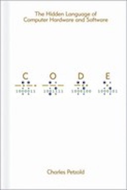
*[Code: The Hidden Language of Computer Hardware and Software] Authored by Charles Petzold*
 
>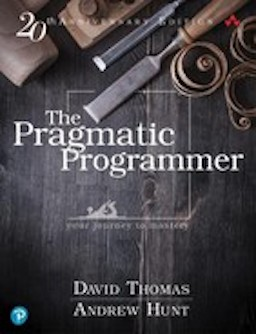
*[The Pragmatic Programmer: your journey to mastery] Authored by Andrew Hunt, David Thomas*

>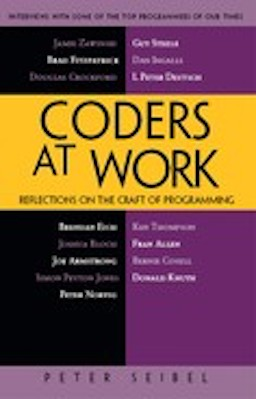
*[Coders at Work: Reflections on the Craft of Programming] Authored by Peter Seibel*
 
>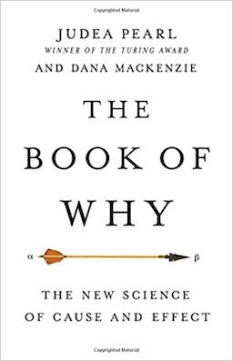 
*[The Book of Why: The New Science of Cause and Effect] Authored by Judea Pearl*

>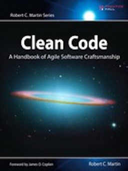
*[Clean Code]  Authored by Robert C. Martin*

## 2. Kubernetes

>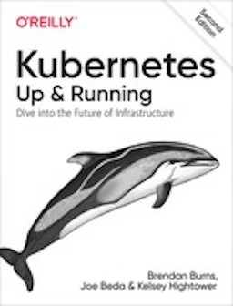
*[Kubernetes: Up and Running] Authored by Kelsey Hightower, Joe Beda, Brendan Burns*

>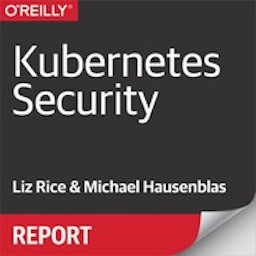
*[Kubernetes Security] Authored by Michael Hausenblas, Liz Rice *

  
>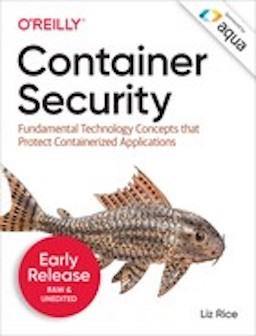
*[Container Security] Authored by Liz Rice *

>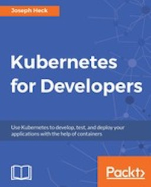
*[Kubernetes for Developers] Authored by Joseph Heck*
 

## 3. Machine Learning, AI, Deep Learning

>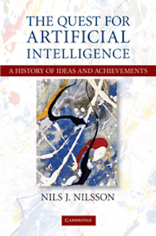
[The Quest for Artificial Intelligence: A History of Ideas and Achievements] Authored by Nils J. Nilsson*

>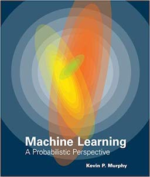
*[Machine Learning: A Probabilistic Perspective] Authored by Kevin P Murphy*

>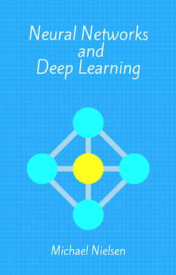
*[Neural Networks and Deep Learning]  Authored by Michael Nielsen*

>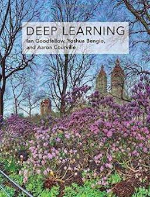
*[Deep Learning] Authored by Ian Goodfellow et al.*

>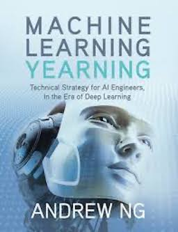
*[Machine Learning Yearning] Authored by Andrew Ng*

## 4. Statistics
 
>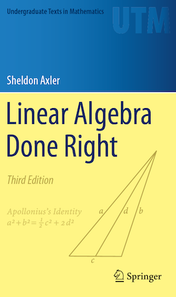
*[Linear Algebra Done Right], Authored by Sheldon Axler*

>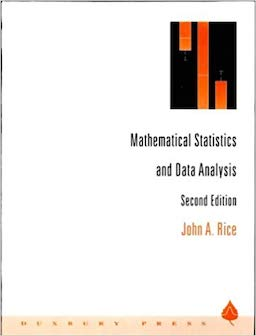
*[Mathematical Statistics and Data Analysis], Authored by John A. Rice*

>
*[Elements of Statistical Learning], Authored by Trevor Hastie et al.*

>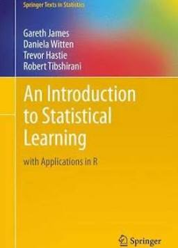
*[Introduction to Statistical Learning]  Authored by Trevor Hastie et al.*

## 5. Parenting

>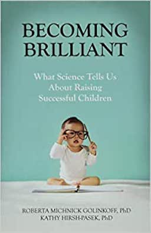
*[Becoming Brilliant: What Science Tells Us About Raising Successful Children] Authored by Roberta Golinkoff, Kathryn Hirsh-Pasek*

>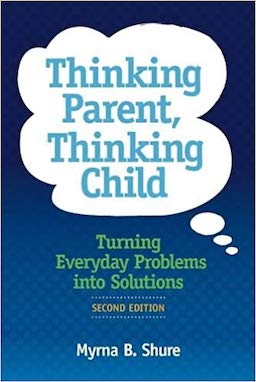
*[Thinking Parent, Thinking Child: Turning Everyday Problems into Solutions] Authored by Myrna B. Shure*

>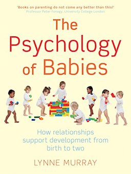
*[The Psychology of Babies: How relationships support development from birth to two] Authored by Lynne Murray* 

## 6. Miscellaneous

> 
*[The End of Ice: Bearing Witness and Finding Meaning in the Path of Climate Disruption] Authored by Dahr Jamail*

>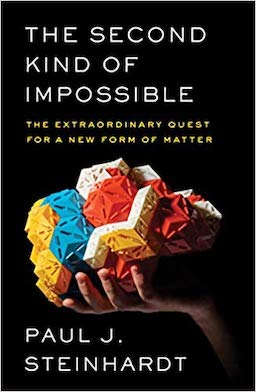 
*[The Second Kind of Impossible: The Extraordinary Quest for a New Form of Matter] Authored by Paul Steinhardt*

[Linear Algebra Done Right]: https://linear.axler.net/
[Mathematical Statistics and Data Analysis]: https://www.amazon.com/Mathematical-Statistics-Data-Analysis-John/dp/0534209343
[Elements of Statistical Learning]: https://web.stanford.edu/~hastie/Papers/ESLII.pdf
[Introduction to Statistical Learning]: http://faculty.marshall.usc.edu/gareth-james/ISL/
[Neural Networks and Deep Learning]: http://neuralnetworksanddeeplearning.com/
[The Quest for Artificial Intelligence: A History of Ideas and Achievements]: https://ai.stanford.edu/~nilsson/QAI/qai.pdf
[Machine Learning: A Probabilistic Perspective]: https://www.amazon.com.au/Machine Learning-Probabilistic-Kevin-Murphy/dp/0262018020
[Kubernetes: Up and Running]: https://www.amazon.com.au/Kubernetes-Up-Running-Brendan-Burns/dp/1492046531/
[Kubernetes Security]: https://learning.oreilly.com/library/view/kubernetes-security/9781492039075/
[Container Security]: https://learning.oreilly.com/library/view/container-security/9781492056690/
[Kubernetes for Developers]: https://learning.oreilly.com/library/view/kubernetes-for-developers/9781788834759/
[Real-World Bug Hunting]: https://www.amazon.com/Real-World-Bug-Hunting-Field-Hacking/dp/1593278616
[Code: The Hidden Language of Computer Hardware and Software]: https://www.amazon.com.au/Code-Language-Computer-Developer-Practices-ebook/dp/B00JDMPOK2
[The Pragmatic Programmer: your journey to mastery]: https://www.amazon.com.au/Pragmatic-Programmer-journey-mastery-Anniversary-ebook/dp/B07VRS84D1
[Coders at Work: Reflections on the Craft of Programming]: https://www.amazon.com.au/Coders-Work-Reflections-Craft-Programming/dp/1430219483
[Machine Learning Yearning]: https://www.deeplearning.ai/Machine Learning-yearning/
[Becoming Brilliant: What Science Tells Us About Raising Successful Children]: https://www.amazon.com.au/Becoming-Brilliant-Science-Successful-Children/dp/1433822393/
[Thinking Parent, Thinking Child: Turning Everyday Problems into Solutions]: https://www.amazon.com/Thinking-Parent-Child-Everyday-Solutions/dp/0878227032
[The Psychology of Babies: How relationships support development from birth to two]: https://www.amazon.com.au/Psychology-Babies-relationships-support-development-ebook/dp/B0070TRFIO
[Clean Code]: https://www.amazon.com.au/Clean-Code-Handbook-Software-Craftsmanship/dp/0132350882
[The Book of Why: The New Science of Cause and Effect]: https://www.amazon.com.au/Book-Why-Science-Cause-Effect/dp/046509760X/
[The End of Ice: Bearing Witness and Finding Meaning in the Path of Climate Disruption]: https://www.amazon.com/End-Ice-Bearing-Witness-Disruption-ebook/dp/B079G4NJVD
[The Second Kind of Impossible: The Extraordinary Quest for a New Form of Matter]: https://www.amazon.com.au/Second-Kind-Impossible-Extraordinary-Matter/dp/1476729921/