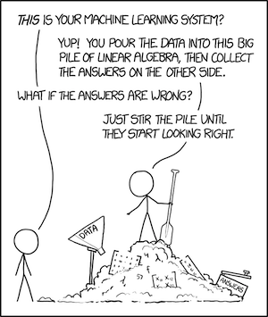
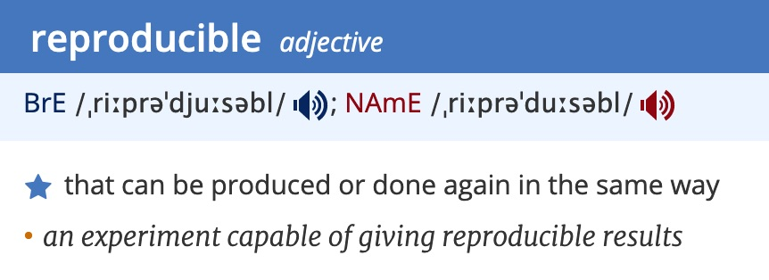
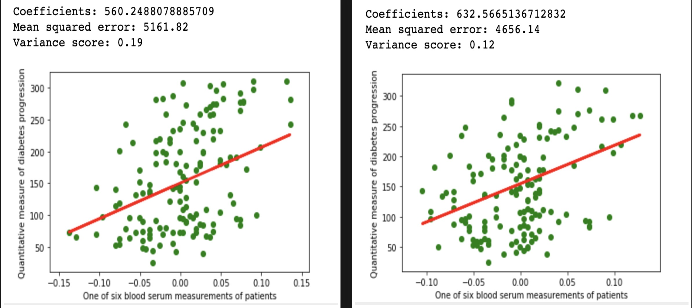
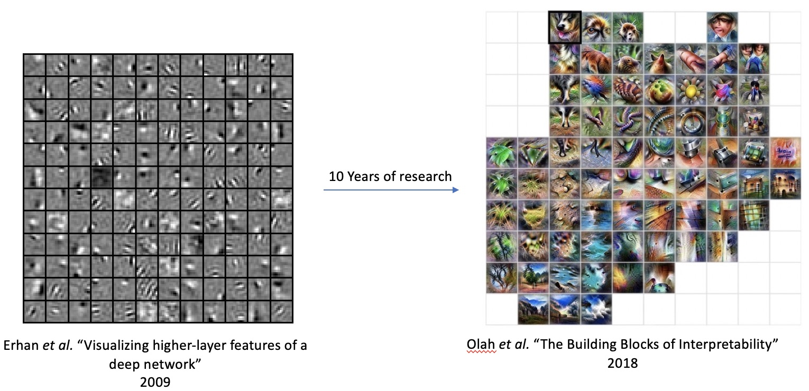
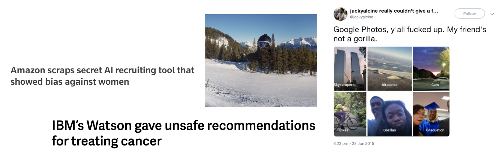
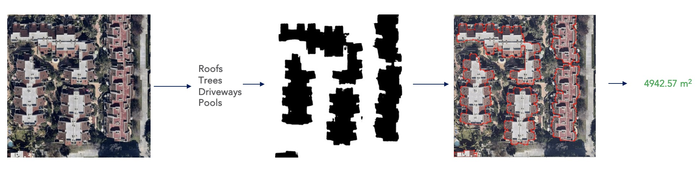
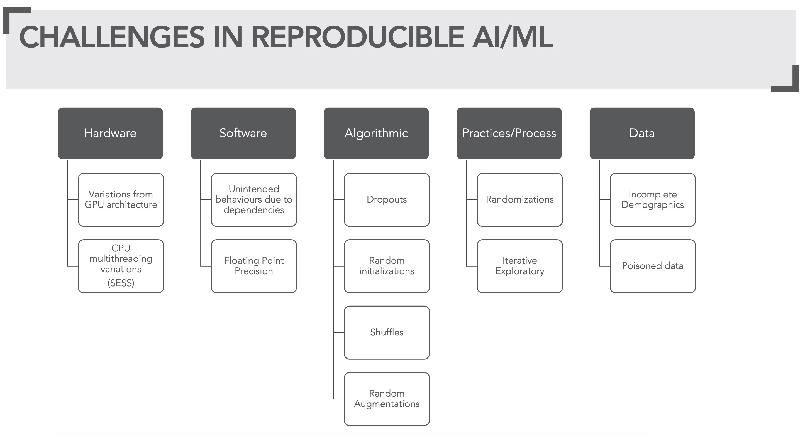
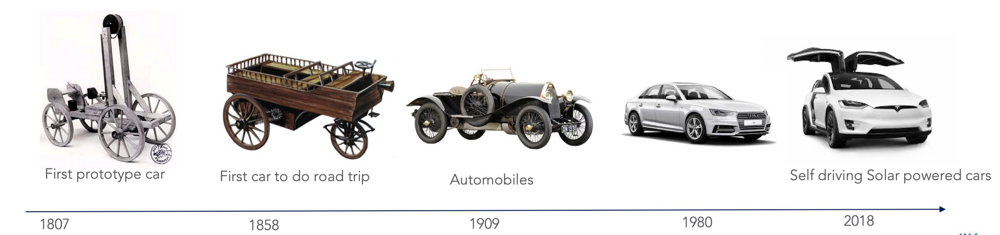

# Reproducibility in Machine Learning - Research and Industry

This is [Part 1] - **Reproducibility in Machine Learning - Research and Industry** of technical blog series titled [Reproducibility in Machine Learning]. [Part 2] & [Part 3] can be found [here][Part 2] & [here][Part 3] respectively.      

---

Machine learning (ML) is an interesting field aimed at solving problems that can not be solved by applying deterministic logic. 
In fact, ML solves problems in logits [0, 1] with probabilities!
ML is a highly iterative and fiddly field with much of its **_intelligence_** derived from data upon application of complex mathematics. 
Sometimes, even a slight change such as changing the order of input/data can change the outcome of ML processes drastically.
Actually [xkcd] quite aptly puts it:

>
*Figure 1: Machine Learning explained by XKCD*

This phenomenon is explained as **C**hange **A**nything **C**hanges **E**verything a.k.a. CAKE principle coined by Scully et. _al_ 
in their NIPS 2015 paper titled ["_Hidden Technical Debt in Machine Learning Systems_"][scully_2015]. 
CAKE principle highlights that in ML - no input is ever really independent. 

## What is reproducibility in ML

Reproducibility as per the Oxford dictionary is defined as something that can be _produced again in the same way_.

*Figure 2: Reproducible defined*

In ML context, it relates to getting the same output on the same algorithm, (hyper)parameters, and data on every run. 

To demonstrate, let's take a simple linear regression example (shown below) on [Scikit Diabetes Dataset]. 
Linear regression is all about fitting a line i.e. `Y = a + bX` over data-points represented as X, with b being the 
slope and a being the intercept.   
```python
import matplotlib.pyplot as plt
import numpy as np
from sklearn import datasets, linear_model
from sklearn.metrics import mean_squared_error, r2_score
from sklearn.model_selection import train_test_split

diabetes = datasets.load_diabetes()    
diabetes_X = diabetes.data[:, np.newaxis, 9]
xtrain, xtest, ytrain, ytest = train_test_split(diabetes_X, diabetes.target, test_size=0.33)
regr = linear_model.LinearRegression()
regr.fit(xtrain, ytrain)
diabetes_y_pred = regr.predict(xtest)
   
# The coefficients 
print(f'Coefficients: {regr.coef_[0]}\n'
      f'Mean squared error: {mean_squared_error(ytest, diabetes_y_pred):.2f}\n'
      f'Variance score: {r2_score(ytest, diabetes_y_pred):.2f}')
# Plot outputs 
plt.scatter(xtest, ytest,  color='green')
plt.plot(xtest, diabetes_y_pred, color='red', linewidth=3)
plt.ylabel('Quantitative measure of diabetes progression')
plt.xlabel('One of six blood serum measurements of patients')
plt.show()
```
*A linear regression example on [Scikit Diabetes Dataset]*

Above ML code is NOT reproducible. Every run will give different results: **a)** The data distribution will vary and 
**b)** Obtained slop and intercept will vary. See Figure 3.


*Figure 3: Repeated run of above linear regression code produces different results*  

In the above example, we are using the same dataset, same algorithm, same hyper-parameters. So why are we getting different results? 
Here the method `train_test_split` splits the diabetes dataset into training and test but while doing so, it performs a random shuffle of the dataset. 
The seed for this random shuffle is not set here. Because of this, every run produces different training dataset distribution. 
Due to this, the regression line slope and intercept ends up being different. In this simple example, if we were to set a random state for method `train_test_split` e.g. `random_state=42` then we will have a reproducible regression example over the diabetes dataset. The reproducible version of the above regression example is as follows:

```python
import matplotlib.pyplot as plt
import numpy as np
from sklearn import datasets, linear_model
from sklearn.metrics import mean_squared_error, r2_score
from sklearn.model_selection import train_test_split

diabetes = datasets.load_diabetes()    
diabetes_X = diabetes.data[:, np.newaxis, 9]
xtrain, xtest, ytrain, ytest = train_test_split(diabetes_X, diabetes.target, test_size=0.33,
                                                random_state=42)
regr = linear_model.LinearRegression()
regr.fit(xtrain, ytrain)
diabetes_y_pred = regr.predict(xtest)
   
# The coefficients 
print(f'Coefficients: {regr.coef_[0]}\n'
      f'Mean squared error: {mean_squared_error(ytest, diabetes_y_pred):.2f}\n'
      f'Variance score: {r2_score(ytest, diabetes_y_pred):.2f}')
# Plot outputs 
plt.scatter(xtest, ytest,  color='green')
plt.plot(xtest, diabetes_y_pred, color='red', linewidth=3)
plt.ylabel('Quantitative measure of diabetes progression')
plt.xlabel('One of six blood serum measurements of patients')
plt.show()
```
*A reproducible linear regression example on [Scikit Diabetes Dataset]*

Seeding random state is not the only challenge in writing reproducible ML. In fact, there are several reasons why reproducibility in ML is so hard to achieve. But I will go into that a bit later in section `Challenges in realizing reproducible ML`. 
The first question should be  "why reproducibility matters in ML"? 

## Importance of reproducibility in ML

>Non-reproducible single occurrences are of no significance to science. <sub>- Popper (The Logic of Scientific Discovery)</sub>

The importance of reproducibility is increasingly getting recognized since [Nature's Survey (2016)] reported a `reproducibility crisis`. 
As per this survey report, 70% of researchers have failed to reproduce another scientist's experiments, and 
more than 50% have failed to reproduce their own experiments. With more than half of participating scientist agreeing to 
the presence of reproducibility crisis is indeed very real. Dr. Joelle Pineau, an Associate Professor at McGill University and lead for 
Facebook’s Artificial Intelligence Research lab, covered the reproducibility crisis in her talk at 
International Conference on Learning Representations (ICLR) 2018 [you tube][jp_talk]. She is determined to nip  
this crisis in bud from AI research<sup>[src][nature_jp]</sup>. It's not just her, several AI research groups are coming up with measures to
ensure reproducibility (example below):
- [Model Card] at Google
- [Reproducibility Checklist] at NeurIPS 
- [ICLR Reproducibility Challenge] at ICLR
- [Show your work] at Allen Institute of Artificial Intelligence

Aside from being of `no use if can't be reproduced`, as Popper suggested in the above quote, why does reproducibility matter?

### 1. Understanding, Explaining, Debugging, and Reverse Engineering

Reproducibility helps with **_understanding, explaining, and debugging_**. Reproducibility is also a crucial means to **_reverse engineering_**.

Machine learning is inherently difficult to explain, understand, and also debug. Obtaining different output on the subsequent run just makes this whole understanding, explaining, debugging thing all the more challenging. How do we ever reverse engineer? 
As it is, understanding and explaining are hard with machine learning. It's increasingly harder with deep learning. 
For over a decade, researches are have been trying to understand what these deep networks learn and yet have not 100% succeeded in doing so.
 

From visualizing higher layer features of deep networks [year 2009][Erhan] to activation-atlases i.e. 
what individual neurons in deep network do [year 2017][Olah_viz] to understanding how deep networks decides 
[year 2018][Olah_interpretability] - are all ongoing progressive efforts towards understanding. Meanwhile, explainability 
has morphed into a dedicated field 'Explainable Artificial Intelligence [XAI]. 

### 2. Correctness

> If anything can go wrong, it will <sub>-[Murphy's law]</sub>

Correctness is important as [Murphy's law] rarely fails us. These are some of the examples of great AI failures of our times.  

*Figure 4: Example of some of the great AI failures of our times*

Google Photos launched AI capabilities with automatically tagging images. It was found to be tagging [people of dark skin as gorillas][ai_fail_race]. 
Amazon's recruiting software exhibiting [gender bias][ai_fail_aws] or even IBM's Watson giving unsafe recommendations for [cancer treatment][ai_fail_cancer]. 

[//]: # (Perhaps because their classifier model was not trained with enough people of dark skin. But google responded by immediately banning `gorilla`)  
 
ML output should be correct in addition to being explainable. Reproducibility helps to achieve correctness through understanding and debugging.   

### 3. Credibility

ML output must be credible. It's not just from a fairness, ethical viewpoint but also because they sometimes impact lives (e.g. mortgage approval).
Also, end-users of ML output expect answers to verifiable, reliable, unbiased, and ethical.
As Lecun said in his [International Solid State Circuit Conference in San Francisco, 2019][lecunn_icc] keynote:
> Good results are not enough, Making them easily reproducible also makes them credible. <sub>- Lecun, ISSCC 2019</sub>


### 4. Extensibility

Reproducibility in preceding layers is needed to build out and extend. Can we build a building outline model if we cant repeatedly generate roof semantics as shown in figure 5? What if we keep getting the different size for the same roof?

*Figure 5: Extending ML*

Extensibility is essential to utilizing ML outputs for consumption. As it is, raw outputs from ML are rarely usable by end-user. Most ML outputs need to be post-processed and augmented to be consumption ready. 
  
### 4. Data harvesting

>The world’s most valuable resource is no longer oil, but data! <sub>- [economist.com][imp_data]</sub>

To train a successful ML algorithm large dataset is mostly needed - this is especially true for deep-learning. 
Obtaining large volumes of training data, however, is not always easy - it can be quite expensive. In some cases 
the occurrences of the scenario can be so rare that obtaining a large dataset will either take forever or is simply not possible. 
For eg. dataset for [Merkel-cell carcinoma][rare_cancer], a type of skin cancer that's very rare, 
will be very challenging to procure.

For this reason, data harvesting a.k.a. synthetic data generation is considered. 
Tirthajyoti Sarkar, the author of [Data Wrangling with Python: Creating actionable data from raw sources][data_python_sarkar], wrote 
an excellent post on [data harvesting][synthetic_data_generation] using scikit that covers this topic in detail. 
However, more recently, Generative Adversarial Networks [(GAN)][gan_goodfellow] by [Ian Goodfellow][goodfellow] is being
heavily used for this purpose. [Synthetic Data for Deep Learning] is an excellent review article that covers this topic in detail for deep-learning.

Give ML models e.g. [(GAN)][gan_goodfellow] are being used to generate training data now, it's all the more important that reproducibility in such application is ensured. Let's say, we trained a near-perfect golden goose model on data 
(including some synthetic). But the storage caught proverbial fire, and we lost this golden goose model along with data.
Now, we have to regenerate the synthetic data and obtain the same model but the synthetic data generation process is not quite reproducible.
Thus, we lost the golden goose! 


## Challenges in realizing reproducible ML

Reproducible ML does not come in easy. A wise man once said:
> When you want something, all the universe conspires in helping you to achieve it. <sub>- [The Alchemist] by Paulo Coelho</sub>

But when it comes to reproducible ML it's quite the contrary. Every single resource and techniques 
(Hardware, Software, Algorithms, Process & Practice, Data) needed to realize ML poses some kind of challenge in meeting 
reproducibility (see figure 6).



*Figure 6: Overview of challenges in reproducible ML*

### 1. Hardware

ML algorithms are quite compute hungry. Complex computation needed by ML operation, now a day's runs in order of Giga/Tera floating-point operations (GFLOPS/TFLOPS). Thus needing high parallelism and multiple central processing Units [(CPU)][CPU] 
if not, specialized hardware such as (general purpose) graphics processing unit [(GPU)][GPU] or more specifically [(GPGPU)][GPGPU], 
tensor processing unit [(TPU)][TPU] etc. to complete in the reasonable time frame.  

But these efficiencies in floating-point computations both at CPU & GPU level comes at a cost of reproducibility. 

- CPU

>Using Intra-ops (within an operation) and inter-ops (amongst multiple operations) parallelism on CPU can sometimes give different results on each run. One such example is using OpenMP for (intra-ops) parallelization. See this excellent talk titled
>"Corden’s Consistency of Floating Point Results or Why doesn’t my application always give"  [Corden 2018][corden] for more in-depth insight into this. Also see wandering precision [blog][nag].

- GPU

>General purpose GPUs can perform vector operations due to stream multiprocessing (SEM) unit. The asynchronous computation performed
>by this unit may result in different results on different runs. Floating multiple adders (FMAD) or even reductions in floating-point operands are 
>such examples. Some algorithms e.g. vector normalization, due to reduction operations, can also be non-reproducible.
> See [reproducible summation paper][reproducible_ops] for more info.  

> Changing GPU architecture may lead to different results too. The differences in SEM, or architecture-specific optimizations 
> are a couple of reasons why the differences may arise.

See [Corden's Consistency of Floating-Point Results or Why doesn’t my application always give the same answer][corden] for more details.
 
### 2. Software

It's not just hardware. Some software's offering high-level abstraction or APIs for performing intensive computation do not guarantee reproducibility
in their routines. For instance NVIDIA's popular cuda based deep learning library [cudnn] do not guarantee reproducibility
in some of their routines e.g. cudnnConvolutionBackwardFilter>sup>[ref][cudnn_repo]</sup>.
Popular deep learning libraries such as 
tensorflow<sup>[ref 1][tensorflow_missing_doco],[ref 2][tensorflow_determinism]</sup>, pytorch<sup>[ref][pytorch_ref]</sup> 
also do not guarantee 100% reproducibility.  

There is an excellent talk [Duncan Riach], maintainer of [tensorflow_determinism] on [Determinism in deep learning][gtcc_2019] presented at GPU technology conference by NVIDIA 2019
 
Sometimes it's not just a trade-off for efficiency but simple software bugs that lead to non-reproducibility. One such example is this [bug][proj_bug] 
that I ran into resulting in different geo-location upon same computation when a certain library version was upgraded. This is a clear case of software bug but underlines the fact that reproducibility goes beyond just computation, and precision.
  
### 3. Algorithm

Several ML algorithms can be non-reproducible due to the expectation of randomness. Few examples of these algorithms are dropout layers, initialization.
Some algorithms can be non-deterministic due to underlined computation complexity requiring non-reproducible measures similar to ones discussed in the software section.
Some example of these are e.g. vector normalization, [backward pass][tensorflow_bpass].

### 4. Process & Practice

ML loves randomness! 


*Figure 7: Randomness defined by [xkcd][xkcd_221]*


When things don't work with ML - we randomize (pun intended). We have randomness everywhere - 
from algorithms to process and practices for instance:
- Random initializations 
- Random augmentations  
- Random noise introduction (adversarial robustness)
- Data Shuffles

To to ensure that randomness is seeded and can be reproduced (much like earlier example of scikit linear regression), with python, 
a long list of seed setting ritual needs to be performed:
```python
os.environ['PYTHONHASHSEED'] = str(seed)
random.seed(seed)
tensorflow.random.set_seed(seed)
numpy.random.seed(seed)
tensorflow.keras.layers.Dropout(x, seed=SEED)
tensorflow.image.random_flip_left_right(x, seed=seed)
tensorflow.random_normal_initializer(x, y, seed=seed)
# many such algorithmic layers as aabove 
```

Can we ever win with this seed setting? 


*Figure 8: Seed setting (image credit: google)*


### 5. Data

> No input is ever really independent. <sub>[Scully et. al 2015][scully_2015]</sub>

Data is the main input to ML algorithms and these algorithms are just compute hungry but also **data-hungry**. So we are 
really talking about big data. When data volume is large, we are dealing with all sorts of challenges:
- Data management
- Data provenance  
- Data poisoning
- Under-represented data (inappropriate  demographic)
- Over-represented data (inappropriate  demographic)

One of the reasons why ML is so iterative because we need to evolve the ML algorithm with data whilst also continuously evolving data (e.g. 
data massaging, feature engineering, data augmentations). That's why data provenance is important but it's also important to maintain
a linage with data provenance to ML processes. In short, an end to end provenance is needed with ML processes.      


### 6. Concept drift

> A model is rarely deployed twice. <sub>[Talby, 2018][Talby]</sub>

One of the reason for why a model rarely gets deployed more than once <sup>[ref][Talby]</sup> is `Concept drift`. Our concept of 
[things and stuff][things_stuff] keeps evolving. Don't believe me? figure 9 shows how we envisaged car 18's to now. Our current
evolving impression of the car is solar power self-driving cars!



*Figure 9: Our evolving concept of `car`*

So, now we don't just have to manage reproducibility over one model but many! Because our model needs to continually keep learning in a more commonly known term in ML as `Continual learning` [more info][or_continuous-learning]. An interesting review
paper on this topic is [here][cl_paper].


*Figure 10: Top features - Dresner Advisory Services Data Science and Machine Learning [Market Study]*

In fact, Continual learning is so recognized that support for easy iteration & continuous improvement were the top two
features industry voted as their main focus with ML as per Dresner Advisory Services’6th annual 2019 Data Science and Machine Learning [Market Study] (see figure 10).


---

The next part of this technical blog series, [Reproducibility in Machine Learning], is [Realizing reproducible Machine Learning - with Tensorflow][Part 2].       


[Reproducibility in Machine Learning]: /2019/12/20/Reproducibility-in-Machine Learning.html
[Part 1]: /2019/12/21/Reproducible-ml-research-n-industry.html
[Part 2]: /2019/12/22/Reproducible-ml-tensorflow.html
[Part 3]: /2019/12/23/Reproducible-ml-pipeline-k8s.html
[xkcd]: https://xkcd.com/1838
[Erhan]: https://www.iro.umontreal.ca/~lisa/publications2/index.php/publications/show/247
[Olah_viz]: https://distill.pub/2017/feature-visualization
[Olah_interpretability]: https://distill.pub/2018/building-blocks/
[scully_2015]: https://papers.nips.cc/paper/5656-hidden-technical-debt-in-Machine Learning-systems.pdf
[Scikit Diabetes Dataset]: https://scikit-learn.org/stable/modules/generated/sklearn.datasets.load_diabetes.html
[XAI]: https://arxiv.org/abs/1910.10045
[lecunn_icc]: https://twitter.com/ylecun/status/1097532314614034433
[Murphy's law]: https://en.wikipedia.org/wiki/Murphy%27s_law
[ai_fail_race]: https://twitter.com/jackyalcine/status/615329515909156865
[ai_fail_cancer]: https://www.theverge.com/2018/7/26/17619382/ibms-watson-cancer-ai-healthcare-science
[ai_fail_aws]: https://medium.com/syncedreview/2018-in-review-10-ai-failures-c18faadf5983
[The Alchemist]: https://www.amazon.com/Alchemist-Paulo-Coelho/dp/0061122416
[rare_cancer]: https://www.cancer.gov/types/skin/patient/merkel-cell-treatment-pdq
[synthetic_data_generation]: https://towardsdatascience.com/synthetic-data-generation-a-must-have-skill-for-new-data-scientists-915896c0c1ae
[imp_data]: https://www.economist.com/leaders/2017/05/06/the-worlds-most-valuable-resource-is-no-longer-oil-but-data
[data_python_sarkar]: https://www.amazon.com.au/Data-Wrangling-Python-Creating-actionable-ebook/dp/B07JF26NGJ
[Synthetic Data for Deep Learning]: https://arxiv.org/abs/1909.11512
[gan_goodfellow]: https://arxiv.org/abs/1406.2661
[goodfellow]: https://en.wikipedia.org/wiki/Ian_Goodfellow
[TPU]: https://en.wikipedia.org/wiki/Tensor_processing_unit
[CPU]: https://en.wikipedia.org/wiki/Tensor_processing_unit
[GPU]: https://en.wikipedia.org/wiki/Graphics_processing_unit
[GPGPU]: https://en.wikipedia.org/wiki/General-purpose_computing_on_graphics_processing_units
[(SIMD)]: https://en.wikipedia.org/wiki/SIMD
[reproducible_ops]: https://people.eecs.berkeley.edu/~hdnguyen/public/papers/repsum.pdf
[corden]: https://www.nccs.nasa.gov../../resources/FloatingPoint_consistency.pdf
[nag]: https://www.nag.co.uk/content/wandering-precision
[cudnn]: https://developer.nvidia.com/cudnn
[cudnn_repo]: https://docs.nvidia.com/deeplearning/sdk/cudnn-developer-guide/index.html#reproducibility
[pytorch_ref]: https://pytorch.org/docs/stable/notes/randomness.html
[tensorflow_determinism]: https://github.com/NVIDIA/tensorflow-determinism
[tensorflow_missing_doco]: https://github.com/tensorflow/tensorflow/issues/26147 
[gtcc_2019]: https://drive.google.com/file/d/18pmjeiXWqzHWB8mM2mb3kjN4JSOZBV4A/view
[Duncan Riach]: https://github.com/duncanriach
[proj_bug]: https://github.com/pyproj4/pyproj/issues/470
[tensorflow_bpass]: https://github.com/tensorflow/tensorflow/issues/2652
[xkcd_221]: https://xkcd.com/221
[Talby]: https://www.oreilly.com/radar/lessons-learned-turning-Machine Learning-models-into-real-products-and-services/
[things_stuff]: https://arxiv.org/abs/1612.03716
[or_continuous-learning]: https://www.oreilly.com/radar/why-continuous-learning-is-key-to-ai/
[cl_paper]: https://arxiv.org/abs/1802.07569
[Nature's Survey (2016)]: https://www.nature.com/news/1-500-scientists-lift-the-lid-on-reproducibility-1.19970
[nature_jp]: https://www.nature.com/articles/d41586-019-03895-5?utm_source=twt_nnc&utm_medium=social&utm_campaign=naturenews&sf226569864=1
[jp_talk]: https://www.youtube.com/watch?v=Vh4H0gOwdIg
[Model Card]: https://arxiv.org/abs/1810.03993
[Reproducibility Checklist]: https://www.cs.mcgill.ca/~jpineau/ReproducibilityChecklist.pdf
[ICLR Reproducibility Challenge]: https://reproducibility-challenge.github.io/iclr_2019/
[Show your work]: https://arxiv.org/abs/1909.03004

[Market Study]://gumroad.com/l/dTfno
