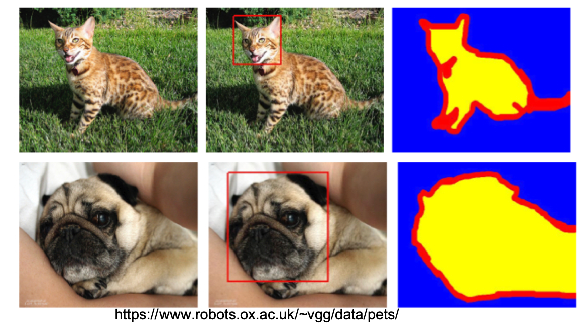
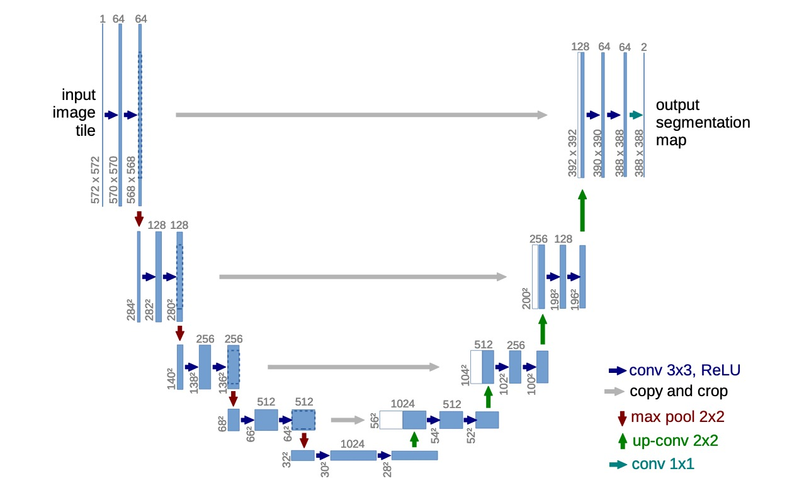
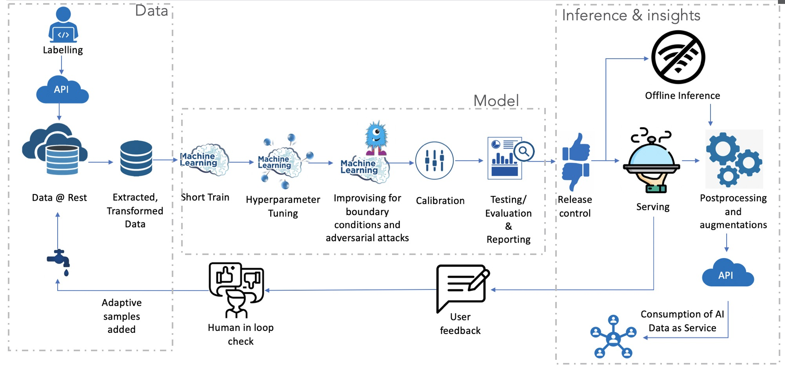
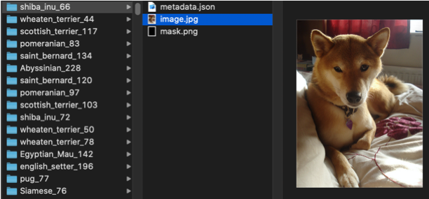
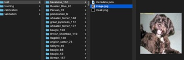
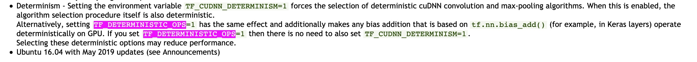
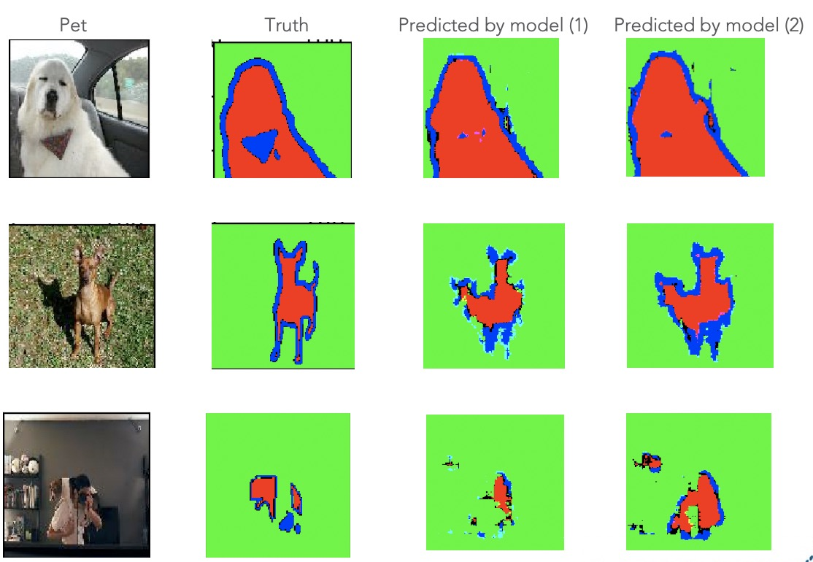

# Realizing reproducible Machine Learning - with Tensorflow

This is [Part 2] - **Realizing reproducible Machine Learning - with Tensorflow** of technical blog series titled [Reproducibility in Machine Learning]. [Part 1] & [Part 3] can be found [here][Part 1] & [here][Part 3] respectively.      

---

As discussed in [Part 1], writing reproducible machine learning is not easy with challenges arising from every direction e.g. hardware, software, algorithms, process & practice, data. In this post, we will focus on what is needed to ensure 
ML code is reproducible.

## First things first

There are a few very simple things that are needed to be done before _thinking big_ and focussing on writing reproducible ML code.
These are:
 
- Code is version controlled

>Same input (data), same process (code) resulting in the same output is the essence of reproducibility. But code keeps evolving,
>since ML is so iterative. Hence, it's important to version control code (including configuration). This allows obtaining the same 
>i.e. exact code (commit/version) from the source repository.  

- Reproducible runtime – pinned libraries 

> So we version-controlled code but what about environment/runtime? Sometimes, non-determinism is introduced not direct by user code 
>but also dependencies. We talked about this at length in the software section of `Challenges in realizing reproducible ML` in [Part 1].
> Taking the example of Pyproj - a geospatial transform library, that I once used to compute geo-location-based on some parameters.
> We changed nothing but just a version of pyproj from V1.9.6 to V2.4.0 and suddenly all our calculations were giving different results.
> The difference was so much that location calculation for San Diego Convention Centre was coming out to be somewhere in Miramar 
>off golf course (see figure 1) [issue link][proj_bug]. Now imagine ordering pizza delivery on the back of my computation snippet 
>backed with an unpinned version of pyproj?  


*Figure 1: Example of why pinned libraries are important*

> Challenges like these occur quite often that we would like. That's why it's important to pin/fix dependent runtime either by
>pinning version of libraries or using versioned containers (like [docker]).  


- Smart randomness

> As discussed in [Part 1], randomization plays a key role in most ML algorithms. Unseeded randomness is the simplest 
> way to make code non-reproducible. It is also one of the easiest to manage amongst all things gotchas of non-reproducible ML. 
> All we need to do is seed all the randomness and manage the seed via configuration (as code or external). 

- Rounding precision, under-flows & overflow

> [Floating point][floating_point] arithmetic is ubiquitous in ML. The complexity and intensity of floating-point operations (FLOPS)
> are increasing every day with current needs easily meeting [Giga-Flops][burden] order of computations. 
> To achieve efficiency in terms of speed despite the complexity, [mixed precision][mixed_prcision_training] 
> floating-point operations have also been proposed. As discussed [Part 1], accelerated hardware such as [(GPGPU)][GPGPU], 
> tensor processing unit [(TPU)][TPU], etc. due to their architecture and asynchronous computing do not guarantee reproducibility. 
> Besides, when dealing with floating points, the issues related to [overflow and underflow][fp_over_under] are expected. 
> This just adds to the complexity.  

- Dependent library's behavior aware 
 
> As discussed in the software section of `Challenges in realizing reproducible ML` in [Part 1], some routines of ML libraries 
> do not guarantee reproducibility. For instance,  NVIDIA's CUDA based deep learning library [cudnn][cudnn_repo].
> Similarly, with Tensorflow, using some methods may result in non-deterministic behavior. One such example is 
>backward pass of broadcasting on GPU<sup>[ref][issues_tf]</sup>.
> Awareness about behaviors of libraries being used and approaches to overcome the non-determinism should be explored. 


## Writing reproducible ML

To demonstrate reproducible ML, I will be using [Oxford Pet dataset][oxford-petset] that has labels for pet images. I will be
doing a semantic segmentation of pets images and will be using pixel-level labeling. Each pixel of the pet image in [Oxford Pet dataset][oxford-petset] is labeled as 1) Foreground (Pet area), 2) Background (not pet area) and 3) Unknown (edges). 
These labels by definition are mutually exclusive - i.e. a pixel can only be one of the above 3.   

>
*Figure 2: Oxford pet dataset*

I will be using a convolution neural network (ConvNet) for semantic segmentation. The network architecture is based on [U-net]. 
This is similar to standard semantic segmentation example by [tensorflow][segmentation]. 

>
*Fihure 3: [U-net] architecture*

The reproducible version of semantic segmentation is available in Github [repository][e2e-ml-on-k8s]. This example demonstrates
reproducible ML and also performing end to end ML with provenance across process and data.   


*Figure 4: Reproducible ML sample - semantic segmentation of oxford pet*

In this post, however, I will be discussing only the reproducible ML aspect of it and will be referencing snippets of this example.

### ML workflow

In reality, a machine learning workflow is very complex and looks somewhat similar to figure 5. In this post, however, 
we will only discuss the data and model training part of it. The remaining workflow i.e. the end-to-end workflow will be discussed in [next post][Part 3].  

>
*Figure 5: Machine learning workflow*

### Data

The source dataset is [Oxford Pet dataset][oxford-petset] which contains a multitude of labels e.g. class outcome, pixel-wise label, bounding boxes, etc.
The first step is to process this data to generate the trainable dataset. In the example code, this is done by 
[download_petset.py](https://github.com/suneeta-mall/e2e-ml-on-k8s/blob/master/app/download_petset.py) script. 

```bash
python download_petset.py  --output /wks/petset
```
The resulting sample is shown in figure 6.

>
*Figure 6: Pets data partitioned by Pets ID*

Post data partition, the entire dataset is divided into 4 sets: a) training, b) validation, c) calibration, and d) test
We would want this set partitioning strategy to be reproducible. By doing this, we ensure that if we have to blow away the training dataset,
or if accidental data loss occurs then the *exact* dataset can be created.

In this sample, this is achieved by generating the hash of petid and partitioning the hash into 10 folds (script below) to obtain
partition index of pet id. 

```python
partition_idx = int(hashlib.md5((os.path.basename(petset_id)).encode()).hexdigest(), 16) % 10
```

With partition_idx 0-6 assigned for training, 7 for validation, 8 for calibration, and 9 for the test, 
every generation will result in pets going into their respective partition. 

Besides, to set partitioning, any random data augmentation performed is seeded with seed controlled as configuration as code.
See `tf.image.random_flip_left_right` used in this tensorflow data pipeline 
[method](https://github.com/suneeta-mall/e2e-ml-on-k8s/blob/master/pypkg/pylib/datapipeline.py#L29). 

Script for model dataset preparation is located in 
[dataset_gen.py](https://github.com/suneeta-mall/e2e-ml-on-k8s/blob/master/app/dataset_gen.py) and used as following
```bash
python dataset_gen.py --input /wks/petset --output /wks/model_dataset
```
with results shown below:
>
*Figure 7: Pets data partitioned into training, validation, calibration, and test set*

### Modelling semantic segmentation 

The model for pet segmentation is based on [U-net] with backbone of either [MobileNet-v2] or [VGG-19] (defaults to VGG-19). 
As per this model's network architecture, 5 activation layers of pre-trained backbone network are chosen. These layers are:
* MobileNet

>```
>'block_1_expand_relu' 
>'block_3_expand_relu'  
>'block_6_expand_relu' 
>'block_13_expand_relu'
>'block_16_project'
>```

* VGG
>```
>'block1_pool'
>'block2_pool'
>'block3_pool'
>'block4_pool'
>'block5_pool'
>```

Each of these layers is then concatenated with a corresponding upsampling layer comprising of [Conv2DTranspose] layer forming what's known as skip connection. See [model](https://github.com/suneeta-mall/e2e-ml-on-k8s/blob/master/pypkg/pylib/model.py#L40)
code for more info.

The training script [train.py](https://github.com/suneeta-mall/e2e-ml-on-k8s/blob/master/app/train.py) can be used as following:

```bash
python train.py --input /wks/model_dataset --output /wks/model --checkpoint_path /wks/model/ckpts --tensorboard_path /wks/model
```

#### 1. Seeding randomness

All methods exploiting randomness is used with appropriate seed.  
- All random initialization is seeded e.g. [tf.random_normal_initializer](https://github.com/suneeta-mall/e2e-ml-on-k8s/blob/master/pypkg/pylib/model.py#L27)
- All dropout layers are seeded e.g. [dropout](https://github.com/suneeta-mall/e2e-ml-on-k8s/blob/master/pypkg/pylib/model.py#L35)

Global seed is set for any hidden methods that may be using randomness by 
[calling](https://github.com/suneeta-mall/e2e-ml-on-k8s/blob/master/pypkg/pylib/model.py#L91) in 
`set_seed(seed)` which sets seed for used libraries:

```python
def set_seeds(seed=SEED):
    os.environ['PYTHONHASHSEED'] = str(seed)
    random.seed(seed)
    tf.random.set_seed(seed)
    np.random.seed(seed)
```

#### 2. Handing library behaviors

##### 2.1 CuDNN

[CuDNN][cudnn_repo] does not guarantee reproducibility in some of its routines. 
Environment variable `TF_DETERMINISTIC_OPS` & `TF_CUDNN_DETERMINISTIC` can be used to control this behavior as per this 
snippet (figure 8) from cudnn [release page](https://docs.nvidia.com/deeplearning/frameworks/tensorflow-release-notes/rel_19.06.html). 

>
*Figure 8: NVIDIA release page snippet reproducibility*

#### 2.2 CPU thread parallelism

As discussed in [Part 1], using high parallelism with compute intensive workflow may not be reproducible. Configurations for 
inter<sup>[ref](https://www.tensorflow.org/api_docs/python/tf/config/threading/set_inter_op_parallelism_threads)</sup> and 
intra<sup>[ref](https://www.tensorflow.org/api_docs/python/tf/config/threading/set_intra_op_parallelism_threads)</sup> 
operation parallelism should be set if 100% parallelism is desired.

In this example, I have chosen *1* to avoid any non-determinism arising from inter-operation parallelism. *Warning* setting  this 
will considerably slow down the training. 

```python
tf.config.threading.set_inter_op_parallelism_threads(1)
tf.config.threading.set_intra_op_parallelism_threads(1)
```

#### 2.3 Tensorflow determinism

Following are some of the application of [Tensorflow](https://tensorflow.org) that are not reproducible:
- Backward pass of broadcasting on GPU is non-deterministic<sup>[link](https://github.com/tensorflow/tensorflow/issues/2652)</sup>
- Mention that GPU reductions are nondeterministic in docs<sup>[link](https://github.com/tensorflow/tensorflow/issues/2732)</sup>
- Problems Getting TensorFlow to behave Deterministically<sup>[link](https://github.com/tensorflow/tensorflow/issues/16889)</sup>

[Duncan Riach], along with several other contributors have created [tensorflow_determinism] package that can be used to overcome non-reproducibility related challenges from TensorFlow. It should be used in addition to the above measures we have discussed so far.


If we combine all the approaches discussed above (aside from using seeded randomness), they can be wrapped into a lightweight 
method like one below:  
```python
def set_global_determinism(seed=SEED, fast_n_close=False):
    """
        Enable 100% reproducibility on operations related to tensor and randomness.
        Parameters:
        seed (int): seed value for global randomness
        fast_n_close (bool): whether to achieve efficient at the cost of determinism/reproducibility
    """
    set_seeds(seed=seed)
    if fast_n_close:
        return

    logging.warning("*******************************************************************************")
    logging.warning("*** set_global_determinism is called,setting full determinism, will be slow ***")
    logging.warning("*******************************************************************************")

    os.environ['TF_DETERMINISTIC_OPS'] = '1'
    os.environ['TF_CUDNN_DETERMINISTIC'] = '1'
    # https://www.tensorflow.org/api_docs/python/tf/config/threading/set_inter_op_parallelism_threads
    tf.config.threading.set_inter_op_parallelism_threads(1)
    tf.config.threading.set_intra_op_parallelism_threads(1)
    from tfdeterminism import patch
    patch()
```
which can then be used on top of the ML algorithm/process code to generate a 100% reproducible code. 

### Result

What happens if we don't write reproducible ML? What kind of difference we are really talking about?
The last two columns of figure 9 show results obtained by a model trained on the exact same dataset, exactly the same code with EXACTLY 
one exception. The dropout layer used in the network were unseeded. All other measures discussed above were taken into account.   

>
*Figure 9: Effect of just forgetting to set one seed amidst many*

Looking at the result of the first pet which is a very simple case, we can see the subtle difference in the outcome of these two models. The second pet case is slightly complicated due to shadow and we can see obvious differences in the outcome. But what about the third case,
this is a very hard case for pre-trained frozen backbone model we are using but we can see major differences in result between the two models.

If we were to use all the measures discussed above then 100% reproducible ML can be obatined. This is shown in the following 2 logs 
obtained by running the following:
```bash
python train.py \
  --input /wks/model_dataset \
  --hyperparam_fn_path best_hyper_parameters.json \
  --output logs \
  --checkpoint_path "logs/ckpts" \
  --tensorboard_path logs
``` 
wherein content of `best_hyper_parameters.json` are:
```json
{
   "batch_size":60,
   "epochs":12,
   "iterations":100,
   "learning_rate":0.0018464290366223407,
   "model_arch":"MobileNetV2",
   "steps_per_epoch":84
}
```
Run attempt 1:
```
WARNING:root:******* set_global_determinism is called, setting seeds and determinism *******
TensorFlow version 2.0.0 has been patched using tfdeterminism version 0.3.0
Input: tf-data, Model: MobileNetV2, Batch Size: 60, Epochs: 12, Learning Rate: 0.0018464290366223407, Steps Per Epoch: 84
Train for 84 steps, validate for 14 steps
Epoch 1/12
2019-11-07 12:48:27.576286: I tensorflow/core/profiler/lib/profiler_session.cc:184] Profiler session started.
84/84 [==============================] - 505s 6s/step - loss: 0.8187 - iou_score: 0.4867 - f1_score: 0.6092 - binary_accuracy: 0.8749 - val_loss: 1.0283 - val_iou_score: 0.4910 - val_f1_score: 0.6297 - val_binary_accuracy: 0.8393
Epoch 2/12
84/84 [==============================] - 533s 6s/step - loss: 0.6116 - iou_score: 0.6118 - f1_score: 0.7309 - binary_accuracy: 0.9150 - val_loss: 0.6965 - val_iou_score: 0.5817 - val_f1_score: 0.7079 - val_binary_accuracy: 0.8940
Epoch 3/12
84/84 [==============================] - 527s 6s/step - loss: 0.5829 - iou_score: 0.6301 - f1_score: 0.7466 - binary_accuracy: 0.9197 - val_loss: 0.6354 - val_iou_score: 0.6107 - val_f1_score: 0.7312 - val_binary_accuracy: 0.9038
Epoch 4/12
84/84 [==============================] - 503s 6s/step - loss: 0.5733 - iou_score: 0.6376 - f1_score: 0.7528 - binary_accuracy: 0.9213 - val_loss: 0.6192 - val_iou_score: 0.6227 - val_f1_score: 0.7411 - val_binary_accuracy: 0.9066
Epoch 5/12
84/84 [==============================] - 484s 6s/step - loss: 0.5566 - iou_score: 0.6461 - f1_score: 0.7599 - binary_accuracy: 0.9241 - val_loss: 0.5827 - val_iou_score: 0.6381 - val_f1_score: 0.7534 - val_binary_accuracy: 0.9156
Epoch 6/12
84/84 [==============================] - 509s 6s/step - loss: 0.5524 - iou_score: 0.6497 - f1_score: 0.7629 - binary_accuracy: 0.9247 - val_loss: 0.5732 - val_iou_score: 0.6477 - val_f1_score: 0.7605 - val_binary_accuracy: 0.9191
Epoch 7/12
84/84 [==============================] - 526s 6s/step - loss: 0.5439 - iou_score: 0.6544 - f1_score: 0.7669 - binary_accuracy: 0.9262 - val_loss: 0.5774 - val_iou_score: 0.6456 - val_f1_score: 0.7590 - val_binary_accuracy: 0.9170
Epoch 8/12
84/84 [==============================] - 523s 6s/step - loss: 0.5339 - iou_score: 0.6597 - f1_score: 0.7710 - binary_accuracy: 0.9279 - val_loss: 0.5533 - val_iou_score: 0.6554 - val_f1_score: 0.7672 - val_binary_accuracy: 0.9216
Epoch 9/12
84/84 [==============================] - 518s 6s/step - loss: 0.5287 - iou_score: 0.6620 - f1_score: 0.7730 - binary_accuracy: 0.9288 - val_loss: 0.5919 - val_iou_score: 0.6444 - val_f1_score: 0.7584 - val_binary_accuracy: 0.9148
Epoch 10/12
84/84 [==============================] - 506s 6s/step - loss: 0.5259 - iou_score: 0.6649 - f1_score: 0.7753 - binary_accuracy: 0.9292 - val_loss: 0.5532 - val_iou_score: 0.6554 - val_f1_score: 0.7674 - val_binary_accuracy: 0.9218
Epoch 11/12
84/84 [==============================] - 521s 6s/step - loss: 0.5146 - iou_score: 0.6695 - f1_score: 0.7789 - binary_accuracy: 0.9313 - val_loss: 0.5586 - val_iou_score: 0.6581 - val_f1_score: 0.7689 - val_binary_accuracy: 0.9221
Epoch 12/12
84/84 [==============================] - 507s 6s/step - loss: 0.5114 - iou_score: 0.6730 - f1_score: 0.7818 - binary_accuracy: 0.9317 - val_loss: 0.5732 - val_iou_score: 0.6501 - val_f1_score: 0.7626 - val_binary_accuracy: 0.9179
```

Run attempt 2:
```
WARNING:root:******* set_global_determinism is called, setting seeds and determinism *******
TensorFlow version 2.0.0 has been patched using tfdeterminism version 0.3.0
Input: tf-data, Model: MobileNetV2, Batch Size: 60, Epochs: 12, Learning Rate: 0.0018464290366223407, Steps Per Epoch: 84
Train for 84 steps, validate for 14 steps

Epoch 1/12
2019-11-07 10:45:51.549715: I tensorflow/core/profiler/lib/profiler_session.cc:184] Profiler session started.
84/84 [==============================] - 549s 7s/step - loss: 0.8187 - iou_score: 0.4867 - f1_score: 0.6092 - binary_accuracy: 0.8749 - val_loss: 1.0283 - val_iou_score: 0.4910 - val_f1_score: 0.6297 - val_binary_accuracy: 0.8393
Epoch 2/12
84/84 [==============================] - 515s 6s/step - loss: 0.6116 - iou_score: 0.6118 - f1_score: 0.7309 - binary_accuracy: 0.9150 - val_loss: 0.6965 - val_iou_score: 0.5817 - val_f1_score: 0.7079 - val_binary_accuracy: 0.8940
Epoch 3/12
84/84 [==============================] - 492s 6s/step - loss: 0.5829 - iou_score: 0.6301 - f1_score: 0.7466 - binary_accuracy: 0.9197 - val_loss: 0.6354 - val_iou_score: 0.6107 - val_f1_score: 0.7312 - val_binary_accuracy: 0.9038
Epoch 4/12
84/84 [==============================] - 515s 6s/step - loss: 0.5733 - iou_score: 0.6376 - f1_score: 0.7528 - binary_accuracy: 0.9213 - val_loss: 0.6192 - val_iou_score: 0.6227 - val_f1_score: 0.7411 - val_binary_accuracy: 0.9066
Epoch 5/12
84/84 [==============================] - 534s 6s/step - loss: 0.5566 - iou_score: 0.6461 - f1_score: 0.7599 - binary_accuracy: 0.9241 - val_loss: 0.5827 - val_iou_score: 0.6381 - val_f1_score: 0.7534 - val_binary_accuracy: 0.9156
Epoch 6/12
84/84 [==============================] - 494s 6s/step - loss: 0.5524 - iou_score: 0.6497 - f1_score: 0.7629 - binary_accuracy: 0.9247 - val_loss: 0.5732 - val_iou_score: 0.6477 - val_f1_score: 0.7605 - val_binary_accuracy: 0.9191
Epoch 7/12
84/84 [==============================] - 506s 6s/step - loss: 0.5439 - iou_score: 0.6544 - f1_score: 0.7669 - binary_accuracy: 0.9262 - val_loss: 0.5774 - val_iou_score: 0.6456 - val_f1_score: 0.7590 - val_binary_accuracy: 0.9170
Epoch 8/12
84/84 [==============================] - 514s 6s/step - loss: 0.5339 - iou_score: 0.6597 - f1_score: 0.7710 - binary_accuracy: 0.9279 - val_loss: 0.5533 - val_iou_score: 0.6554 - val_f1_score: 0.7672 - val_binary_accuracy: 0.9216
Epoch 9/12
84/84 [==============================] - 518s 6s/step - loss: 0.5287 - iou_score: 0.6620 - f1_score: 0.7730 - binary_accuracy: 0.9288 - val_loss: 0.5919 - val_iou_score: 0.6444 - val_f1_score: 0.7584 - val_binary_accuracy: 0.9148
Epoch 10/12
84/84 [==============================] - 531s 6s/step - loss: 0.5259 - iou_score: 0.6649 - f1_score: 0.7753 - binary_accuracy: 0.9292 - val_loss: 0.5532 - val_iou_score: 0.6554 - val_f1_score: 0.7674 - val_binary_accuracy: 0.9218
Epoch 11/12
84/84 [==============================] - 495s 6s/step - loss: 0.5146 - iou_score: 0.6695 - f1_score: 0.7789 - binary_accuracy: 0.9313 - val_loss: 0.5586 - val_iou_score: 0.6581 - val_f1_score: 0.7689 - val_binary_accuracy: 0.9221
Epoch 12/12
84/84 [==============================] - 483s 6s/step - loss: 0.5114 - iou_score: 0.6730 - f1_score: 0.7818 - binary_accuracy: 0.9317 - val_loss: 0.5732 - val_iou_score: 0.6501 - val_f1_score: 0.7626 - val_binary_accuracy: 0.9179
```

So we have 100% reproducible ML code now but saying **training is snail-ish is an understatement**. Training time has increased 
(CPU based measures) from 28 minutes vs 1 hr 45 minutes as we give away with inter-thread parallelism and also asynchronous computation optimization. This is not practical in reality. This is also why reproducibility in ML is more focussed around 
_having a road map to reach the same conclusions<sub>- [Dodge]</sub>_. This is realized by maintaining a system capable of capturing full provenance over everything involved in the ML process including data, code, processes, and infrastructure/environment. 
This will be the focus of [part 3] of this blog series. 
 
---

The next part of the technical blog series, [Reproducibility in Machine Learning], is [End-to-end reproducible Machine Learning pipelines on Kubernetes][Part 3].       


[Reproducibility in Machine Learning]: /2019/12/20/Reproducibility-in-Machine Learning.html
[Part 1]: /2019/12/21/Reproducible-ml-research-n-industry.html
[Part 2]: /2019/12/22/Reproducible-ml-tensorflow.html
[Part 3]: /2019/12/23/Reproducible-ml-pipeline-k8s.html
[proj_bug]: https://github.com/pyproj4/pyproj/issues/470
[docker]: https://www.docker.com/
[floating_point]://docs.oracle.com/cd/E19957-01/806-3568/ncg_goldberg.html
[burden]: https://github.com/albanie/convnet-burden
[fp_over_under]: https://journals.sagepub.com/doi/pdf/10.1177/1536867X0800800207
[mixed_prcision_training]: https://arxiv.org/pdf/1710.03740.pdf
[GPGPU]: https://en.wikipedia.org/wiki/General-purpose_computing_on_graphics_processing_units
[TPU]: https://en.wikipedia.org/wiki/Tensor_processing_unit
[cudnn_repo]: https://docs.nvidia.com/deeplearning/sdk/cudnn-developer-guide/index.html#reproducibility
[issues_tf]: https://github.com/tensorflow/tensorflow/issues/2652
[e2e-ml-on-k8s]: https://github.com/suneeta-mall/e2e-ml-on-k8s 
[oxford-petset]: https://www.robots.ox.ac.uk/~vgg/data/pets/
[segmentation]: https://www.tensorflow.org/tutorials../../resources/segmentation
[KubeCon US 2019]: /talks/KubeCon_US_2019.html
[kubecon_us_talk]: https://www.youtube.com/watch?v=ZEGdSLWdrH0
[U-net]: https://arxiv.org/abs/1505.04597
[VGG-19]: https://arxiv.org/abs/1409.1556
[MobileNet-V2]: https://arxiv.org/abs/1801.04381
[Conv2DTranspose]: https://towardsdatascience.com/a-comprehensive-introduction-to-different-types-of-convolutions-in-deep-learning-669281e58215
[tensorflow_determinism]: https://github.com/NVIDIA/tensorflow-determinism
[tensorflow_missing_doco]: https://github.com/tensorflow/tensorflow/issues/26147 
[gtcc_2019]: https://drive.google.com/file/d/18pmjeiXWqzHWB8mM2mb3kjN4JSOZBV4A/view
[Duncan Riach]: https://github.com/duncanriach
[dodge]: https://www.wired.com/story/artificial-intelligence-confronts-reproducibility-crisis/
