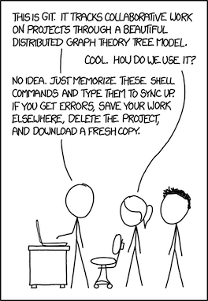
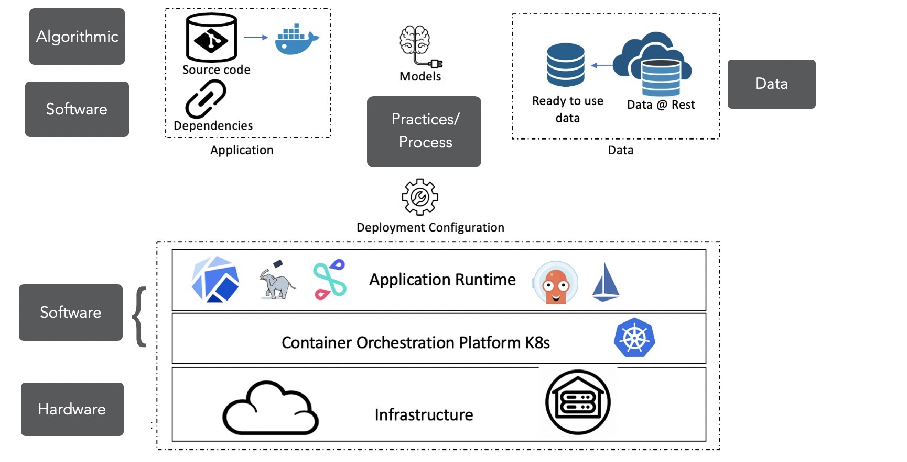
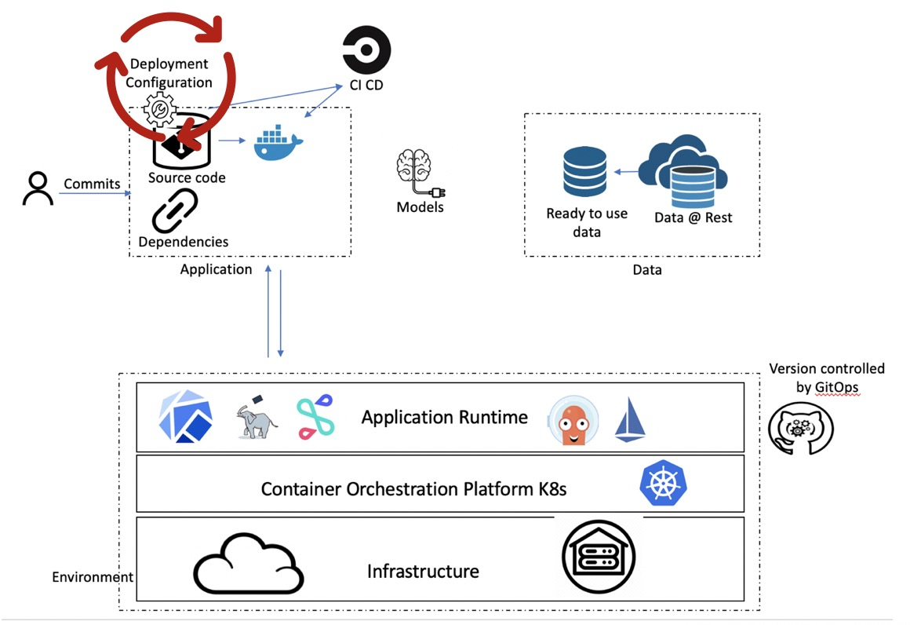
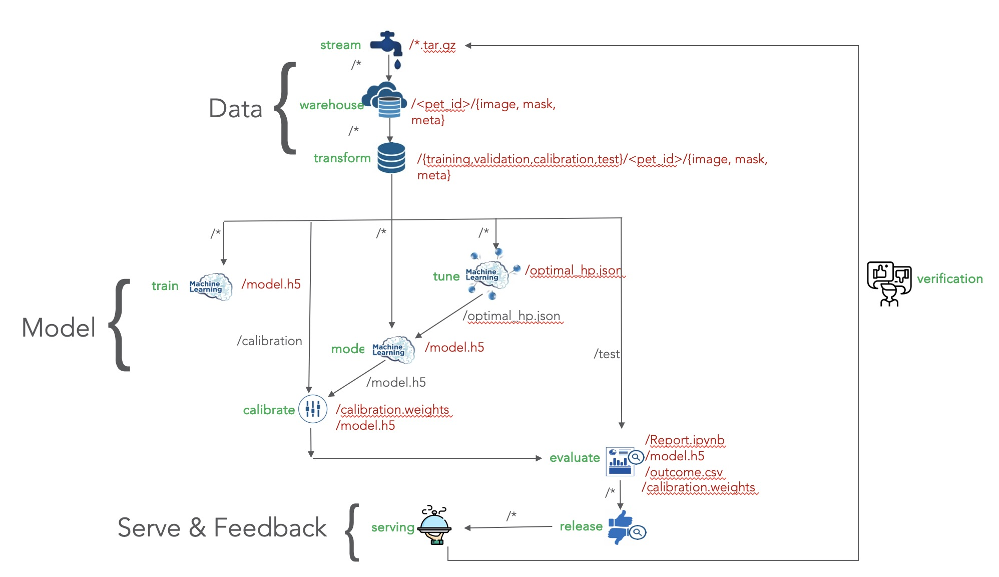

# End-to-end reproducible Machine Learning pipelines on Kubernetes

This is [Part 3] - **End-to-end reproducible Machine Learning pipelines on Kubernetes** of technical blog series titled [Reproducibility in Machine Learning]. [Part 1] & [Part 2] can be found [here][Part 1] & [here][Part 2] respectively.

---


**C**hange **A**nything **C**hanges **E**verything (CAKE) principle <sub>-[Scully et al][scully_2015]</sub> is 
real in ML. Also, 100% reproducible ML code comes at a cost of speed - a non-negotiable aspect in today's time. 
If  we cannot be 100% and change is evident, then the only way to maintaining explainability, understanding, trust 
&  confidence is through version control everything. 

>
*Figure 1: Version control explained by [XKCD][git_xkcd]*

In this post, we will be looking at building an end to end fully automated ML pipeline that can maintain full provenance
across the entire ML system. In my view, a standard machine learning workflow looks like the one below: 

>
*Figure 2: Machine Learning end to end system*

So we will be working towards building this system with full provenance over it. For this, we will be extending [our sample 
semantic segmentation example][e2e-ml-on-k8s] based on [Oxford Pet dataset][oxford-petset] 

To build this ML workflow, we will be using [Kubernetes](https://kubernetes.io/) - a container orchestration platform. 
On top of [Kubernetes](https://kubernetes.io/), we will be running [Pachyderm](https://github.com/pachyderm/pachyderm) 
software that will do the heavy lifting of maintaining provenance across data, artifacts, and ml processes.

## What to version control

In [part 1] of this blog series, we discussed above the challenges, shown in figure 3, in realizing reproducible ML.


*Figure 3: Overview of challenges in reproducible ML*

The presence of these challenges in the system-wide view of ML is shown in figure 4.



*Figure 4: What to version control?*

But first, let's talk about creating the environment, infrastructure, and versioning it.   

### 1. Versioning environment

Using [gitops](https://www.weave.works/technologies/gitops/) environment and any changes associated with it can be version controlled.
In this sample, we will be using [ArgoCD](https://argoproj.github.io/argo-cd/) to implement GitOps workflow (figure 5)
which will see our environment config moved to be alongside the code repository (figure 6).   


*Figure 5: Gitops*

This is achieved by defining [argo apps](https://raw.githubusercontent.com/suneeta-mall/e2e-ml-on-k8s/master/cluster-conf/e2e-ml-argocd-app.yaml)
which can be applied on BYO Kubernetes cluster (version 1.14.7) that has ArgoCD installed:

```bash
kubectl apply –f https://raw.githubusercontent.com/suneeta-mall/e2e-ml-on-k8s/master/cluster-conf/e2e-ml-argocd-app.yaml
```


*Figure 6: Gitops on environment config*

Once the Argo apps are created, the following software will be installed on the cluster:
- Kubernetes: 1.14.7 (tested on this version, in theory, should work with other versions too!)
- ArgoCD: 1.2.3
- Kubeflow: 0.6.2
> Kubeflow is an ML toolkit designed to bring a variety of ML related [Kubernetes] based software together.
- Seldon 0.4.1 (upgraded from packaged version on kubeflow 0.6.2)
> Seldon is a model serving software
- Pachyderm: 1.9.7
> Pachyderm offers a git like a repository that can hold data even big data. It also offers automated repository capability
> that `act` on input and generate data thus holding a versioned copy of this generated data. Together with these 
>constructs, it can be used to create pipeline DAG like processes with provenance across graph input, transformation spec, output


Any change on this configuration repository will then trigger a cluster update keeping environment in synced with versioned
config. 

### 2. Versioning data, process, and artifacts


*Figure 7: Artifact view of Machine Learning end to end system (shown in figure 2)*

Pachyderm pipeline specification for an end to end ML workflow capability shown in figure 2 is available [here](https://github.com/suneeta-mall/e2e-ml-on-k8s/blob/master/cluster-conf/k8s/ml-workflow/pachyderm-specs.yaml).
The generated artifacts/data as a result of this ML workflow is shown in figure 7 above. These artifacts and their association with other processes are also highlighted in figure 7. 

```yaml
---
pipeline:
  name: stream
transform:
  image: suneetamall/pykubectl:1.14.7
  cmd:
  - "/bin/bash"
  stdin:
  - "wget -O images.tar.gz https://www.robots.ox.ac.uk/~vgg/data/pets/data/images.tar.gz && \
     wget -O annotations.tar.gz https://www.robots.ox.ac.uk/~vgg/data/pets/data/annotations.tar.gz && \
     tar -cvf data.tar.gz *.tar.gz && \
     cat data.tar.gz > /pfs/out && \
     while :; do sleep 2073600; done"
spout:
  overwrite: true
---
input:
  pfs:
    glob: /
    repo: stream
pipeline:
  name: warehouse
transform:
  cmd:
  - "/bin/bash"
  image: suneetamall/e2e-ml-on-k8s:1
  stdin:
  - "python download_petset.py --input /pfs/stream/ --output /pfs/out"
datum_tries: 2
#standby: true
---
input:
  pfs:
    glob: "/"
    repo: warehouse
pipeline:
  name: transform
transform:
  cmd:
  - "/bin/bash"
  image: suneetamall/e2e-ml-on-k8s:1
  stdin:
  - "python dataset_gen.py --input /pfs/warehouse --output /pfs/out"
datum_tries: 2
#standby: true
---
input:
  pfs:
    glob: "/"
    repo: transform
pipeline:
  name: train
transform:
  cmd:
  - "/bin/bash"
  image: suneetamall/e2e-ml-on-k8s:1
  stdin:
  - "python train.py --input /pfs/transform --output /pfs/out --checkpoint_path /pfs/out/ckpts --tensorboard_path /pfs/out"
resource_requests:
  memory: 2G
#  gpu:
#    type: nvidia.com/gpu
#    number: 1
datum_tries: 2
#standby: true
---
input:
  pfs:
    glob: "/"
    repo: transform
pipeline:
  name: tune
transform:
  cmd:
  - "/bin/bash"
  image: suneetamall/e2e-ml-on-k8s:1
  stdin:
  - "python tune.py --input /pfs/transform --output /pfs/out"
resource_requests:
  memory: 4G
  cpu: 1
#  gpu:
#    type: nvidia.com/gpu
#    number: 1
datum_tries: 2
#standby: true
---
input:
  cross:
    - pfs:
       glob: "/"
       repo: transform
    - pfs:
        glob: "/optimal_hp.json"
        repo: tune
pipeline:
  name: model
transform:
  cmd:
  - "/bin/bash"
  image: suneetamall/e2e-ml-on-k8s:1
  stdin:
  - "python train.py --input /pfs/transform --hyperparam_fn_path /pfs/tune/optimal_hp.json
     --output /pfs/out --checkpoint_path /pfs/out/ckpts --tensorboard_path /pfs/out"
  - "ln -s /pfs/tune/optimal_hp.json /pfs/out/optimal_hp.json"
resource_requests:
  memory: 2G
#  gpu:
#    type: nvidia.com/gpu
#    number: 1
datum_tries: 2
#standby: true
---
input:
  cross:
    - pfs:
       glob: "/calibration"
       repo: transform
    - pfs:
        glob: "/model.h5"
        repo: model
pipeline:
  name: calibrate
transform:
  cmd:
  - "/bin/bash"
  image: suneetamall/e2e-ml-on-k8s:1
  stdin:
  - "python calibrate.py --input /pfs/transform --model_weight /pfs/model/model.h5 --output /pfs/out"
  - "ln -s /pfs/model/model.h5 /pfs/out/model.h5"
datum_tries: 2
#standby: true
---
input:
  cross:
    - pfs:
       glob: "/test"
       repo: transform
    - pfs:
        glob: "/"
        repo: calibrate
pipeline:
  name: evaluate
transform:
  cmd:
  - "/bin/bash"
  image: suneetamall/e2e-ml-on-k8s:1
  stdin:
  - "papermill evaluate.ipynb /pfs/out/Report.ipynb \
      -p model_weights /pfs/calibrate/model.h5 \
      -p calibration_weights /pfs/calibrate/calibration.weights \
      -p input_data_dir /pfs/transform \
      -p out_dir /pfs/out \
      -p hyperparameters /pfs/calibrate/optimal_hp.json"
  - "ln -s /pfs/calibrate/model.h5 /pfs/out/model.h5"
  - "ln -s /pfs/calibrate/calibration.weights /pfs/out/calibration.weights"
resource_requests:
  memory: 1G
datum_tries: 2
#standby: true
---
input:
  pfs:
    glob: "/"
    repo: evaluate
pipeline:
  name: release
transform:
  cmd:
  - "/bin/bash"
  image: suneetamall/e2e-ml-on-k8s:1
  stdin:
  - "python release.py --model_db evaluate --input /pfs/evaluate/evaluation_result.csv --version ${evaluate_COMMIT}"
pod_spec: '{"serviceAccount": "ml-user", "serviceAccountName": "ml-user"}'
datum_tries: 2
#standby: true
---
## Service https://docs.pachyderm.io/en/1/concepts/pipeline-concepts/pipeline/service.html
input:
  pfs:
    glob: "/"
    repo: model
pipeline:
  name: tensorboard
service:
  external_port: 30888
  internal_port: 6006
transform:
  cmd:
  - "/bin/bash"
  stdin:
  - tensorboard --logdir=/pfs/model/
  image: suneetamall/e2e-ml-on-k8s:1
---
```

This pipeline creates ML workflow, with artifact dependency shown in above figure 7, wherein full provenance across 
data, processes, and outcomes are maintained along with respective lineage.   

---

This is the last post of the technical blog series, [Reproducibility in Machine Learning].       


[Reproducibility in Machine Learning]: /2019/12/20/Reproducibility-in-Machine Learning.html
[Part 1]: /2019/12/21/Reproducible-ml-research-n-industry.html
[Part 2]: /2019/12/22/Reproducible-ml-tensorflow.html
[Part 3]: /2019/12/23/Reproducible-ml-pipeline-k8s.html
[git_xkcd]: https://xkcd.com/1597/
[scully_2015]: https://papers.nips.cc/paper/5656-hidden-technical-debt-in-Machine Learning-systems.pdf
[e2e-ml-on-k8s]: https://github.com/suneeta-mall/e2e-ml-on-k8s 
[oxford-petset]: https://www.robots.ox.ac.uk/~vgg/data/pets/
[Kubernetes]: https://kubernetes.io
