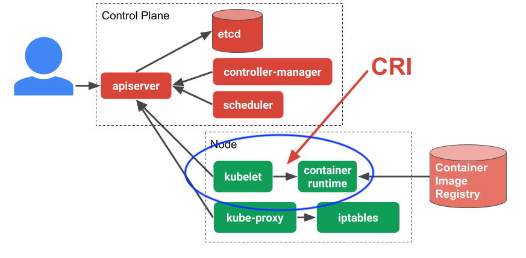
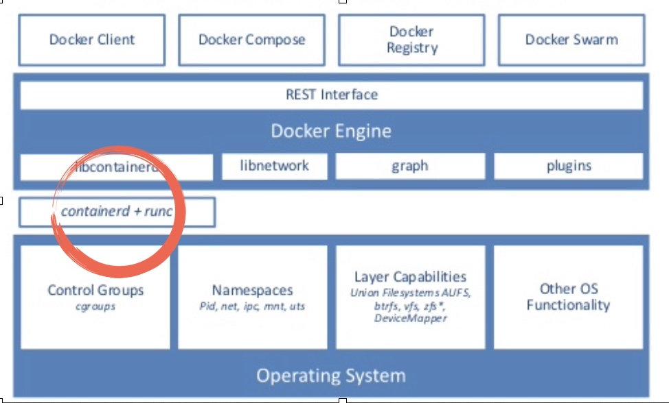
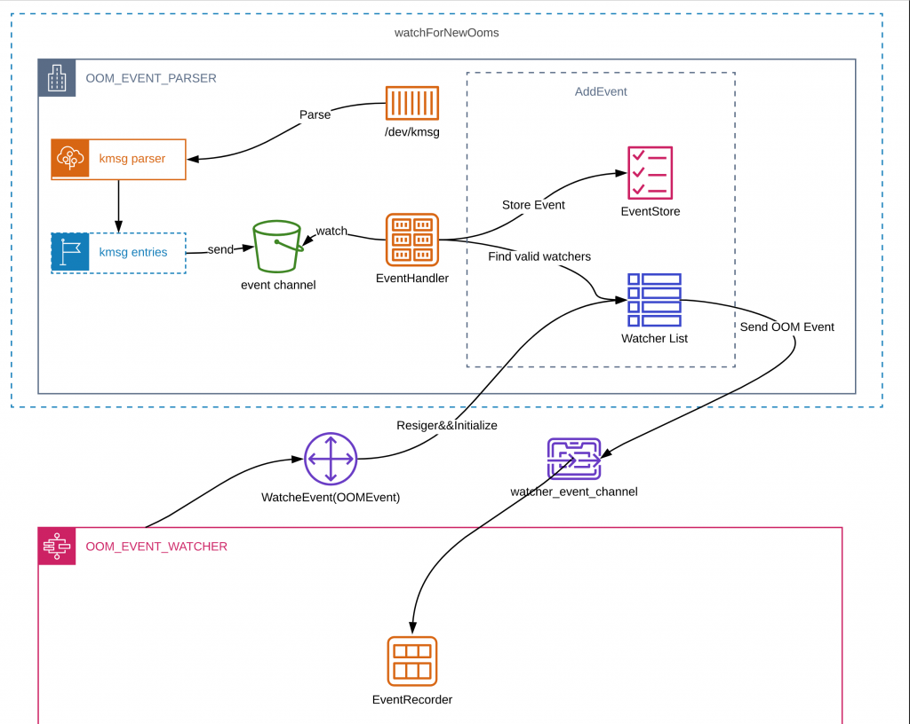
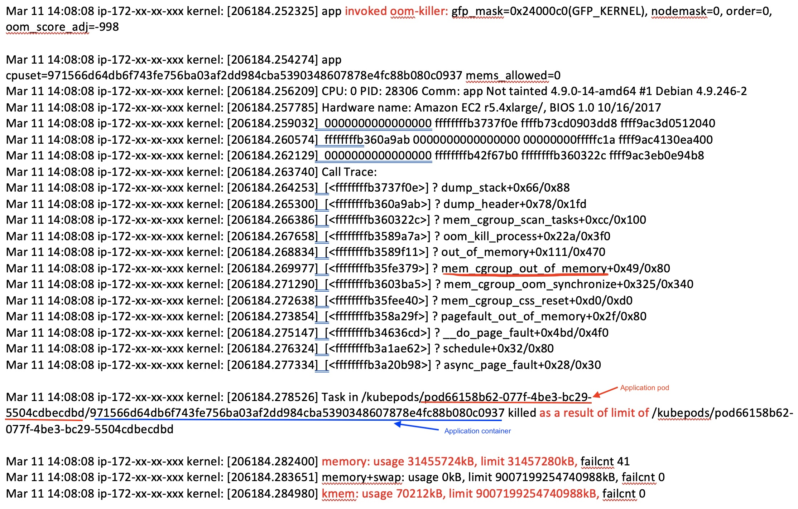
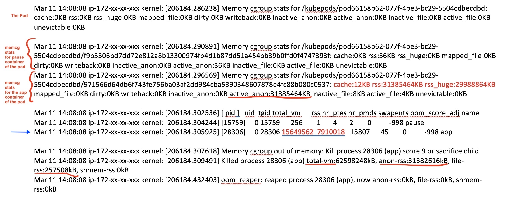

# WTH! Who killed my pod - Whodunit?

A few days ago, I deployed a brand new application onto a self-managed Kubernetes cluster (hereafter referred to as Kube). 
Suffice to say, all hell broke loose. The pods were getting `OOMKilled` with error code 137 left and right! 

Now, I know a thing or two about Kubernetes<sup>[1],[2]</sup>. I am not a total Kube noob!  
But, I could not figure out what the fudge was going on actually! 
Besides, this app has been thoroughly tested and profiled and ran fine on bare metal and virtual environments.

So this was me, a few days ago!.
<!-- -->


This sparked a massive hunt for the culprit, and some interesting insights were discovered. Worth noting, similar investigating
has also been done on by [Line Corp][line-eng-qos] in their excellent blog however, I have a different story to tell!
 
In this writeup, 
I am going to talk about this particular incident and the insights I have uncovered about both Kube and Linux kernels.


## Context of the app
The app runs some intensive [numpy] and [Tensorflow] computations to produce some artifacts and associative metadata.
The workloads are more memory-intensive as they operate on rich multi-media content. 
Other gory details besides _resource requirements_ of the app is irrelevant for this discussion. 

The average resource requirement, for this app, is very fluctuating yet predictable (in a given range). 
At least so we thought looking at our metrics:
    


*Figure 2: Average resource requirements of the app when run on VMs or bare metal*

I hear you, the resource utilization is not following a zero gradient line (fig 2)! 
It would be awesome to have constant non-flapping resource requirement needs - so clearly some work needs to happen on the app here. Having said that, it's an absolutely acceptable and supported workload. 

Ok, so the app was deployed and now, we will look at the line of investigation:

## App's on Kube: day 1 

The provisioned app pods started to get killed as frequently as every 20 mins or more with error code 137 and reason `OOMKilled`. 


*Figure 3: The killer is on the loose! - Whodunit?*


Let me explain a few things about the failure first:
1. `Error code 137` indicates that the container process received the SIGKILL and thus was killed by the OS kernel. 
    SIGKILL on Kube can only be produced using one of the following means:
    
    1.1. Manually (human): Triggering CTRL+C or using other means of manually sending SIGKILL or even manually killing process.
    
    1.2. Container Runtime/Interface: `Kubelet` the process running on the host machine that manages running Kube workload is `the power that be` for containers. 
    It communicates through container runtime to manage the container lifecycle. It can kill and almost always kills badly behaving pods!  

    
    *Figure 4: Container runtime interface. Image Credit: [Ian Lewis]! Borrowed from his 4 part container runtime series [container runtime] that I highly recommend reading*

    1.3. OS kernel: The OS kernel is responsible for the life cycle of processes running on the host. 
    It is `the mighty power that be` for all the processes on the host including the container process and its children.
    It can also kill and almost always kills badly behaving processes!
    

2. `OOMKilled` represent a kill event (SIGKILL) triggered to a process because someone _in-charge_ suspected of the process to be the culprit of a memory surge that may lead to an out of memory event. This is a safeguard mechanism to avoid 
system-level failure and to nip mischieve in the bud.  

`Takeaway 1`: Either Container Runtime/Interface or OS Kernel killed my process because supposedly it was misbehaving and causing the out-of-memory issue! 
Essentially, I am ruling out the manual kill because that was simply not the case!

### Deep-dive into factors at play here

1. _Container runtime_ (in fig 4) is responsible for two things: 

    a) Running containers: Comes from open container initiative (OCI) (about 2013) open sourced by Docker called "runc". It provides ability to run containers.

    b) Image management: How images are packed, unpacked, pushed, pulled etc comes under this umbrella. A good example for this is "containerd".          

    
    *Figure 5: Docker stack! Image credit: internet*
    
    There are several other implementation for runtime than runc+containerd like rkt but for me, its `runc+containerd` in play.
    
2. [control groups][cgroups] are a Linux kernel feature that allows processes to be organized into hierarchical groups whose usage of various types of ../resources (memory, CPU, and so on) can then be limited and monitored. The cgroups interface is provided through a pseudo-filesystem called cgroupfs. You may have heard about `/sys/fs/cgroup/`! 
 
    [Liz Rice] did an excellent demonstration of [what it means to run a container and how they work][container from scratch] that I highly recommend
    going through. Don't forget playing with the [demo code][source]. It gives a foundational understanding of cgroups's role in all things containers.
    
    
    *Figure 6: CGroup in picture! Image credit: [zines] by [Julia Evans]*
                                                                                                                                                                                                                                                                                                                                                                                                                                                                                                                                                                                                                                                                                 
3. `Kubelet` (see fig 4) not only interfaces container runtime but also has `cAdvisor`(for [**C**ontainer **Advisor**][Container Advisor]) integrated within. 
Note `kubelet` is a service running on the host and it operates at the host level, not the pod. 
With `cAdvisor` it captures resource utilization, statistics about [control group][cgroups] of all container processes on the host.

4. Kubernetes manages the resource for containers using `cgroups` that guarantees resource isolation and restrictions. 
Kube can allocate X amount of ../resources to a container and allow the ../resources to grow until a pre-existing limit is reached or no more is left on the host to use.
Kube provides these [requests and limits] semantic on containers which are used to enforce the said limit on process hierarchy for each container via cgroups.
Now, the `limit is not always a hard cut-off. As documented in google's blog of [best practices resource requests and limits], there are two types of ../resources:
    1. _Compressible_ ../resources: When resource limit is reached, Kube will throttle the container i.e. start to restrict the usage but won't actually terminate the container. 
        CPU is considered as a compressible resource.
    1. _Incompressible_ ../resources: When a limit for this type of resource is reached, the highest usage process within the cgroups hierarchy will be killed.
        Memory is an incompressible resource. 

    `Takeaway 2`: It's not the CPU limit, but the memory limit that we need to focus on.

5. Kubernetes classifies pod into three categories based on the quality of service (QoS) they provide:
    
    4.1 _Guaranteed_ pods are those who's resource request and limit are just the same. These are the best kind of workload from Kube's viewpoint as they are easier to allocate and plan for resource-wise. These pods are guaranteed to not be killed until they exceed their limits.
    
    *Figure 7: Guaranteed QoS pod example*

    4.2 _Best-Effort_ pods are those where no resource requirements are specified. These are the lowest priority pods and the first to get killed if the system runs out of memory. 
    
    *Figure 8: Best-Effort QoS pod example*

    4.3 _Burstable_ pods are those whose resource request and limit are defined in a range (fig 9), with limit treated as max if undefined. 
    These are the kind of workloads that are more likely to be killed when the host system is under load and they exceed their requests and no Best-Effort pods exist. 
    
    *Figure 9: Burstable QoS pod example*


    ```
    So can Kube over-commit? 
    If yes, would it always be on the compressible ../resources? 
    ```
    
    Yes, Kube can overcommit. The pod limits are allowed to be higher than requests. It's possible that the sum of all limits exceeds the total node capacity. It's possible to overcommit both compressible and incompressible ../resources. This is pictorially explained [here][sysdig's].
    In fact, with Kube, it's also possible to not only vertically overcommit but also horizontally (at cluster level) overcommit. 
    Horizontal overcommits are nicer as they can trigger auto-scaling events to scale out.   
    


### So why the pods are getting killed? 

The app was initially deployed with `Burstable` QoS with Memory requirements set at request: 4Gi, limit: 7Gi, and 
CPU set at 2 for both requests, limits (see fig 2). The nodes were AWS `r5.2xlarge` type with 8 CPU, 64GB RAM, running Debian/Linux.
Other than Kube system components and the app, nothing else was deployed on these nodes. 

So, Kube could have only deployed 3 app pods per `r5.2xlarge` nodes (due to CPU request). This means, 43GB (=64-7*3) of RAM 
was lying around singing hakuna matata! What a waste! Sure but let's not digress!
So why the OOMKill? `¯\_(ツ)_/¯`

Noteworthy observation:
    - Node monitoring tells us that is running healthy and has plenty of ../resources at its disposal. 
    - the pod is still OOMKilled but not all app pods on the node, just one is killed.

I am still clueless. So, caving in, I decided to use up this extra memory floating around and beef up the nodes a bit more 
and buy more time to do a proper investigation. 
Now, the apps are redeployed again with RAM request 4Gi, limit: 31Gi (leaving 4GB for other misc system components).

Did that ameliorate the problem - no! Of course, I am being silly about this, I should be making it guaranteed to have better 
chance of avoiding OOMKill. 


## App's on Kube: day 2

So, my apps are running with guaranteed QoS with 31GB of RAM as required/limit. Node still seems healthy and shows no sign of duress.  

Hows the app doing with the new revised configuration: `still getting OOMKilled with 137 error code left and right!` 


Meanwhile, we uncovered random memory surges in some pods (see figure 10). These surges occurred very rarely and did not match
to the duration of out-of-memory kill events. In fact, the frequency of OOM was much higher than these memory surges. 


*Figure 10: The notorious spike of memory use on pod*

While these surges are worth investigating, they are still within the request/limit range (28.x Gi suurge on 31Gi request).
So they still don't justify the OOM event.

### Whats log telling us

Based on Takeaway 1 & 2, we look at who is firing the kill signal. #Whodunit

#### Kube events for pod and other higher-level abstractions
Investigating, on Kube `Events` there is no record or any OOMKill or any event signaling anything malicious.
```bash
kubectl describe pod <my pod>
kubectl describe deploy <my pod>
```
In fact, according to my Kube event stream `kubectl get events`, Kube is all healthy and there is nothing to see, nothing to worry about there!
It shows that containers are clearly being restart but it seems to be not capturing any adverse event and bringing it back up to keep
to desired declared state on attached replicaset. 
```text
26m         Normal   Created   pod/myapp   Created container planck
26m         Normal   Started   pod/myapp   Started container planck
26m         Normal   Pulled    pod/myapp   Container image "app" already present on machine
```

#### What are the CRI and kubelet doing?

Looking at the system journal, there is nothing noteworthy recorded for OOM. 
1. Nothing is logged for `Out of memory` (command reference `journalctl -u kubelet | grep -i "Out of memory"`)
2. Only log I see for shorter term `oom` (cmd reference `journalctl -u kubelet | grep -i "oom"` is info level log of kubelet startup record.  
```text
kubelet[2130]: I0309 04:52:13.990735    2130 flags.go:33] FLAG: --oom-score-adj="-999"
kubelet[2130]: I0309 04:52:15.416807    2130 docker_service.go:258] Docker Info: &{ID:XF74:2JFW:UOE4:QI7X:TXQU:RJLG:E7FC:K4K3:IUTM:MGFW:W2GM:Z6AC Containers:0 ContainersRunning:0 ContainersPaused:0 ContainersStopped:0 Images:0 Driver:overlay2 DriverStatus:[[Backing Filesystem extfs] [Supports d_type true] [Native Overlay Diff true]] SystemStatus:[] Plugins:{Volume:[local] Network:[bridge host macvlan null overlay] Authorization:[] Log:[awslogs fluentd gcplogs gelf journald json-file logentries splunk syslog]} MemoryLimit:true SwapLimit:false KernelMemory:true KernelMemoryTCP:false CPUCfsPeriod:true CPUCfsQuota:true CPUShares:true CPUSet:true PidsLimit:false IPv4Forwarding:true BridgeNfIptables:true BridgeNfIP6tables:true Debug:false NFd:23 OomKillDisable:true NGoroutines:44 SystemTime:2021-03-09T04:52:15.411198727Z LoggingDriver:json-file CgroupDriver:cgroupfs NEventsListener:0 KernelVersion:4.9.0-14-amd64 OperatingSystem:Debian GNU/Linux 9 (stretch) OSType:linux Architecture:x86_64 IndexServerAddress:https://index.docker.io/v1/ RegistryConfig:0xc00062c0e0 NCPU:16 MemTotal:133666107392 Generic../resources:[] DockerRootDir:/var/lib/docker HTTPProxy: HTTPSProxy: NoProxy: Name:ip-172-30-36-152 Labels:[] ExperimentalBuild:false ServerVersion:18.06.3-ce ClusterStore: ClusterAdvertise: Runtimes:map[runc:{Path:docker-runc Args:[]}] DefaultRuntime:runc Swarm:{NodeID: NodeAddr: LocalNodeState:inactive ControlAvailable:false Error: RemoteManagers:[] Nodes:0 Managers:0 Cluster:<nil> Warnings:[]} LiveRestoreEnabled:false Isolation: InitBinary:docker-init ContainerdCommit:{ID:468a545b9edcd5932818eb9de8e72413e616e86e Expected:468a545b9edcd5932818eb9de8e72413e616e86e} RuncCommit:{ID:a592beb5bc4c4092b1b1bac971afed27687340c5 Expected:a592beb5bc4c4092b1b1bac971afed27687340c5} InitCommit:{ID:fec3683 Expected:fec3683} SecurityOptions:[name=seccomp,profile=default] ProductLicense: Warnings:[]}
kubelet[2130]: I0309 04:52:15.437879    2130 manager.go:1159] Started watching for new ooms in manager
```

Normally, in the event of OOM triggered by Kube, we should see kubelet recording some signal for oom e.g. `An OOM event was triggered`

`Takeaway 3`: As far as Kube is concerned, the pod is well behaved and it's all hakuna matata!


So, #Whodunit? Enter day 3 - new day new investigation 

## App's on Kube: day 3
Based on the previous 3 takeaways, the only potential suspect we have is OS kernel. The pods are still crashing and metrics, events, and Kube level logs
do not justify the observation. 
  
### Reading kernel logs
1. System level log scan `grep -i -r 'out of memory' /var/log/` takes us somewhere. 
    ```
    /var/log/kern.log:Mar  9 13:17:05 ip-172-xxx-xx-xxx kernel: [30320.358563] Memory cgroup out of memory: Kill process 11190 (app) score 9 or sacrifice child
    ```
    `Takeaway 4`: We do in fact have kernel thinking memory cgroups is in danger and starting to kill!

2. Kernel logs (`/var/log/kern.log`) seem to have much more insightful info than the above one-liner `out of memory: Kill process `. 
    
But before we look into this, let's do a bit of a deep dive into related concepts: 

### Deep-dive into OS Kernel

1. **Swap space and Kube**

   Docker supports setting [swappiness] however it's discouraged as it's slow and less performant. 
   Also, providing a limit on the swap is unsupported at the docker level which can lead to resource management and overcommitment chaos. 
   These are some of the reasons why [kops] and in general Kube prefer no swap on hosts. 

2. **OOMKill disable on Kubernetes**

   OS Kernels allow disabling OOM Kill for cgroups level (`/sys/fs/cgroup/memory/memory.oom_control`) even docker 
   supports it using `--oom-kill-disable` flag. These are highly discouraged due to the nature of problem band-aid fixer `OOM Killer`
   solves. It also does not sit with Kube's declarative approach orchestration and also with cattle workload philosophy.
   It's also why by default oom kill is enabled on Kubernetes.
   
   Its possible however to configure it to disable OOMKill by starting kubelet service with `--cgroup-driver=cgroupfs` argument and then setting `oom_kill_disable` under `/sys/fs/cgroup/memory/memory.oom_control`  as 1.
   
   `Takeaway 5`: It's not something I want to enable either, but for the completeness of the discussion, it's worth mentioning :).    

3. **Kernel memory management**
    
    The kernel uses virtual addressing (using paging and segmentation) to provide isolation amongst various processes running on host. 
    It is also virtual addressing that allows for use of more memory than what's available currently in physical memory (RAM) by making use of other sources like a disk (a.k.a. swap). 
    Virtual addressing is divided into user & kernel space. 
    Userspace is the sort of virtual address space that's reserved for user/application programs whereas kernel space is reserved for kernel-related operations. 
    
    Now, the os kernel is designed to be greedy - greedy to be able to run as many processes as possible. This is also the reason why we need mechanisms like `out of memory'.
    
    
4. **System vs memory controller (memch) OOM**

   cgroups comprises of two components: `core` and `controller`. Core corresponds to managing the hierarchy and core capabilities whereas controllers
    are focused on the type of resource cgroup is controlling eg cpu, io, memory controller ('memcg').  
    
    Now, the user-space out-of-memory handling can address OOM conditions for both cgroups using the memory controller ('memcg') and for the system as a whole.
    `Takeaway 6`: We know, based on our takeaways, that our OOM is not stemming from system draining or system as whole. Also, log `Memory cgroup out of memory` indicating that its `memcg`
    that's triggering the OOM Kill. Here, the app process hierarchy memory usage is aggregated together into its memcgs so the memory usage at group level can be accounted for. 
    What our first log here is telling us is `memcg usage reached its limits and memory cannot be reclaimed i.e. the memcg is out of memory`<sup>[1][lwn]</sup>.
    

6. **OOM kill score**

    How does kernel come to decide which process to kill, is based on a score. The score has two parts: main (`oom_score`) and adjustment factor (`oom_score_adj`).
    These scores are store against process id in process space and can be located on disk as :
    ```bash
    /proc/<pid>/oom_score
    /proc/<pid>/oom_score_adj
    ```
    
    The `oom_score` is given by kernel and is proportional to the amount of memory used by the process i.e. = 10 x percentage of memory used by the process. 
    This means, the maximum `oom_score` is 100% x 10 = 1000!.
    Now, the higher the oom_score higher the change of the process being killed. However, user can provide an adjustment factor `oom_score_adj (a.k.a. oom_adj in older kernel versions)`. 
    If provided, it is used to adjust the final score. The valid value for `oom_score_adj` is in the range of  (-1000, +1000), where -ve score decreases and +ve increases the chances of oomkill.
    More details on this can be found in this very interesting article by Jonathan Corbet [another OOMKill rewrite][another oomkill rewrite], with precursory article found [here][oomkill writeup].

    
4. **OOM trigger workflow**

   `kmsg` is the kernel message interface that directs kernel messages to `/proc/kmsg` & `/dev/kmsg`. Now, `/dev/kmsg` is more useful for us mere mortals as it's designed to be persistent.
   `/proc/kmsg` is designed to be read once and treated more as event queue if you will. Messages from here also trickle through to kernel logs @ `/var/log/kern.log`.
   
    _On Kube_
    
    Kebelet watches for `kmsg` and handles messages that will translate to OOMEvent/OOMKillEvent in Kube event stream which is then handled appropriately to trigger OOMKill. More interesting details of how this happens can be found [here][line-eng-qos] (also shown in borrowed fig 11). 

    
    *Figure 11: OOM handling workflow on Kubernetes. Image credit: [Line Corp][line-eng-qos]*

    As mentioned in `takeway 3 & 4`, this workflow however was not triggered in our case, we are did not record any Kube related OOM events or even kubelet receiving
    any related messages.
    
    _At Kernel Level_
    When system or memory controller related OOM is suspected, based on `oom_score` (with adjustment `oom_score_adj`), `oom-killer` is invoked on the highest
    score process and its children. 
    
### So why the pods are getting killed? 
    
In my case, memory cgroup ran out of memory and my stack trace confirms this (see fig 12). It tells me that the application container was 
killed because it was consuming 1.5MB shy of memory set as limit (31457280 KB).


*Figure 12: Kernel log part 1*

OK! this explains the OOMKill but why:

a. My monitoring only shows 29GB as max memory surge!

b. I never noticed beyond 9GB usage in local/testing/profiling and all the jazz!


This simply does not add up! Let's hold on to this thought for a bit and look at the rest of the logs and what it says:

Before we go into part 2 of the log, I should explain a few things:

1. The _pause container_ is the parent container of each pod, responsible for creating and managing the environment for the group of containers that would be provisioned within the pod. For more info, I will direct you to an excellent article by [Ian Lewis], the [almighty pause container]. 
I need to explain this because it will be shown in the following log.

2. Definition of memory cgroups stats metrics as per [kernel.org] is listed below. 
   
   Note that, `anonymous memory` (abbreviated often as `anon`) is a memory mapping with no file or device backing it. 
   Anon memory is used by programs to allocate memory for the stacks and heaps.
   Also, the standard page size on the Linux kernel is 4KB which can be really inefficient to store mapping for a large block of memory virtual memory. 
   `Hugepages` are designed to solve this inefficiency and can hold a bigger chunk than 4KB. More details on this is available [here][hugepages]. 
   
    | Metrics of memory cgroups stats |                                                                                                        Definition                                                                                                        |
    | ------------------------------- | :----------------------------------------------------------------------------------------------------------------------------------------------------------------------------------------------------------------------: |
    | rss                             | rss stands for resident set size. It is the portion of memory occupied by a process that is held in RAM. This metric represents the number of bytes of anonymous and swap cache memory (includes transparent hugepages). |
    | rss_huge                        |                                                                                   number of bytes of anonymous transparent hugepages.                                                                                    |
    | cache                           |                                                                                          number of bytes of page cache memory.                                                                                           |
    | mapped_file                     |                                                                                number of bytes of the mapped file (includes tmpfs/shmem)                                                                                 |
    | swap                            |                                                                                              number of bytes of swap usage                                                                                               |
    | dirty                           |                                                                            number of bytes that are waiting to get written back to the disk.                                                                             |
    | writeback                       |                                                                         number of bytes of file/anon cache that are queued for syncing to disk.                                                                          |
    | inactive_anon                   |                                                                         number of bytes of anonymous and swap cache memory on inactive LRU list.                                                                         |
    | active_anon                     |                                                                          number of bytes of anonymous and swap cache memory on active LRU list.                                                                          |
    | inactive_file                   |                                                                               number of bytes of file-backed memory on inactive LRU list.                                                                                |
    | active_file                     |                                                                                number of bytes of file-backed memory on active LRU list.                                                                                 |
    | unevictable                     |                                                                            number of bytes of memory that cannot be reclaimed (mlocked etc).                                                                             |


Now, as discussed previously, the swap is not being used in this system. See the second part of the logs in fig 13. 
You will note, there are two containers recorded and their memory stats is a capture - a) the pause container and b) the app container. 
We can ignore the pause, it's tiny and looking very healthy. But look at the stats for app pod in fig 13 (below)!
At the time my app was killed, it held about 29GB in hugepages and only 1.3GB extra in RSS. 
That's huge and remember monitoring it not picking it for some reason! It captured 29GB but not 31GB! Perhaps its picking only `rss_huge` and
presenting it as `rss` erroneously! `¯\_(ツ)_/¯`! Yes, we have a problem but this monitoring issue is for another day!


*Figure 13: Kernel log part 2*

Notice the blue arrow in fig 13, its capturing page info by both the pause container process and app container process. These are page info and not
and need to be multiplied by 4KB to get actual memory stats. These are translated two lines below the blue line! 

My app has freaking **_62GB_** in total virtual memory! What's going on!


Ok, so "total-vm" is the part of virtual memory the process uses. A part of this "total-vm" that's mapped to RAM is `rss`. Part of `rss` that's allocated on
to real memory, blocks is your `anon-rss` (anonymous memory), and the other part of rss is mapped to devices and files and termed `file-rss`.
If my app goes crazy and allocates a large chunk of space (say using malloc()) but never really use it then `total-vm` can be high but it won't all be used in real memory. 
This is made possible due to overcommit. A good sign of this happening, given swap off, is when `total-vm` is high but `rss` is actually low!
This is exactly what's happening here! We have about **30GB** difference between `total-vm` and `rss`.

`Takeaway 7`: We have two problems here: a) Supporting over-commitment and b) Allocation of what we suspect un-needed memory!   

Let's look at solving the over-commit first and see what level of fixes it provides:
 
### Controlling over-commits

So far, we have concluded over-commitment is a problem. Well, as discussed previously, it's a feature (of both kernel & kube) apparently!


Kernel uses the "extendability" of virtual addressing to over-commit. The kernel settings `vm.overcommit_memory` and 
`vm.overcommit_ratio` is specially designed to controlling this capability. For more info, see [here][problem with overcommit].

1.1 `vm.overcommit_memory = 0`: Make best guess and overcommit where possible. This is the default.

1.2 `vm.overcommit_memory = 1`: Always overcommit 

1.3 `vm.overcommit_memory = 2`: Never overcommit, and only allocate as much memory as defined in overcommit_ratio.

`vm.overcommit_ratio` is only used when overcommit_memory=2. It defines what percent of the physical RAM plus swap space should be allocated. This is default to 50.
We want this config to be 100. 

But the use of `sysctl` to set these(using the following) is not enough as the config won't persist on horizontal scaling (new node spinning due to spot instances or less important but restart):
```bash
sysctl -w vm.overcommit_memory=2
sysctl -w vm.overcommit_ratio=100
```
The effect of these configs is immediate and no start is needed. Talking about the restart, `systcl` cli config update do not persist, 
system config needs to be updated in `/etc/sysctl.conf` to persist the setting across restarts. 

On `Kube`, [kops] provisioned clusters, these settings need to be supplied through [sysctlparameters] config but these are only supported from kube 1.17 and higher! Safe [sysctl parameters can be set at pod level][sysctl config on pods] however
our setting is not (obviously) supported at the pod level.
One can't use [additionaluserdata] for this either, as these settings are overridden when kops provision node as Kube node!

And, to make it a helluva fun, this cluster is currently at 1.12! Heya, Mr. Murphy!


So, I say our my prayers, and turn to bash:
```bash
for memip in $(aws ec2 describe-instances --region us-east-1 --instance-ids \
$(aws autoscaling describe-auto-scaling-instances --region us-east-1 --output text \
--query "AutoScalingInstances[?AutoScalingGroupName=='myasg'].InstanceId") \
--query "Reservations[].Instances[].PrivateIpAddress")
do     
    ssh -o StrictHostKeyChecking=no  ${memip} 'bash -s' < set_mem.sh   
done 
``` 
where `set_mem.sh` is:
```bash
#!/usr/bin/env bash
sudo sysctl -w vm.overcommit_memory=2
sudo sysctl -w vm.overcommit_ratio=100 
```

I see a massive improvement in OOMKills. Pods that were killed every 20mins and odd, are chugging along with 24hr processing and no crash still. 

*Figure 14: Getting somewhere! OOMKills sort of under control!*

So, perhaps we can upgrade Kube and make this configuration systematic!  

> But, I am not done yet! No no no no no no no .....

Remember, part `b` of our problem in `takeaway 7` i.e. `b) Allocation of what we suspect un-needed memory!`.

Why was it happening in the first place, and why it's controlled with overcommit disabled. I won't lie, it still happens but far less infrequent!  
> it's not fixed yet!

Oh! the fun never ends! All the places we go! 
I will cover this later, ahem ahem, when I know the answer! Pretty sure it's some nasty behavior of Tensorflow 2, and the investigation is _underway_!


Thanks for reading. Hopefully, it was a fun insightful read!
 
[1]: https://suneeta-mall.github.io/talks/KubernetesSydneyForum_AU_2019.html
[2]: https://suneeta-mall.github.io/talks/KubeCon_US_2019.html
[numpy]: https://numpy.org
[Tensorflow]: https://tensorflow.org
[container runtime]: https://www.ianlewis.org/en/container-runtimes-part-4-kubernetes-container-run
[Ian Lewis]: https://twitter.com/IanMLewis
[container from scratch]: https://www.youtube.com/watch?v=8fi7uSYlOdc
[Liz Rice]: https://twitter.com/lizrice
[source]: https://github.com/lizrice/containers-from-scratch/blob/master/main.go
[sysdig's]: https://sysdig.com/blog/troubleshoot-kubernetes-oom/
[line-eng-qos]: https://engineering.linecorp.com/en/blog/prometheus-container-kubernetes-cluster/
[Container Advisor]: https://github.com/google/cadvisor
[cgroups]: https://man7.org/linux/man-pages/man7/cgroups.7.html
[requests and limits]: https://kubernetes.io/docs/concepts/configuration/manage-../resources-containers/
[best practices resource requests and limits]: https://cloud.google.com/blog/products/containers-kubernetes/kubernetes-best-practices-resource-requests-and-limits
[problem with overcommit]: https://engineering.pivotal.io/post/virtual_memory_settings_in_linux_-_the_problem_with_overcommit/
[lwn]: https://lwn.net/Articles/590960/
[another oomkill rewrite]: https://lwn.net/Articles/391222/
[oomkill writeup]: https://lwn.net/Articles/317814/
[Docker: Up & Running]: https://www.oreilly.com/library/view/docker-up/9781492036722/
[swappiness]: https://docs.docker.com/config/containers/resource_constraints/
[kops]: https://github.com/kubernetes/kops/issues/3251
[sysctl config on pods]: https://kubernetes.io/docs/tasks/administer-cluster/sysctl-cluster/
[sysctlparameters]: https://github.com/kubernetes/kops/blob/master/docs/cluster_spec.md#sysctlparameters
[almighty pause container]: https://www.ianlewis.org/en/almighty-pause-container
[kernel.org]: https://www.kernel.org/doc/Documentation/cgroup-v1/memory.txt
[hugepages]: https://docs.openshift.com/container-platform/4.1/scalability_and_performance/what-huge-pages-do-and-how-they-are-consumed-by-apps.html
[additionaluserdata]: https://github.com/kubernetes/kops/blob/master/docs/instance_groups.md#additionaluserdata
[zines]: https://wizardzines.com/zines/containers/
[Julia Evans]: https://twitter.com/b0rk