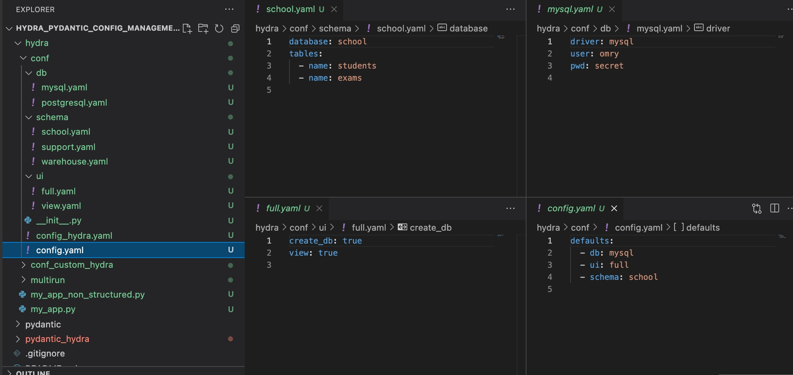
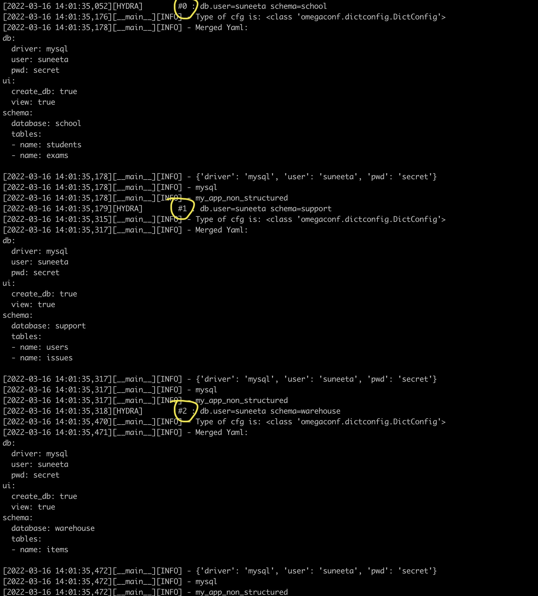
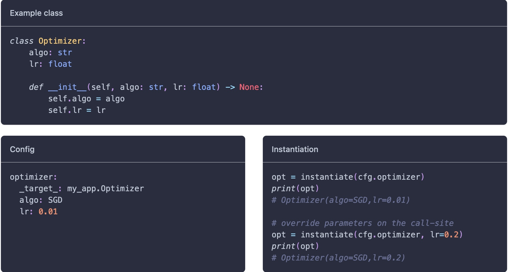
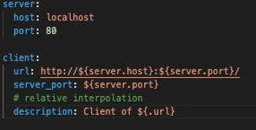
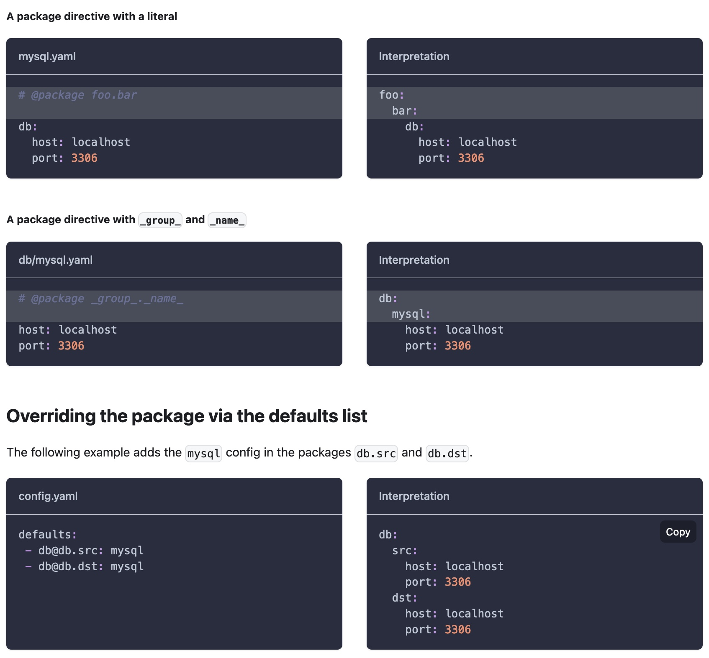
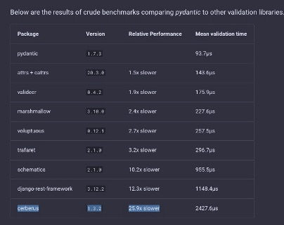

# Pydra - Pydantic and Hydra for configuration management of model training experiments

How do you manage the configurations of your model training experiments? Having good configuration management in place improves the user experience and simplifies experiment management. Some of the indirect advantages of having a good config solution are clean, reliable, and simple application code. This is true for any software application however some applications demand higher investment on the config piece than others. One key differentiator perhaps here is how many config fields one has and how each of these relates to the other. This can get real messy real quick with deep learning experiments where the list of config and hyperparameters can rapidly grow out of hand as soon as one breaks out of adhoc experimentations.


- [Pydra - Pydantic and Hydra for configuration management of model training experiments](#pydra---pydantic-and-hydra-for-configuration-management-of-model-training-experiments)
  - [Context](#context)
  - [Hydra](#hydra)
    - [A simple non-structured config example](#a-simple-non-structured-config-example)
    - [An extension using structured config](#an-extension-using-structured-config)
    - [Some other interesting features of hydra](#some-other-interesting-features-of-hydra)
      - [Interpolation](#interpolation)
      - [Hydra Directives](#hydra-directives)
    - [Where Hydra falls short?](#where-hydra-falls-short)
  - [Pydantic](#pydantic)
    - [An few interesting notes](#an-few-interesting-notes)
    - [Can Pydantic bridge the gaps in hydra](#can-pydantic-bridge-the-gaps-in-hydra)
  - [How well does this integrate with other ecosystem tools](#how-well-does-this-integrate-with-other-ecosystem-tools)
  - [Version config](#version-config)
  - [Conclusion](#conclusion)

## Context


By definition model training configurations are hierarchial. For example, an experiment configuration can be broken down into data and model specifications. While these are loosely coupled specifications, they may enforce some degree of restrictions on each other e.g. model's output specification needs to be in line with data specification. A classifier network needs to output a 10 length vector if the data source is MNIST and 20 if it's PASCAL VOC. 

Overall, configuration solution for training experiments has following requirements:

1. Ability to easily templatize configurations of various components of your training experiments.
2. Ability to organize the configuration of training in a hierarchical fashion acknowledging the dependency and hierarchy of participating components.
2. Without duplication, reuse configurations across modules wherever needed by means such as interpolation, expressions.
4. Ability to compose config using templates and applying customization through overrides, environments etc.
5. Being able to store and reuse the final assembled/compiled config and reproduce the experiments reliably.
6. Support structured config consisting of potentially complex, canonical python types with strong validation support beyond type hint. This perhaps is optional if one is not interested in dynamic domain-specific validations - something that can not be achieved in serialized formats like yaml/json.
7. Ability to version config and enforce a schema on the config specification for reliability and robustness.
8. Ability to integrate easily into complex distributed launcher frameworks for both local and remote launch.
9. A configuration management that nicely integrates into your echo-system of tools and is not very dictative.

With that in mind, I evaluated a bunch of tools combination of [Hydra] and [Pydantic] stood out as a good choice. In this post, I will go over my learnings of both the tools and also talk about gaps I still see present. Lastly, put forth a tentative solution for this gap. The structure of this post is as follows:

1. [Hydra] - its strengths and also, what I think are its weakness.
2. [Pydantic] - how it can be used to fill in the void of Hydra
3. The missing bits of config management from Pydra i.e. both [Hydra] & [Pydantic]
4. The solution to bridging the gap
5. Conclusion

*Note:* The samples and code shared in this post are available [here](https://github.com/suneeta-mall/hydra_pydantic_config_management).


## Hydra

[Hydra] is a dynamic hierarchical config management tool with the ability to override parts of the config and also to compose the config through various sources (eg command line args, environment variables). It offers a nice solution to templated configurations that can be repurposed dynamically based on your objectives. Beyond rewriting rules, compositions, and interpolations to re-config templates, it also provides a mechanism to represent the config in plain old python object style and can take care of serialization and deserialization itself. On some noteworthy features side - with hydra you can fire multi-process workload on multiple instances of configurations derived from the same template source. This can be a really handy feature for many use cases including side-by-side comparisons. 

It is also extensible in a way that one can write their plugins to launch local or remote workload. Some other nice noteworthy features are runner config and callbacks. All in all, powered by [OmegaConf] this is a great tool for config management. 

### A simple non-structured config example
Let's look at a simple use of hydra for yaml based config without involving python object model for config.  This example is borrowed and extended from [a hydra sample](https://hydra.cc/docs/1.0/tutorials/basic/your_first_app/composition/).
.
[this example](https://github.com/suneeta-mall/hydra_pydantic_config_management/blob/master/hydra/my_app_non_structured.py) demonstrates 3 config modules i.e. db, schema and ui assembled togather via high level [config.yaml](https://github.com/suneeta-mall/hydra_pydantic_config_management/blob/master/hydra/conf/config.yaml). 

>
*Example hierarchical hydra config.*

```python
import logging
from dataclasses import dataclass
from typing import List, Optional

import hydra
from hydra.core.config_store import ConfigStore
from hydra.core.hydra_config import HydraConfig
from omegaconf import MISSING, DictConfig, OmegaConf

log = logging.getLogger(__name__)


@hydra.main(config_path="conf", config_name="config")
def my_app(cfg: DictConfig) -> None:
    log.info("Type of cfg is: %s", type(cfg))
    cfg_dict = OmegaConf.to_container(cfg, throw_on_missing=False, resolve=True)

    log.info("Merged Yaml:\n%s", OmegaConf.to_yaml(cfg))

    log.info(cfg.db)
    log.info(cfg.db.driver)

    log.info(HydraConfig.get().job.name)


if __name__ == "__main__":
    my_app()
```
Sample code can be found [here](https://github.com/suneeta-mall/hydra_pydantic_config_management/blob/master/hydra/my_app_non_structured.py)


A few things happening in this script:
1. How is config loaded:
   The above script tells hydra to look for hierarchical config under `conf` as a base location for config directory, and `config.yaml` as top-level config specification. This setting is defaulted by python decorator `@hydra.main(config_path="conf", config_name="config")`.
   A user can override these settings and point the config location to another place by using `--config-dir` for the base directory and `--config-name` for top-level config.yaml as follows:
```bash
python my_app_non_structured.py --config-dir conf_custom_hydra
python my_app_non_structured.py --config-name config_hydra
```
2. What format can I access config:
    Once hydra has loaded the config, it will be loaded as dict/dictionary and surfaced as `DictConfig` from [OmegaConf]. The benefit `DictConfig` is you can access the fields as variable accessors e.g. `cfg.db.driver` as shown in code above instead of dict str key access pattern.
3. Where is composition coming from:
    What's defined in `conf` directory is template config. Some values may be missing - which can be represented in yaml as `???`. It's also possible to override some values from the template config at runtime. An example of this is:
    `python my_app_non_structured.py db.user=suneeta`
    Here, the final used configuration that the application will see is:
```
db:
  driver: mysql
  user: suneeta
  pwd: secret
ui:
  create_db: true
  view: true
schema:
  database: school
  tables:
  - name: students
  - name: exams
```
4. What is the final config used in my run:
  Hydra saves the specifics of the config used in the run in its output location. By default the output location is 
  `outputs/YYYY-MM-DD/HH-MM-SS/.hydra/config.yaml` which can be used to rerun the same run for reproducibility. 
```bash
python my_app_non_structured.py --config-dir=outputs/2022-03-16/13-45-29/.hydra
```
  Hydra also allows you to configure job and run settings, an example of such configuration is located [here](https://github.com/suneeta-mall/hydra_pydantic_config_management/tree/master/hydra/conf_custom_hydra/hydra).
  Alternatively, one can also override these settings in the main [config.yaml](https://github.com/suneeta-mall/hydra_pydantic_config_management/blob/master/hydra/conf/config_hydra.yaml) file:


```yaml
defaults:
  - _self_  # Note: to source default of hydra config 
  - db: mysql
  - ui: full
  - schema: school

hydra:
  job:
    env_set: 
      HDF5_USE_FILE_LOCKING: "false"
      ## Useful for distributed train setup
      # RANK: ${hydra.job.num}
    env_copy: ## Local environment copy
      - API_KEY  

  job_logging:
    version: 1
    formatters:
      simple:
        format: "[%(levelname)s] - %(message)s"
    handlers:
      console:
        class: logging.StreamHandler
        formatter: simple
        stream: ext://sys.stdout
    root:
      handlers: [console]

    disable_existing_loggers: false

  run:
    dir: outputs/${hydra.job.name}/${now:%Y-%m-%d_%H-%M-%S}
```
5. Multi-run and templates:
Multi-run allows users to run the multi-process workload on the same template of config but dynamically changing some values of it. Effectively, the user will be running multiple processes of the same code under different configurations. Parameter sweeps are a really good use case for when this may come in handy. In the following run, `multirun` is doing the trick triggering 3 different processes each for schema of school, support, and warehouse. 
```bash
python my_app_non_structured.py db.user=suneeta schema=school,support,warehouse  --config-dir conf_custom_hydra --multirun
```

Each process gets an int id assigned which the application can recognize. The index starts from 0, as shown in fig below. 
>
*Example Of multi-runs.*


This is especially useful in distributed training runs where things like [RANK](https://pytorch.org/tutorials/intermediate/dist_tuto.html) of process needs to be known. This can be easily configured using hydra as [following](https://github.com/suneeta-mall/hydra_pydantic_config_management/blob/master/hydra/conf/config_hydra.yaml#L12):
```
hydra:
  job:
    env_set: 
      RANK: ${hydra.job.num}
```


### An extension using structured config
If your application configs are slightly more complex and you might want object representation of your config then [Hydra] provided structured config option with `ConfigStore`. An example of this is [here](https://github.com/suneeta-mall/hydra_pydantic_config_management/blob/master/hydra/my_app.py).


In this case, you define your config object model as follows:
```python
@dataclass
class DBConfig:
    user: str = MISSING
    pwd: str = MISSING
    driver: str = MISSING
    timeout: int = 100


@dataclass
class MySQLConfig(DBConfig):
    driver: str = "mysql"


@dataclass
class PostGreSQLConfig(DBConfig):
    driver: str = "postgresql"


@dataclass
class View:
    create_db: bool = False
    view: bool = MISSING


@dataclass
class Table:
    name: str = MISSING


@dataclass
class Schema:
    database: str = "school"
    tables: List[Table] = MISSING


@dataclass
class Config:
    # We can now annotate db as DBConfig which
    # improves both static and dynamic type safety.
    db: DBConfig
    ui: View
    schema: Schema
```
A few things noteworthy to call out here:
1. `MISSING` is the replacement of yaml equivalent of missing denoted as `???`. 
2. Hydra can only work with plain old python objects and at best with [dataclasses](https://docs.python.org/3/library/dataclasses.html) or drop-in replacements of `dataclasses`.
3. Structured config can not work with python primitives and cant serde (serialize and deserialize) canonical or complex python objects. Not even things like python pathlib `Path`. 


Once, the config object model is done, one should define `ConfigStore` and register [config objects](https://github.com/suneeta-mall/hydra_pydantic_config_management/blob/master/hydra/my_app.py#L57-L62):
```
cs = ConfigStore.instance()
cs.store(name="config", node=Config)
cs.store(group="db", name="mysql", node=MySQLConfig)
cs.store(group="db", name="postgresql", node=PostGreSQLConfig)
cs.store(name="ui", node=View)
cs.store(name="schema", node=Schema)
```

Here, `group` key in config registry indicates mutually exclusive groups. More about these can be found [here](https://hydra.cc/docs/tutorials/structured_config/config_groups/).

How does hydra injection change then to support config store? 
Not by a lot, as shown in this [example](https://github.com/suneeta-mall/hydra_pydantic_config_management/blob/master/hydra/my_app.py#L75-L80), changing `DictConfig` to your high-level config object `Config` in this case does the trick.
Then, `OmegaConf.to_object(cfg)` unpacks dict config in your python object model. 
```
@hydra.main(config_path="conf", config_name="config")
def my_app(cfg: Config) -> None:    
    log.info("Type of cfg is: %s", type(cfg))
    cfg_dict = OmegaConf.to_container(cfg, throw_on_missing=False, resolve=True)

    cfg_obj = OmegaConf.to_object(cfg)
```

This is all the application needs to do to move to structured config and features discussed earlier can be explored using the following commands:
```
python my_app.py
python my_app.py db.user=suneeta    
python my_app.py db.user=suneeta --config-dir conf_custom_hydra
# python my_app.py db.user=suneeta --config-name config_hydra
# Multi-run
python my_app.py db.user=suneeta schema=school,support,warehouse  --config-dir conf_custom_hydra --multirun
```
Code located [here](https://github.com/suneeta-mall/hydra_pydantic_config_management/blob/master/hydra/my_app.py)


There is another approach [Hydra] offers to [instantiate objects](https://hydra.cc/docs/advanced/instantiate_objects/overview/) through the config. This approach requires the user to know which config is object-able beforehand as unpacking them into objects requires explicit calls to `instantiate` API. 
An example of such use is as follows, notice fully qualified class name in `__target__` field in config:
>
*Example Of instantiate objects.*

This feature, in my view, should be used sparingly as it tightly couples the config to application-specific objects. This kind of mixed-breed config handling approach is very hard to maintain and understand.

### Some other interesting features of hydra

#### Interpolation
Interpolation offers a means to refer to an existing config instead of duplicating it. It also allows users to use derive values obtained through string interpolation in config. An example of interpolation is shown below:

>
*Example Of instantiate objects.*

#### Hydra Directives
[Hydra] allows overriding package configuration employing directives; documentation for these is [here](https://hydra.cc/docs/1.0/advanced/overriding_packages/). In short, they offer means to rewrite and relocate config dynamically. 
I think this is evil and facilitates yaml engineering. It can also be a debugging nightmare if your intended use of config is beyond standard interfaces. 

>
*Example Of directives to rewrite config specifications.*

Talking about directives, `__global__` are quite handy in managing configuration overrides. One example is shown here on [hydra samples itself](https://hydra.cc/docs/patterns/configuring_experiments/)


### Where Hydra falls short?

Overall, [OmegaConf] and [Hydra] are two powerful tools for config management, however, I personally find the following shortcoming in these tools:

1. No support to serde (serialize and deserialize) canonical or complex python objects can be really annoying and causes more overhead for applications. Only primitive supports are a good start. 

    1.1. [OmegaConf] and [Hydra] does not support `Union` type in the config either.


1. Support for structured config type is limited to plain old Python objects or dataclasses (and drop-in replacement thereof).

1. Validation framework is a must-have in any config management framework. Anything users provide must be validated in the application for various things like type-checking, application-specific validation, constraint limits, etc. This is currently offloaded largely to application. The choice application is left with is using structured config as simple objects and performing all validation explicitly including obvious things like type checking. This is limiting in my view.

1. Interpolation is great to have feature. Extension to this is being able to run expression-based interpolations eg list of items to the total item in the list. However, this support is lacking in [Hydra] with [issues](https://github.com/omry/omegaconf/issues/91) being raised.


## Pydantic

[Pydantic] offers a runtime type enforcement and validation and is itself a data validation and settings management tool. It works with pure canonical python data models and provides two approaches for this:
1. [Drop in replacement of dataclass](https://pydantic-docs.helpmanual.io/usage/dataclasses/)
2. [BaseModel abstraction](https://pydantic-docs.helpmanual.io/usage/models/)

Through its validation framework and type checking pydantic offers schema enforcement and can serialize and deserialize objects from various formats including but not limited to yaml/json, xml, ORM, etc. Its field type support especially [constrained types](https://pydantic-docs.helpmanual.io/usage/types/#constrained-types) are very rich and vastly simplifies application config validations. Eg can the image size be less than 0? What's the best approach to validate this? limit at config level or sprinkle that in the application where config is used?

Overall, pydantic is a well-documented library, an example of its dataclass use is as shown [below](https://github.com/suneeta-mall/hydra_pydantic_config_management/blob/master/pydantic/model_dc.py):
```python
import logging
import sys
from pathlib import Path
from typing import Optional, Union

from pydantic import BaseModel, conint, validator
from pydantic.dataclasses import dataclass


log = logging.getLogger(__name__)


@dataclass
class Dataset:
    name: str
    path: str

    @validator("path")
    def validate_path(cls, path: str) -> Path:
        if Path(path).exists():
            print("exist")
        return Path(path)


@dataclass
class Model:
    type: str
    num_layers: conint(ge=3)
    width: Optional[conint(ge=0)]

    @validator("type")
    def validate_supported_type(cls, type: str) -> str:
        if type not in ["alex", "le"]:
            raise ValueError(f"'type' canonly be [alex, le] got: {type}")
        return type


@dataclass
class Config:
    dataset: Dataset
    model: Model
```
Notice the use of the validator decorator here. This is an approach to validate for application-specific logics.


BaseModel comes with more bells and whistles as it provides syntactic sugar of `Config` inner class that can be used to configure the behavior of a concrete implementation of BaseModels. Details of this can be found [here](https://pydantic-docs.helpmanual.io/usage/model_config/). Some of the settings like `anystr_lower` and `use_enum_values` are so handy. Who does not want to work with case insensitive configurations but keep the application clear of case conversions? Like BCE and bce means any different than binary cross entropy?
BaseModel implementation looks like this:

```python
class Dataset(BaseModel):
    name: str
    path: str

    @validator("path")
    def validate_path(cls, path: str) -> Path:
        if Path(path).exists():
            print("exist")
        return Path(path)

    class Config:
        title = "Dataset"
        max_anystr_length = 10
        allow_mutation = False
        validate_assignment = True
        anystr_lower = True
        validate_all = True
        use_enum_values = True 
```
Full example code is located [here](https://github.com/suneeta-mall/hydra_pydantic_config_management/blob/master/pydantic/model.py)

BaseSettings is also another great feature that seeks to abstract away settings/config that is sourced from other sources like an environment variable, init files, etc.
```python
class Secrets(BaseSettings):
    api_key: str = Field("", env="api_key")
    token: str

    class Config:
        # case_sensitive = True
        env_nested_delimiter = "_"

        @classmethod
        def customise_sources(
            cls,
            init_settings: SettingsSourceCallable,
            env_settings: SettingsSourceCallable,
            file_secret_settings: SettingsSourceCallable,
        ) -> Tuple[SettingsSourceCallable, ...]:
            return env_settings, init_settings, file_secret_settings

```

### An few interesting notes

1. It's interesting to note that the validator of pydantic can be repurposed to implement derived fields. An example of this is captured [here](https://github.com/suneeta-mall/hydra_pydantic_config_management/blob/master/pydantic/dynamic.py):
The use-case being, a list of classes is already provided in config in another module say data. You want to "infer" the total number of classes from this in the model config. In this case, you can interpolate and copy over a list of classes from the data module to model but your requirement of actually only caring about total classes is unfulfilled as you cant do expression-based interpolation just yet.  In this case, `total_classes` can be defined as either list of int and then the total is deduced upon validation, leaving your in config object always representing total int value and logic-based deduction happening upon validation. Example of this is as follows:

```python
from typing import List, Union
from pydantic import BaseModel, conint, validator

class Model(BaseModel):
    total_classes: Union[conint(ge=0), List[conint(ge=0)]]

    @validator("total_classes")
    def validate_classes(cls, total_classes: Union[conint(ge=0), List[conint(ge=0)]]) -> conint(ge=0):
        if isinstance(total_classes, List):
            return len(total_classes)
        return total_classes
```
I have not seen any issue in the use of validator like this but unsure if this is the intended use of validator support. Also, unsure why the validator returns in the said interface. 

2. Hydra's benchmarking is pretty favorable (see image below). However, they dont benchmark against OmegaConf and some other related tools, see details [here](https://github.com/samuelcolvin/pydantic/pull/3264). 

>
*Hydra's benchmarks.*


### Can Pydantic bridge the gaps in hydra

Pydantic offers a strong validation framework something that's been missing in hydra. While drop-in replacement of pydantic dataclass works with hydra one can still miss out on the syntactical sugars of Model Config and still be limited to primitives and non Union types and more interesting constrained types of pydantic. 

It's fair to say that direct integration of hydra with pydantic is absent. The follow-up question should be, can we make it work? Sure we can :). 


An example demonstrating how [Hydra] and [Pydantic] can be used in conjunction is shown [here](https://github.com/suneeta-mall/hydra_pydantic_config_management/blob/master/pydantic_hydra/example.py). The secret sauce of integration lies in the following:

1. Giving up on the use of `ConfigStore` of hydra
2. Reading the config as `DictConfig` and unpacking to Pydantic BaseModel object via dict

In short, this is two-liner:
```python
    OmegaConf.resolve(cfg)
    r_model = Config(**cfg)
```
where `Config` is a concrete implementation of [Pydantic]'s BaseModel. The decision we make it here is configs are specified in yaml format and we leave Hydra to manage template, composition, and all the good things of non-structured config management. Upon resolution and merge of config, we deserialize with Pydantic and get all the goodies of Pydantic validation, check, etc.


## How well does this integrate with other ecosystem tools

Given hydra can provide a final configuration in dict format, the configuration side can easily integrate with echo-system tools that care about configs. Given most experiment management and tracking tools support managing config as dict, this is less of a challenge. A post from [Weights and biases](https://wandb.ai/adrishd/hydra-example/reports/Configuring-W-B-Projects-with-Hydra--VmlldzoxNTA2MzQw) goes in detail about integration. 

It's interesting to note that other features of Hydra like multirun and sweeps given they employ multi-processing may interfere with other tools employing MP techniques too. 


## Version config
Versioning is very important practice to follow if one works with large, actively evolving code base. For the same reasons as REST APIs should be versioned, docker images are versioned, library releases are versioned, and so on, application config specifications should be versioned as well. If not for incremental updates then at least for breaking changes. [Kubernetes](https://kubernetes.io/) actually does this really well, where users can bring their resource specification of supported version and it can work with that version creating ../resources for you. There is lot more complexity in config management that Kubernetes immplements but whats transferable here in my view is:

1. When creating a run, always use latest version of config.
2. Have a support in place where you can migrate your old configs to latest version of config so you can reproduce [not repeat] your experiments with newer features should you need to.


[This prototype](https://github.com/suneeta-mall/hydra_pydantic_config_management/blob/master/pydantic_hydra/example.py#L83-L172) is a toy example to explore how to handle versioning in the config and provide a migration path for when old version config is provided. The assumption made here is, your training code only ever works with the latest version of config so the application code is simple and is always progressive. Whenever a breaking change is introduced, a new float version of config is created while the preceding version of config implements a migration path to the following version.

Code shown below, represents Model config which has 3 versions `v` i.e. 1.0, 2.0, 3.0. Each version makes a breaking change to the previous but each concrete implementation implements a method ` def to_next(self) -> Optional[BaseModel]` that cracks at migrating the config to a new specification. 
```python
class VersionModel(BaseModel, abc.ABC):
    v: Literal["inf"] = Field(float("inf"), const=True)

    class Config:
        title = "Model"
        allow_mutation = False
        max_anystr_length = 10
        validate_assignment = True
        anystr_lower = True
        validate_all = True
        use_enum_values = True

    def version(self) -> float:
        return self.v

    def _next_version_model(self) -> float:
        versions = list(fake_registry.keys())
        versions.sort()
        idx = versions.index(self.v) + 1
        if idx == len(versions):
            return None
        return versions[idx]

    def next_version(self) -> BaseModel:
        next_class = fake_registry.get(self._next_version_model())
        return next_class

    @abc.abstractmethod
    def to_next(self) -> BaseModel:
        pass


class Model1(VersionModel):
    # https://pydantic-docs.helpmanual.io/usage/types/#arguments-to-constr
    type: str  # constr(to_lower=True)
    num_layers: conint(ge=3)
    width: Optional[conint(ge=0)]
    # v: float = Field(1.0, const=True)
    zoom: conint(gt=18) = 19
    v: Literal[1.0] = Field(1.0, const=True)

    # @classmethod
    # def to_next(cls, instance: Type[VBT]) -> BaseModel:
    def to_next(self) -> Optional[BaseModel]:
        next_class = self.next_version()
        if next_class != Model2:
            raise Exception("WTH")

        logging.warning("================================================")
        logging.warning("==============Migrating from 1->2 ==============")
        logging.warning("================================================")

        d = self.dict()
        d.pop("v")
        return Model2(**d)


class Model2(Model1):
    width: conint(ge=5)
    context: conint(ge=256) = 256
    # v: float = Field(2.0, const=True)
    v: Literal[2.0] = Field(2.0, const=True)

    def to_next(self) -> Optional[BaseModel]:
        next_class = self.next_version()
        if next_class != Model3:
            raise Exception("WTH")

        logging.warning("================================================")
        logging.warning("==============Migrating from 2->3 ==============")
        logging.warning("================================================")

        return Model3(
            new_context=self.context,
            num_layers=self.num_layers,
            type=self.type,
            width=self.width,
            zoom=self.zoom,
        )

class Model3(Model1):
    new_context: conint(ge=512, le=1300) = 512
    v: Literal[3.0] = Field(3.0, const=True)

    def to_next(self) -> Optional[BaseModel]:
        logging.warning("================================================")
        logging.warning("============== Latest no migration =============")
        logging.warning("================================================")

        return None
```
Config templates, as shown [here](https://github.com/suneeta-mall/hydra_pydantic_config_management/tree/master/pydantic_hydra/conf/model) are versioned as well. 

Let's run through various scenarios:
1. A user wants to run a training and uses the latest config, they run `python example.py model=resnet_v3`
2. A user wants to run a training and uses the latest config but overrides some values, they run `python example.py model=resnet_v3 +model.zoom=25`
3. A user wants to re-run a training from an old config, they run `python example.py`. They use the v2 version of config and migration fails because field `context` require value is greater than or equal to 512 in v3 but used config in v2 template is 256. The user received feedback on what needs to change in config to make it work.
4. the Same user in #3 wants to re-run a training from the old config, they run `python example.py model.context=512`. They can run and the application performs the migration and the application actually only Model3 version of object config.
5. I want to expose the schema of Model config, how can I do this:
```
        _Models = Annotated[Union[Model1, Model2, Model3], Field(discriminator="v")]
        _schema = schema_json_of(_Models, title="Model Schema", indent=2)
``` 
This produces the following schema for model config:
```json
{
  "title": "Model Schema",
  "discriminator": {
    "propertyName": "v",
    "mapping": {
      "1.0": "#/definitions/Model1",
      "2.0": "#/definitions/Model2",
      "3.0": "#/definitions/Model3"
    }
  },
  "anyOf": [
    {
      "$ref": "#/definitions/Model1"
    },
    {
      "$ref": "#/definitions/Model2"
    },
    {
      "$ref": "#/definitions/Model3"
    }
  ],
  "definitions": {
    "Model1": {
      "title": "Model",
      "type": "object",
      "properties": {
        "v": {
          "title": "V",
          "const": 1.0,
          "enum": [
            1.0
          ],
          "type": "number"
        },
        "type": {
          "title": "Type",
          "type": "string"
        },
        "num_layers": {
          "title": "Num Layers",
          "minimum": 3,
          "type": "integer"
        },
        "width": {
          "title": "Width",
          "minimum": 0,
          "type": "integer"
        },
        "zoom": {
          "title": "Zoom",
          "default": 19,
          "exclusiveMinimum": 18,
          "type": "integer"
        }
      },
      "required": [
        "type",
        "num_layers"
      ]
    },
    "Model2": {
      "title": "Model",
      "type": "object",
      "properties": {
        "v": {
          "title": "V",
          "const": 2.0,
          "enum": [
            2.0
          ],
          "type": "number"
        },
        "type": {
          "title": "Type",
          "type": "string"
        },
        "num_layers": {
          "title": "Num Layers",
          "minimum": 3,
          "type": "integer"
        },
        "width": {
          "title": "Width",
          "minimum": 5,
          "type": "integer"
        },
        "zoom": {
          "title": "Zoom",
          "default": 19,
          "exclusiveMinimum": 18,
          "type": "integer"
        },
        "context": {
          "title": "Context",
          "default": 256,
          "minimum": 256,
          "type": "integer"
        }
      },
      "required": [
        "type",
        "num_layers",
        "width"
      ]
    },
    "Model3": {
      "title": "Model",
      "type": "object",
      "properties": {
        "v": {
          "title": "V",
          "const": 3.0,
          "enum": [
            3.0
          ],
          "type": "number"
        },
        "type": {
          "title": "Type",
          "type": "string"
        },
        "num_layers": {
          "title": "Num Layers",
          "minimum": 3,
          "type": "integer"
        },
        "width": {
          "title": "Width",
          "minimum": 0,
          "type": "integer"
        },
        "zoom": {
          "title": "Zoom",
          "default": 19,
          "exclusiveMinimum": 18,
          "type": "integer"
        },
        "new_context": {
          "title": "New Context",
          "default": 512,
          "minimum": 512,
          "maximum": 1300,
          "type": "integer"
        }
      },
      "required": [
        "type",
        "num_layers"
      ]
    }
  }
}
```

## Conclusion

It's great to have tools like [Hydra] and [Pydantic] to simplify config management and deal with validations efficiently. It would be even great if [Hydra] integrates nicely with [Pydantic] as well but at least there is a path to using these two tools together. 


[Hydra]: https://hydra.cc/
[Pydantic]: https://pydantic-docs.helpmanual.io/
[OmegaConf]: https://github.com/omry/omegaconf