# Review and comparison of two manifold learning algorithms: t-SNE and UMAP

What are manifold learning algorithms? What is t-SNE and UMAP? What are the differences between [t-SNE] and [UMAP]? How can I explore the features of a dataset using [t-SNE] and [UMAP]? These are my notes from my recent exploration into [t-SNE] and [UMAP] and trying to apply them to a multi-label dataset to understand the abilities and limits of these algorithms. 

This post is broken down into the following sections:

- [Review and comparison of two manifold learning algorithms: t-SNE and UMAP](#review-and-comparison-of-two-manifold-learning-algorithms-t-sne-and-umap)
  - [Manifold learning algorithms (MLA)](#manifold-learning-algorithms-mla)
  - [Neighbour graphs](#neighbour-graphs)
  - [t-Distributed Stochastic Neighbor Embedding (t-SNE)](#t-distributed-stochastic-neighbor-embedding-t-sne)
  - [Uniform Manifold Approximation and Projection UMAP](#uniform-manifold-approximation-and-projection-umap)
  - [Comparison table: t-SNE vs UMAP](#comparison-table-t-sne-vs-umap)
- [Exploring dataset with t-SNE \& UMAP](#exploring-dataset-with-t-sne--umap)
  - [Simple feature dataset like MNIST](#simple-feature-dataset-like-mnist)
  - [More complex datasets like CIFAR](#more-complex-datasets-like-cifar)
  - [What to do when there is noise in features?](#what-to-do-when-there-is-noise-in-features)
  - [how to do this for multi-label](#how-to-do-this-for-multi-label)
- [Can we apply this to understand what neural networks are doing?](#can-we-apply-this-to-understand-what-neural-networks-are-doing)
  - [Conclusion](#conclusion)

## Manifold learning algorithms (MLA)

For us humans, high-dimensional data are very difficult to visualize and reason with. That's why we use dimensionality reduction techniques to reduce data dimensions so that the data is easy to work with and reason about. Manifold learning algorithms (MLA) are dimensionality reduction techniques that are sensitive to non-linear structures in data. The non-linearity is what sets manifold learning apart from other popular linear dimensionality reduction techniques like Principal Component Analysis (PCA) or Independent Component Analysis (ICA). Non-linearity allows MLAs to retain complex and interesting properties of data that would otherwise be lost in linear reduction/projection. Because of this property, MLA is a very handy algorithm to analyze data - to reduce data dimensions to 2D or 3D, and visualize and explore them to find patterns in datasets.

[t-SNE] (t-Distributed Stochastic Neighbor Embedding) and Uniform Manifold Approximation and Projection [UMAP] are the two examples of MLA, that I will cover in this post. I will compare and contrast them and provide a good intuition of how they work and how to choose one over the other.

Note that, MLAs are tweaks and generalizations of existing linear dimensionality reduction frameworks themselves. Similar to linear dimensionality reduction techniques, MLAs are predominantly unsupervised even though supervised variants exist. The scope of this post is unsupervised techniques, however.

So what does non-linearity buys us? The following shows the difference in reduction using PCA vs t-SNE, as shown in [McInnes] excellent talk:
>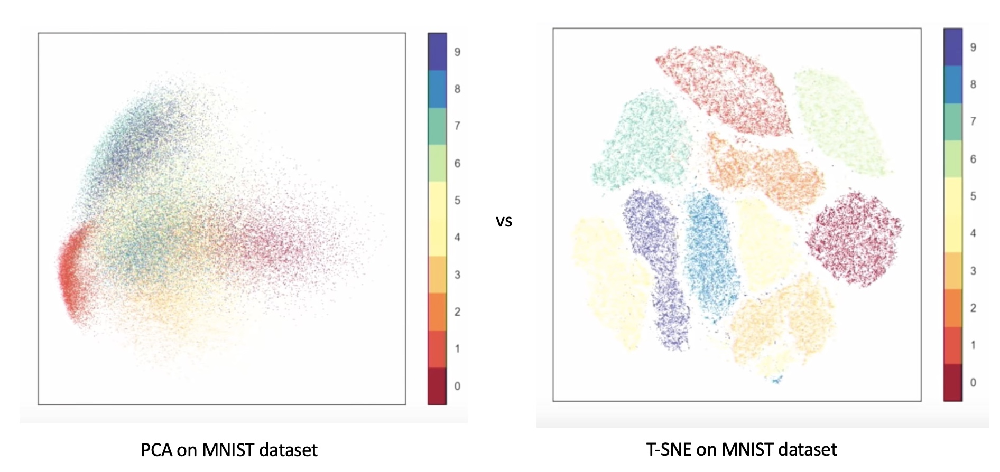
> Comparison of t-SNE and UMAP on MNIST dataset. (Image from [McInnes] talk)

As we can see, PCA retains some structure. However, it is very well pronounced in t-SNE, and clusters are more clearly separated. 

## Neighbour graphs 
[t-SNE] and [UMAP] are neighbor graph technique that models data points as nodes, with weighted edges representing the distance between the nodes. Through various optimizations and iterations, this graph and layout are tuned to best represent the data as the distance is derived from the "closeness" of the features of the data itself. This graph is then projected on reduced dimensional space a.k.a. embedded space. This is a very different technique than matrix factorization as employed by PCA, ICA for example.

## t-Distributed Stochastic Neighbor Embedding (t-SNE)

[t-SNE] uses Gaussian joint probability measures to estimate the pairwise distances between the data points in the original dimension. Similarly, the student's t-distribution is used to estimate the pairwise distances between the data points in the embedded space (i.e. lower dimension or target dimension). t-SNE then uses the gradient descent technique to minimize the divergence between the two distributions in original and embedded space using the Kullback-Leibler (KL) divergence technique.

`Perplexity` in t-SNE is effectively the number of nearest neighbors considered in producing the conditional probability measure. A larger perplexity may obscure small structures in the dataset while small perplexity will result in very localized output ignoring global information. Perplexity must be less than the size of data (number of data points) then; otherwise, we are looking at getting a blobby mass. The recommended range for perplexity lies between 5-50, with a more general rule that the larger the data, the larger the perplexity.

Because of the use of KL divergence, t-SNE preserves the local structure in the original space, however, global structure preservation is not guaranteed. Having said that, when initialization with PCA is applied, the global structure is somewhat preserved. 

Talking more about structures, the scale of distances between points in the embedded space is not uniform in t-SNE as t-SNE uses varying distance scales. That's why it is recommended to explore data under different configurations to tease out patterns in the dataset.
Learning rate and number of iterations are two additional parameters that help with refining the descent to reveal structures in the dataset in the embedded space. As highlighted in this great [distill][distill-tsne] article on t-SNE, more than one plot may be needed to understand the structures of the dataset.
>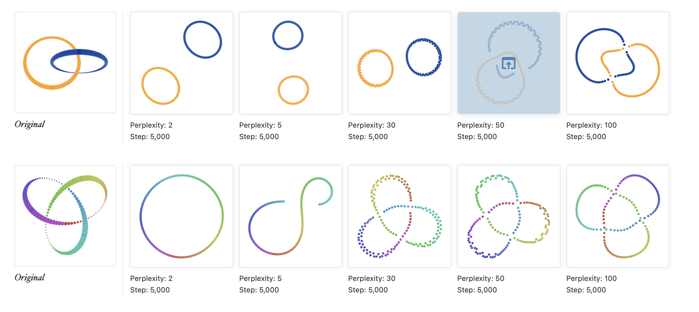
> Different patterns are revealed under different t-SNE configurations, as shown by [distill][distill-tsne] article. (Image from [distill][distill-tsne]).

t-SNE is known to be very slow with the order of complexity given by O(dN^2) where d is the number of output dimensions and  N is the number of samples. Barnes-Hut variation of t-SNE improves the performance [O(dN log N)] however Barnes-Hut can only work with dense datasets and provide at most 3d embedding space. The efficiency gain in Barnes-Hut is coming from changes in gradient calculation which are done with `O(n log n)` complexity, that uses approximation techniques which leads to about 3% error in nearest neighbor calculation.

Because of these performance implications, a common recommendation is to use PCA to reduce the dimension before applying t-SNE. This should be considered very carefully especially if the point of using t-SNE was to explore into non-linearity of the dataset. Pre-processing with linear techniques like PCA will destroy non-linear structures if present.

## Uniform Manifold Approximation and Projection [UMAP]

[UMAP] is based on pure combinatorial mathematics that is well covered in the [paper][UMAP] and is also well explained by author McInnes in his [talk][McInnes] and [library documentation](umap_doco) is pretty well written too. Similar to [t-SNE], [UMAP] is also a topological neighbor graph modeling technique. There are several differences b/w [t-SNE] and [UMAP] with the main one being that UMAP retains not only local but global structure in the data.

There is a great post that goes into detail about [how UMAP works][umap-understanding]. High level, UMAP uses combinatorial topological modeling with the help of simplices to capture the data and applies Riemannian metrics to enforce the uniformity in the distribution. Fuzzy logic is also applied to the graph to adjust the probability distance if the radius grows. Once the graphs are built then optimization techniques are applied to make the embedded space graph very similar to the original space one. UMAP uses binary cross-entropy as a cost function and stochastic gradient descent to iterate on the graph for embedded space. Both t-SNE and UMAP use the same framework to achieve manifold projections however implementation details vary. [Oskolkov]'s post covers in great detail the nuances of both the techniques and is an excellent read.

UMAP is faster for several reasons, mainly, it uses random projection trees and nearest neighbor descent to find approximate neighbors quickly.
As shown in the figure below, similar to t-SNE, UMAP also varies the distance density in the embedded space.
>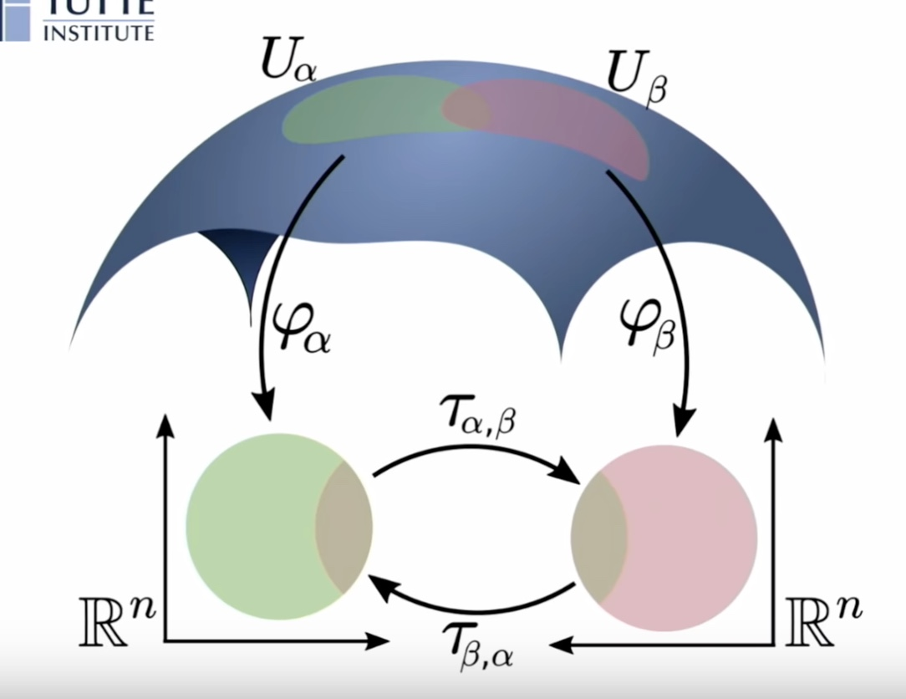
Manifold reprojection used by UMAP, as presented by [McInnes] in his talk.  (Image from [McInnes] talk)

Here's an example of UMAP retaining both local and global structure in embedded space:
>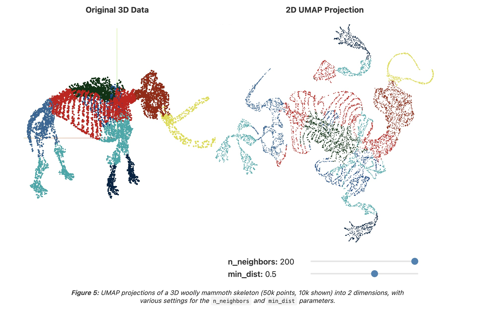
> Example of UMAP reprojecting a point-cloud mammoth structure on 2-D space. (Image provided by the author, produced using tool [1][umap-understanding])

Here's a side-by-side comparison of t-SNE and UMAP on reducing the dimensionality of a mammoth. As shown, UMAP retains the global structure but it's not that well retained by t-SNE. 
>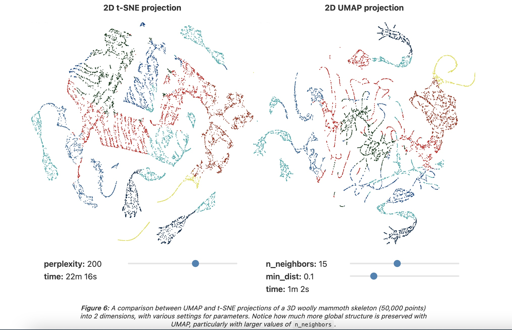
> Side by side comparison of t-SNE and UMAP projections of the mammoth data used in the previous figure. (Image provided by the author, produced using tool [1][umap-understanding]) 

The explanation for this difference lies in the loss function. As shown in the following figure, UMAP uses binary cross-entropy that penalizes both local (clumps) and global (gaps) structures. In t-SNE however, due to KL Divergence as the choice of the cost function, the focus remains on getting the clumps i.e. local structure right.

>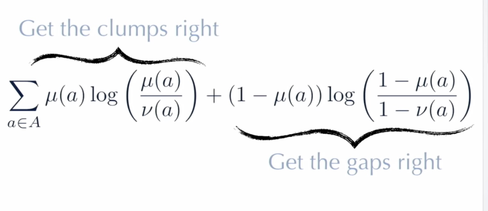
> Cots function used in UMAP as discussed in [McInnes] talk. (Image from [McInnes] talk)

The first part of the equation is the same in both t-SNE (coming from KL divergence) and UMAP. UMAP only has the second part that contributes to getting the gaps right i.e. getting the global structure right.

## Comparison table: t-SNE vs UMAP

| Characteristics                                   | t-SNE                                        | UMAP                                                 |
| ------------------------------------------------- | -------------------------------------------- | ---------------------------------------------------- |
| Computational complexity                          | O(dN^2)  (Barnes-Hut with O(dN log N) ) | O(d*n^1.14)  ([emprical-estimates] O(dN log N)) |
| Local structure preservation                      | Y                                            | Y                                                    |
| Global structure preservation                     | N  (somewhat when `init=PCA`)           | Y                                                    |
|                                                   |                                              |                                                      |
| Cost Function                                     | KL Divergence                                | Cross Entropy                                        |
| Initialization                                    | Random   (PCA as alternate)             | Graph Laplacian                                      |
| Optimization algorithm                            | Gradient Descent (GD)                        | Stochastic Gradient Descent (SGD)                    |
| Distribution for modelling distance probabilities | Student's t-distribution                     | family of curves (1+a*y^(2b))^-1                     |
| Nearest neighbors  hyperparameter                 | 2^Shannon entropy                            | nearest neighbor k                                   |

# Exploring dataset with t-SNE & UMAP

Now that we have covered theoretical differences, let's apply these techniques to a few datasets and do a few side-by-side comparisons between t-SNE and UMAP.

Source code and other content used in this exercise are available in this git repository - [feature_analysis]. The notebook for MNIST analysis is available [here](https://github.com/suneeta-mall/feature_analysis/blob/master/docs/MNIST_TSNE_vs_UMAP.ipynb). Likewise, the notebook for CIFAR analysis is available [here](https://github.com/suneeta-mall/feature_analysis/blob/master/docs/CIFAR10_TSNE_vs_UMAP.ipynb).

## Simple feature dataset like MNIST

The following figure reprojects MNIST image features on the 2D embedded space under different perplexity settings. As shown, increasing the perplexity, makes the local clusters very packed together. In this case, PCA based initialization technique was chosen because I want to retain the global structure as much as possible. 

>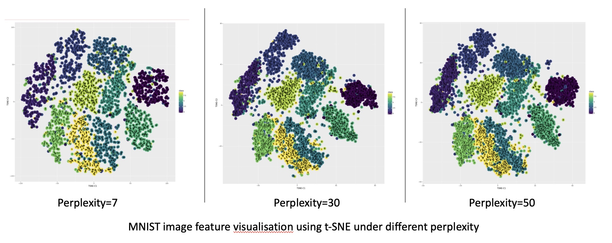
> Reprojection of MNIST image features on the 2D embedded space using t-SNE under different perplexity settings. (Image provided by author)

It's quite interesting to see that the digits that are packed close together are:
1. 7,9,4
2. 3,5,8
3. 6 & 0 
4. 1 & 2
5. That 6 is more close to 5 than 1 
6. Likewise 7 is closer to 1 than 0.

At a high level this co-relation makes sense, the features of the digits that are quite similar are more closely packed than digitals that are very different. Its also, interesting to note that 8 and 9 have anomalies that map closely to 0 in rare cases in embedded space. So what's going on? Following image overlays randomly selected images on the clusters produced by t-SNE @ perplexity of 50.

>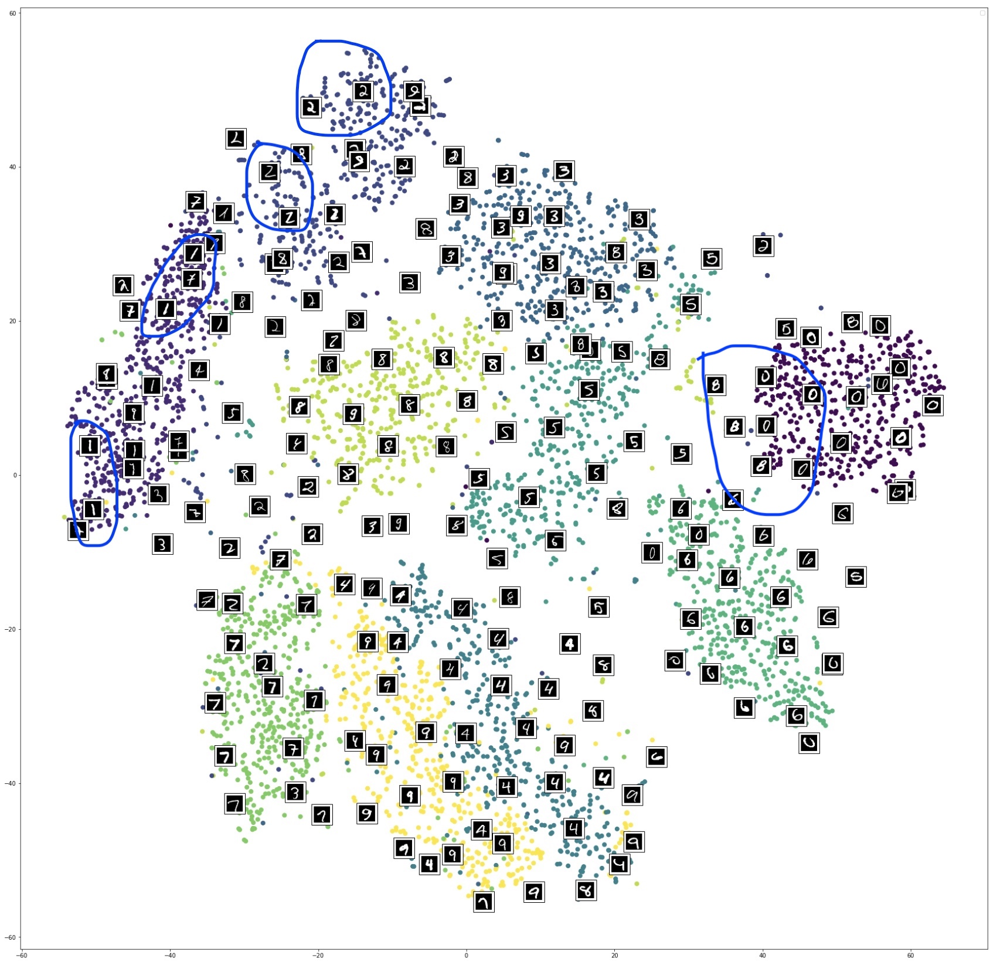
> Reprojection of MNIST image features on the 2D embedded space using t-SNE @ perplexity=50 with randomly selected image overlay. (Image provided by author)

As we pan around this image, we can see a distinct shift in the characteristics of the digits. For example, the 2 digits at the top are very cursive and have a round little circle at the joint of the two whereas as we travel to the lower part of the cluster of 2s, we can see how sharply written the bottom 2s are. The bottom 2s features are sharp angular joints. 
Likewise, the top part of the cluster of 1s is quite slanty whereas the bottom 1s are upright. 

It's quite interesting to see that the 8's occasionally clustered together with 0's are quite round in the middle and do not have the sharp joint in the middle. 

So, what does MNIST data look like with UMAP? UMAP's embedded space also reflects the same grouping as discussed above. In fact, UMAP and t-SNE clustering in terms of digits grouping are very much alike. It appears to me that UMAP and t-SNE are mirror reflections when it comes to how digits are grouped. 

>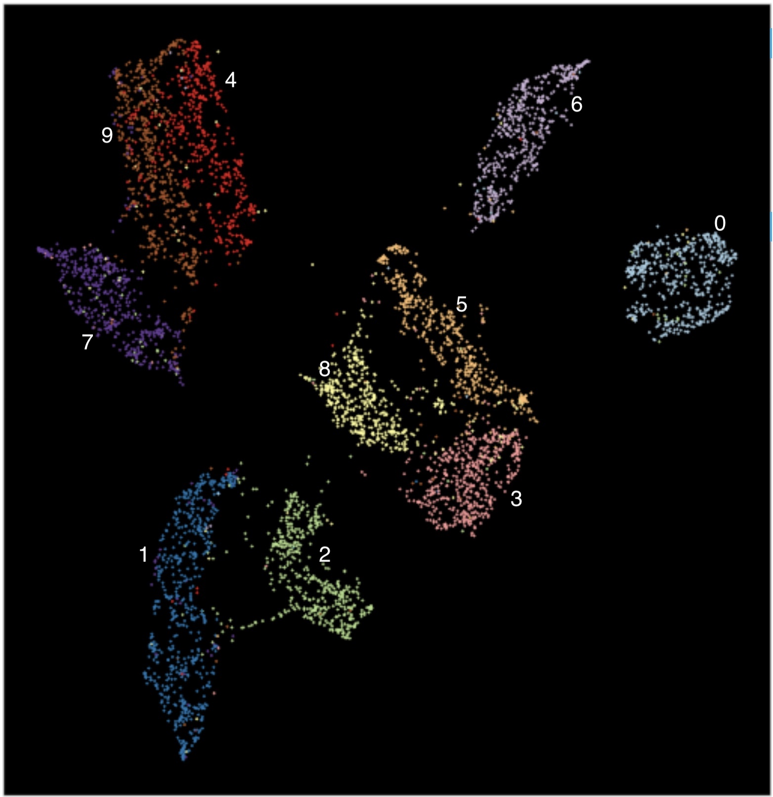
> Reprojection of MNIST image features on the 2D embedded space using UMAP. (Image provided by author)

It's also very interesting to note how similar-looking 1s are that are reprojected to the same coordinates in the embedded space.

>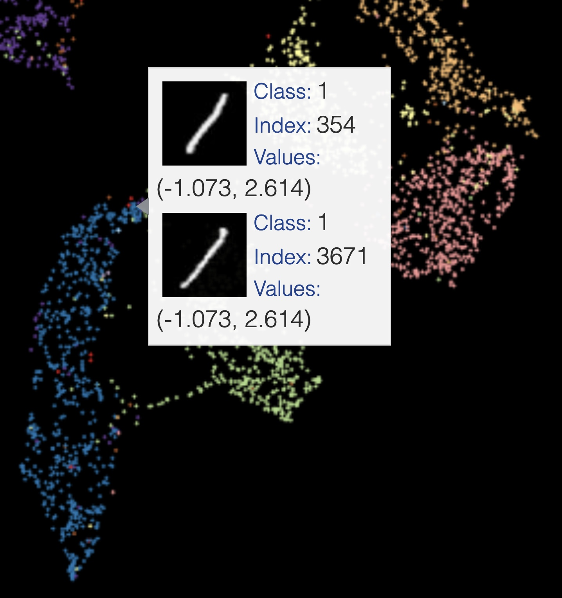
> One example of samples that get reprojected to the same coordinates in the embedded space using UMAP. (Image provided by author)

Not all the data points that collide in embedded space will look exactly similar, the similarity is more in the reduced dimensional space. One such example is shown below. Here 1 and 0 are reprojected to the same coordinates. As we can see the strokes on the left side of 0 are very similar to strokes of 1. The circle of zero is not quite complete either. 

>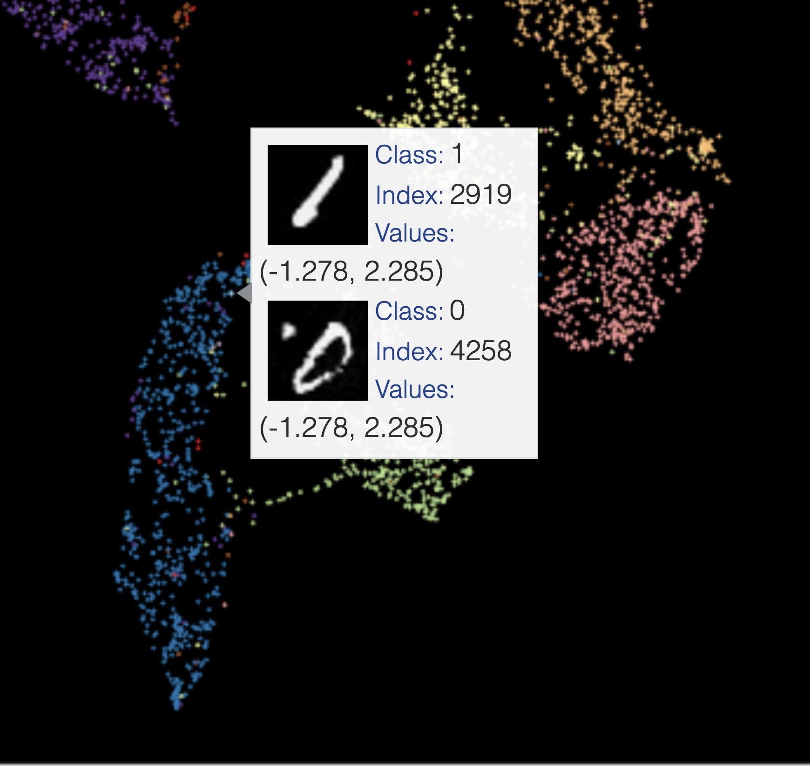
> One example of two different digits getting reprojected to the same coordinates in the embedded space using UMAP. (Image provided by author)

Here's also an example of samples falling into the same neighborhood in the embedded space that look quite distinct despite sharing some commonality (the strokes around the mouth of 4 and incomplete 8s)! 
>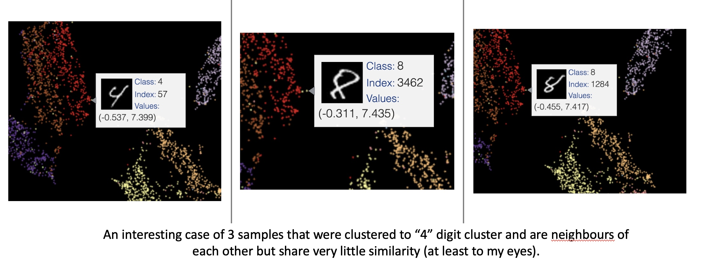
> Example of 4 and 8s reprojected to the nearby coordinates in the embedded space using UMAP. (Image provided by author)

Its unpredictable what tangible features have been leveraged to calculate the similarities amongst data points in the embedded space. This is because the main focus of MLAs has been distance measures and the embedded space is derived based on best effort using unsupervised techniques with evident data loss (due to dimensionality reduction).  

This was MNIST, where digits are captured with empty backgrounds. These are very easy cases because all the signals in the feature vectors are true signals that correspond to the digit as its drawn. When we start talking about visualizing data where there are noises in the signals then that case poses certain challenges. For example, taking the case of [cifar](https://www.cs.toronto.edu/~kriz/cifar.html) dataset, the images of things are captured with a varying background as they are all-natural images unlike MNIST with a black background. In the following section, let's have a look at what happens when we apply t-SNE and UMA to the CIFAR dataset.

>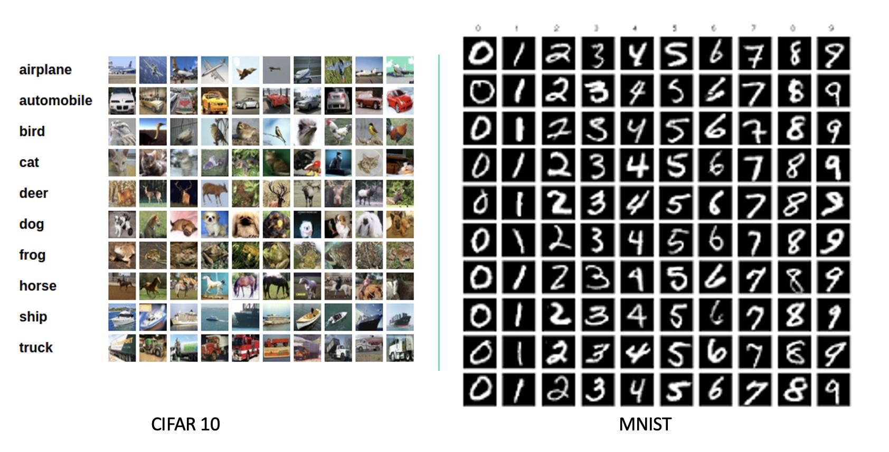
> High-level differences between [cifar](https://www.cs.toronto.edu/~kriz/cifar.html) and MNIST dataset. (Image provided by author)

## More complex datasets like CIFAR

The following figure shows the resultant embedding of CIFAR images after applying UMAP. As shown below results are less than impressive to delineate amongst CIFAR classes or perform any sort of features analysis. 
>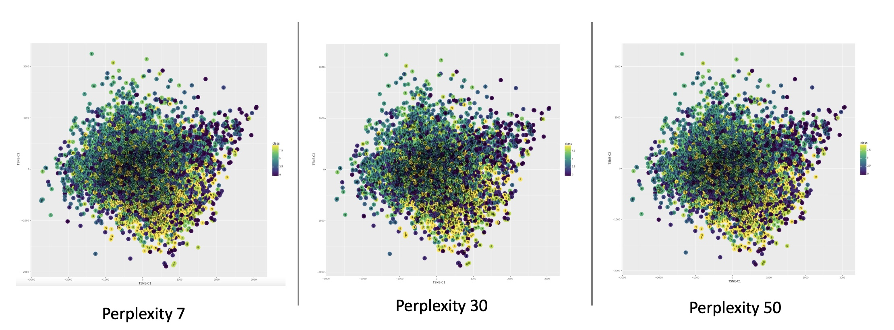
> Results of CIFAR image feature visualization using t-SNE under different perplexity settings. (Image provided by author)

So, what's going on? Let's overlay the images and see if we can find some patterns and make sense of the one big lump we are seeing. The following figure overlays the image. It's really hard to find a consistent similarity between neighboring points. Often we see cars and vehicles nearby but not consistently. They are intermixed with flowers and other classes. It's simply too much noise in the feature vector to do any meaningful convergence. 
>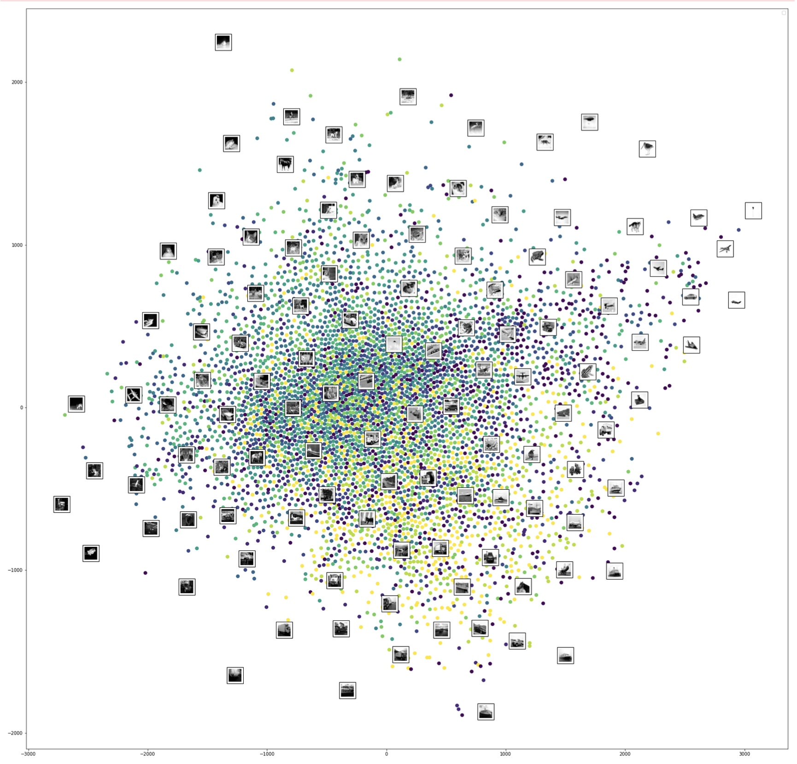
> Results of CIFAR image feature visualization using t-SNE. Shows images in an overlay on randomly selected points. (Image provided by author)

In the above two figures, we looked at analyzing CIFAR with t-SNE. The following plot is produced by using UMAP. As we can see it's not convincing either. Much like t-SNE, UMAP is also providing one big lump and no meaningful insights. 

>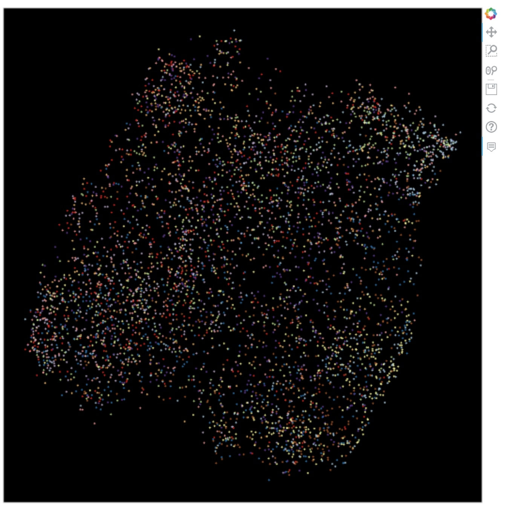
> Results of CIFAR image feature visualization using UMAP. (Image provided by author)

Following show images of 2 cats that are projected to the same location in embedded space. There is some similarity between the two images like nose, and sharp ears obviously but also the two images have varying distinct features.

>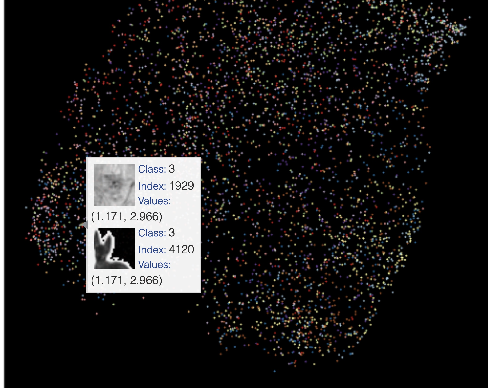
> Results of CIFAR image feature visualization using UMAP showing samples of cats that are reprojected into the same located in the embedded space. (Image provided by author)

Likewise, if we look at the following figure where deer and frog are co-located in embedded space, we can see the image texture is very similar. This texture however is the result of normalization and grayscale conversion. As we can see, a lot goes on in nature scenes and without a clear understanding of which features to focus on, one's features can be other's noise. 
>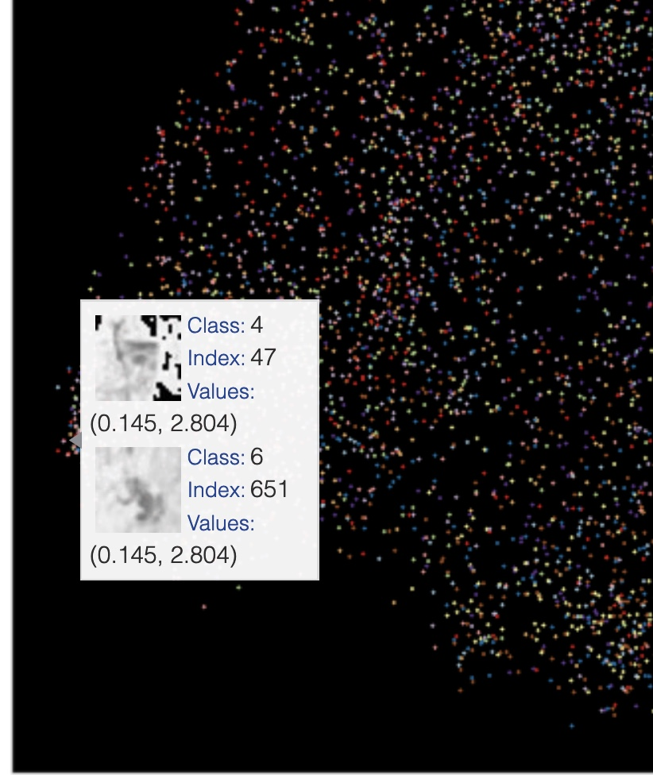
> Results of CIFAR image feature visualization using UMAP. Shows images in an overlay on randomly selected points. (Image provided by author)

t-SNE and UMAP are feature visualization techniques and perform best when the data vector represents the feature sans noise. 

## What to do when there is noise in features?

So, what can we do if there are noises in our feature vectors? We can apply techniques that reduce noises from feature vectors before applying manifold learning algorithms. Given the emphasis on nonlinearity in both t-SNE and UMAP (to preserve nonlinear features), it is better to choose a noise reduction technique that is nonlinear. 

[Autoencoder][deeplearning_book] is a class of unsupervised deep learning techniques that learns the latent representation of the input dataset eliminating noises. Autoencoder can be non-linear depending on the choices of layers in the network. For example, using a convolution layer will allow for non-linearity. If noises are present in the feature vector then an autoencoder can be applied to learn latent features of a dataset and to transform samples to noise-free samples before applying manifold algorithms. [UMAP] has native integration with Tensorflow for similar use cases that is surfaced as [parametric UMAP]. Why parametric because autoencoders/neural networks are parametric! i.e. increasing data size will not increase parameters - the parameters may be large but will be fixed and limited. This approach of transforming input feature vectors to the latest representation not only helps with noise reduction but also with complex and very high dimensional feature vectors. 

The following figure shows the results of applying autoencoder before performing manifold algorithm t-SNE and UMAP for feature visualization. As we can see in the result, the clumps are much more compact and the gaps are wider. The proximity of MNIST classes remains unchanged, however - which is very nice to see.

>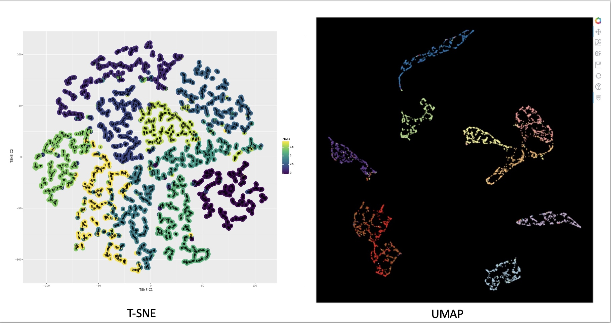
> Results of applying autoencoder on MNIST before applying manifold algorithm t-SNE and UMAP. (Image provided by author)

So how does it affects the features that contribute to proximities/neighborhood of data? The manifold algorithm is still the same however it's now applying on latent feature vector as produced by autoencoders and not raw features. So effectively, the proximity factor is now calculated on latent representation and not directly on perceptible features. Given the digit clusters are still holding global structure and it's just more packed together within the classes, we can get the sense that it's doing the right things if intra-class clumps can be explained. Let's look at some examples. The following shows a reprojection in the embedded space where 4,9 and 1 are clustered together into larger clusters of 1s. If we look closely the backbone of all these numbers is slanting at about 45 degrees and perhaps that has been the main driving factor. The protruding belly of 4 and 9 are largely ignored but also they are not very prominent. 

>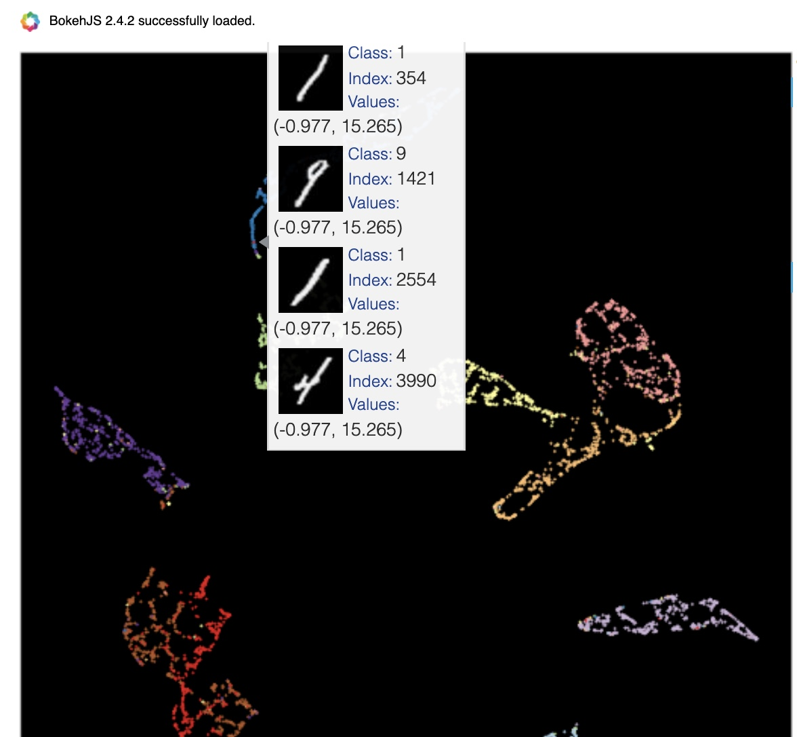
> Example of co-located 1s, 4 & 9 in embedded space obtained by applying Paramertic UMAP on MNIST. (Image provided by author)

More importantly, looking at the dataset (in the following figure), there are not as many 9s or 4s that have a backbone at that steep slant of 45 degrees. This is more easily shown in the full-scale overlay in the following figure (sparsely chosen images to show to make it more comprehensible). We can see all samples are upright 4s and 9s where there is a slant the protrusion is more prominent. Anyhow, we don't need to get overboard with this as manifold algorithms are not feature detection algorithms and certainly can't be compared to the likes of more powerful feature extraction techniques like convolution. The goal with manifold is to find global and local structures in the dataset. These algorithms work best if signals in datasets are noise-free where noise includes features/characteristics we want ignored in the analysis. A rich natural background is a very good case of noise as shown already in the CIFAR case.

>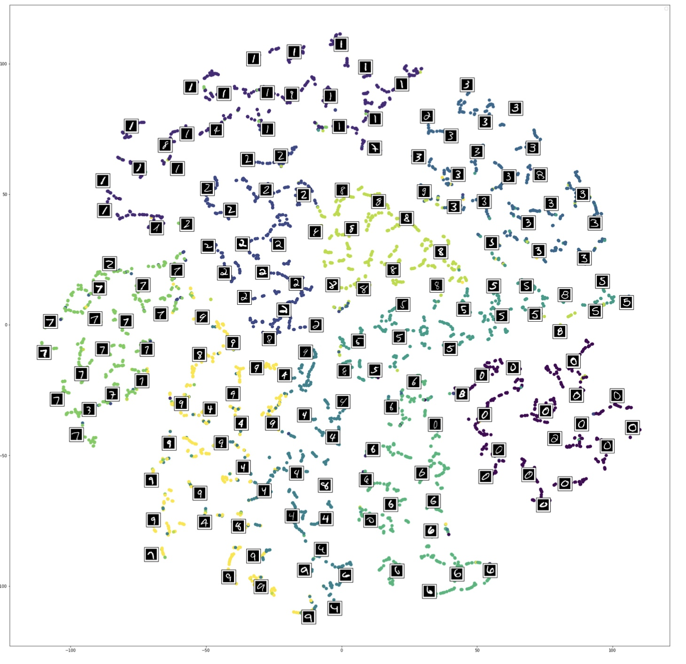
> Images overlaid on t-SNE of auto-encoded features derived from MNIST dataset. (Image provided by author)

## how to do this for multi-label 

In the early day of learning about this, I found myself wondering how would we do the feature analysis on a multi-label dataset? Multi-class is certainly the easy case - each sample only needs to be color-coded for one class so is easy to visualize. We are also expecting class-specific data to be clumped together mostly (perhaps not always and depends on intent but may be more commonly).

If multi-label data consists of exclusive classes similar to [Satnford Cars Dataset](https://ai.stanford.edu/~jkrause/cars/car_dataset.html) where options within the make and the models of cars are mutually exclusive, then splitting the visualization to the group of exclusive cases could be very helpful. 

However, if the multi-label dataset is more alike [MLRSNet](https://paperswithcode.com/dataset/mlrsnet) where classes are independent then it's best to first analyze the data class agnostic and explore if there are any patterns in features and proceed based on this.

# Can we apply this to understand what neural networks are doing?

A lot of work has been done in the area of explainability and feature understanding that is very well documented in [distill] blogs. The underlined idea is that we can take the activation of the layers of the neural network and explore what features it is that that particular layer is paying attention to. The activations are essentially the signal that is fired for a given input to the layer. These signals then formulate the feature vector for further analysis to understand where and what the layer is paying more attention to. T-SNE and UMAP are heavily used in these analyses. 

The [distill] blogs are very well documented and highly recommended for reading if this is something that is of interest to you.

## Conclusion

This post was focused on the fundamentals of manifold learning algorithms, and diving into the details of t-SNE and UMAP. This post also compared and contrasted t-SNE and UMAP and presented some analysis of MNIST and CIFAR datasets. We also covered what to do if we have a very high dimensional dataset and also if we have noises in the dataset. Lastly, we touched on what to do if your dataset is multi-label. 

In the follow-up, I will cover how we can utilize t-SNE and UMAP to better understand what neural networks are doing and apply it in conjunction with convolutions as feature extractors. 

[t-SNE]: https://lvdmaaten.github.io/publications/papers/JMLR_2008.pdf
[UMAP]: https://arxiv.org/abs/1802.03426
[tsne-illustrated]: https://www.oreilly.com/content/an-illustrated-introduction-to-the-t-sne-algorithm/
[distill-tsne]: https://distill.pub/2016/misread-tsne/
[tsne-paper]: https://lvdmaaten.github.io/publications/papers/JMLR_2008.pdf
[tsne-author]: https://lvdmaaten.github.io/tsne/
[karapathy]: https://cs.stanford.edu/people/karpathy/cnnembed/
[datascienceplus]: https://datascienceplus.com/multi-dimensional-reduction-and-visualisation-with-t-sne/
[tricks-to-tsne]: https://towardsdatascience.com/why-you-are-using-t-sne-wrong-502412aab0c0
[McInnes]: https://www.youtube.com/watch?v=nq6iPZVUxZU
[tsne-utube]: https://www.youtube.com/watch?v=RJVL80Gg3lA&list=UUtXKDgv1AVoG88PLl8nGXmw
[emprical-estimates]: https://github.com/lmcinnes/umap/issues/8
[umap-understanding]: https://pair-code.github.io/understanding-umap/index.html
[Oskolkov]: https://towardsdatascience.com/how-exactly-umap-works-13e3040e1668
[umap_doco] https://umap-learn.readthedocs.io/en/latest/how_umap_works.html
[deeplearning_book]: https://www.deeplearningbook.org/contents/autoencoders.html
[parametric UMAP]: https://umap-learn.readthedocs.io/en/latest/parametric_umap.html
[feature_analysis]: https://github.com/suneeta-mall/feature_analysis 
[distill]: https://distill.pub/2019/activation-atlas/