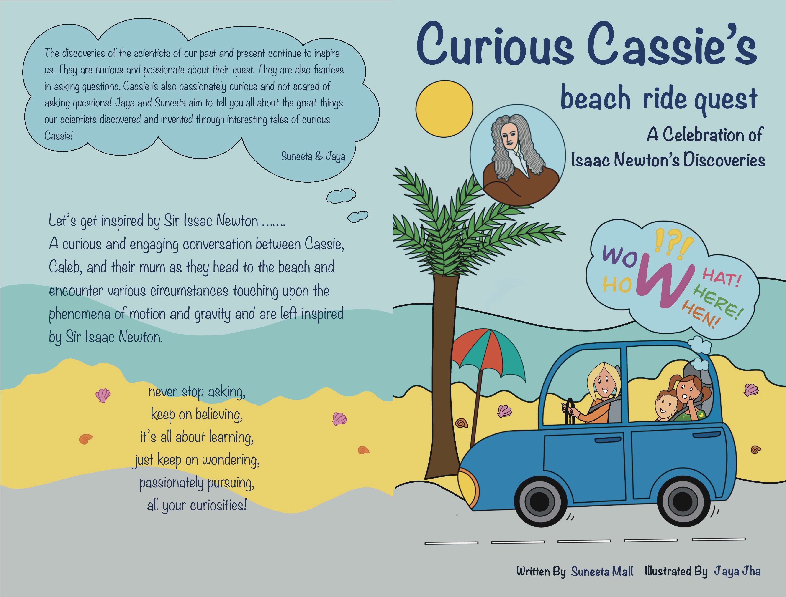

# Launch of Curious Cassie's Beach Ride Quest

We are thrilled to announce the launch of Curious Cassie's Beach Ride Quest - an exciting concept book from the beloved Curious Cassie series!

## Curious Cassie's Beach Ride Quest

Join Cassie, Caleb, and their mom on an extraordinary adventure to the beach. Along the way, they will encounter fascinating situations that explore the wonders of motion and gravity, leaving them inspired by the genius of Sir Isaac Newton.

**Title**: Curious Cassie's Beach Ride Quest: A Celebration of Isaac Newton's Discoveries

**Genre**: Children’s Fiction (picture books, junior fiction)

**Publication Date**: 2023-11-12

You might also enjoy reading [ChatGPT vs Me: As a Children's Author](blog/2023/01/07/chatgpt-vs-me-as-a-childrens-author/)

**Get your copy now**:

Curious Cassie's Beach Ride Quest is available through [Ingram](https://www.ingramspark.com/). You can find it at your favorite book retailer. Here are direct links to Amazon:

[:fontawesome-brands-aws: - Amazon](https://www.amazon.com/dp/B0BPQQPYD8) | [:fontawesome-brands-aws: - Amazon AU](https://www.amazon.com.au/dp/B0BPQQPYD8)

## Stay Connected!
Connect with Cassie:
[:fontawesome-solid-envelope:](mailto:curious.cassie.series@gmail.com) | [:fontawesome-solid-web:](https://curiouscassie.github.io) | [:fontawesome-brands-x-twitter:](https://twitter.com/CuriousCassie22)

