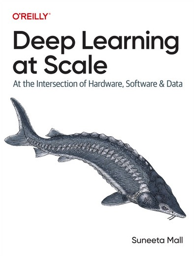

# Launch of Deep Learning at Scale - An O'Reilly Book

I am thrilled to announce the release of "Deep Learning at Scale: At the Intersection of Hardware, Software, and Data" - an O'Reilly Book"! I have been working on this project for over 2 years.

> "Deep Learning at Scale: At the Intersection of Hardware, Software, and Data" (O'Reilly) illustrates complex concepts of full-stack deep learning and reinforces them through hands-on exercises to equip you with tools and techniques to scale your project. Scaling efforts are only beneficial when they are effective and efficient. To that end, this guide explains the intricate concepts and techniques that will help you scale effectively and efficiently.

## **Order your copy today**

To order your copy, use the following links based on your preferred format:

!!! note Kindle
[:fontawesome-brands-aws: - Amazon](https://www.amazon.com/dp/B0D7F9KZWC) | [:fontawesome-brands-aws: - Amazon AU](https://www.amazon.com.au/dp/B0D7F9KZWC)

!!! note Paperback
[:fontawesome-brands-aws: - Amazon](https://www.amazon.com/dp/1098145283) | [:fontawesome-brands-aws: - Amazon AU](https://www.amazon.com.au/dp/1098145283)

Alternatively, you can access the book using the 30-day trial link:

!!! note "30 Days trial access by O'Reilly Media"
[30 days trial - :fontawesome-solid-briefcase:](https://oreillymedia.pxf.io/c/5668688/2121843/15173)

## More info

For more information, see details in the [project](/projects/oreilly_deep_learning_at_scale/)
