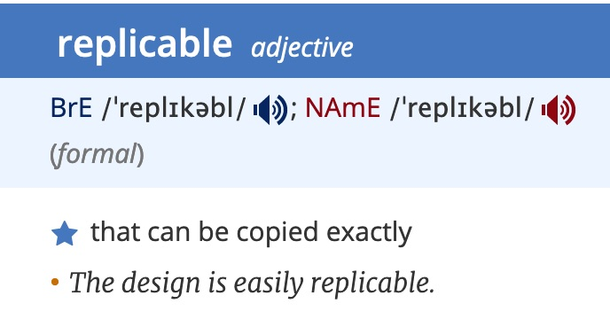

# Replicability - an extension to reproducibility

This is [Part 3] - **End-to-end reproducible Machine Learning pipelines on Kubernetes** of technical blog series titled [Reproducibility in Machine Learning]. [Part 1] & [Part 2] can be found [here][Part 1] & [here][Part 2] respectively.

## Part 1: Reproducibility in Machine Learning - Research and Industry

## Replicability and 

The research community is quite divided when it comes to defining reproducibility and often mixes it up with replicability 

*Figure 4: Replicability defined*

[Reproducibility in Machine Learning]: /2019/12/20/Reproducibility-in-Machine Learning.html
[Part 1]: /2019/12/21/Reproducible-ml-research-n-industry.html
[Part 2]: /2019/12/22/Reproducible-ml-tensorflow.html
[Part 3]: /2019/12/23/Reproducible-ml-pipeline-k8s.html