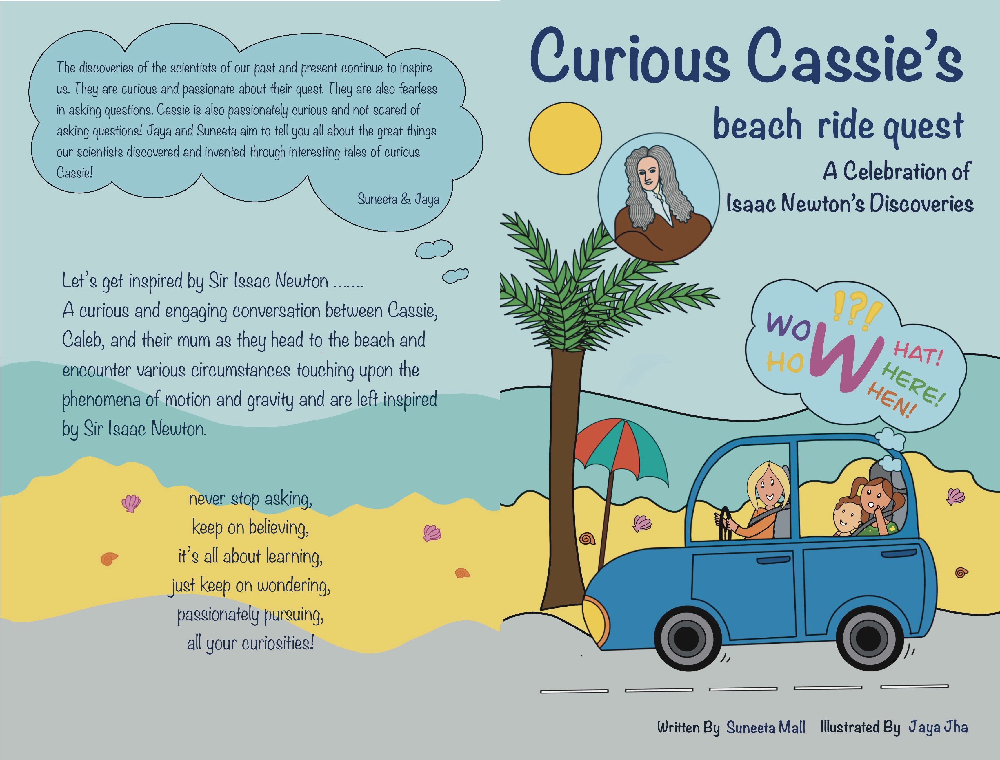

# Curious Cassie Book Series

*Curious Cassie* is a captivating book series designed for young readers who are embarking on their journey of independent reading. These books weave fascinating tales about the remarkable discoveries made by scientists, igniting curiosity
and inspiring courage to pursue their own quests! The scientists of the past and present continue to inspire us with their insatiable curiosity and unwavering passion for knowledge.

As the great scientist [Albert Einstein](https://en.wikipedia.org/wiki/Albert_Einstein) once said:
> "I have no special talent. I am only passionately curious!"

## Inspiration

The [contributors of the Curious Cassie books](https://curiouscassie.github.io/) are dedicated to sharing the incredible achievements of scientists and inventors through a series of interesting stories. Both Suneeta and Jaya, the author and illustrator respectively, recognize the need for more books that ignite curiosity in children and encourage them to ask questions and embark on their own intellectual journeys. With their deep connection to science and engineering, they believe that there are better ways to introduce STEM concepts to children aged 6-8, inspiring them through the stories of great scientists and philosophers throughout history.

The Curious Cassie book series aims to do just that. Cassie, a 6-year-old with an insatiable curiosity, fearlessly asks questions and embarks on exciting adventures with her family. Each book in the series is dedicated to a scientist, exploring their discoveries through engaging conversations and captivating storytelling.

The important message that Jaya and Suneeta want to convey is:

 

Never stop asking,

Keep on believing,

It's all about learning,

Just keep on wondering,

Passionately pursuing,

All your Curiosities!

 

## Contributors

Jaya and Suneeta are the creative minds behind Curious Cassie! In August 2022, they were driving through a motorway discussing how electronic devices, such as phones and tablets, are taking away the "think" time from our kids - the time when they become curious and go on explorations. That's when they planted the seed of this book series, aiming to inspire future generations by showcasing the brilliance of scientists and philosophers from the past and present ♥‿♥!

### Suneeta Mall - Author

Suneeta feels the need for more books that spark curiosity in kids and encourage them to ask questions and pursue their quests. Being closely connected to science and engineering, she believes there are better ways to introduce STEM concepts to children aged 6-8, inspiring them through the stories of great scientists and philosophers throughout history. This is where Curious Cassie comes in.

### Jaya Jha - Illustrator

Jaya is passionate about education and the arts. She is a software developer by profession and is inspired by the questions of her 7-year-old twin daughters. She believes that maintaining the inquisitiveness of young children and providing them with suitable resources is crucial. It brings her immense joy to teach children about numbers or how things work. When her friend Suneeta came up with the idea for this book, Jaya immediately wanted to be a part of it because, for her, this book is the perfect combination of teaching children STEM concepts and visually representing those concepts.

You can find Jaya on: 
[LinkedIn](https://www.linkedin.com/in/jaya-gajjar-39767917/) | [Twitter](https://twitter.com/jaya_jha)| [Instagram](https://www.instagram.com/jayajha/)

## Books in the Curious Cassie Series

### 1. Curious Cassie's Beach Ride Quest

**Title**: Curious Cassie's Beach Ride Quest: A Celebration of Isaac Newton's Discoveries 

**Genre**: Children's Fiction (picture books, junior fiction)

**Publication date**: 11-12-2022

Join Cassie, Caleb, and their mom on an exhilarating journey to the beach, where they encounter various situations that explore the wonders of motion and gravity, leaving them inspired by the genius of Sir Isaac Newton.

## **Order your copy today**

Curious Cassie's Beach Ride Quest is available through [Ingram](https://www.ingramspark.com/). You can find it at your favorite book retailer. Here are direct links to Amazon:

[:fontawesome-brands-aws: - Amazon](https://www.amazon.com/dp/B0BPQQPYD8) | [:fontawesome-brands-aws: - Amazon AU](https://www.amazon.com.au/dp/B0BPQQPYD8)

## You might also like!

To find out more about this project and the launch of the first book in this series, see this [post](/blog/2023/11/12/launch-of-curious-cassies-beach-ride-quest/). You might also enjoy this tongue-in-cheek article [ChatGPT vs Me: As a Children's Author](/blog/2024/01/07/chatgpt-vs-me-as-a-childrens-author/).
