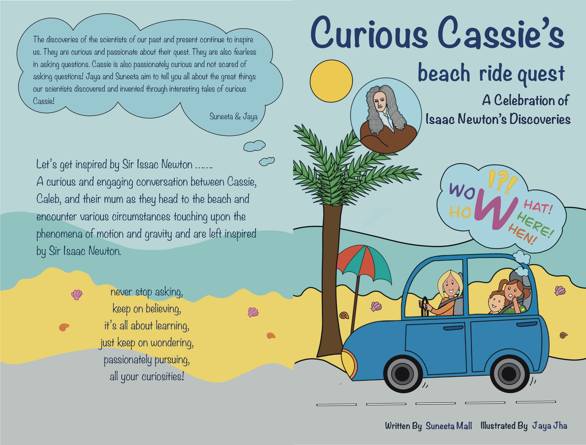

# Curious Cassie Book Series

> *Never stop asking, Keep on believing,
> It's all about learning, Just keep on wondering,
> Passionately pursuing, All your Curiosities!*

---

## Mission & Vision

*Curious Cassie* is a children's chapter book series (ages 6-8) that celebrates scientific discovery through the adventures of Cassie, an endlessly curious 6-year-old who fearlessly asks questions and explores the world around her. Each book honors a pioneering scientist, weaving their discoveries into engaging narratives that inspire young readers to embrace curiosity, courage, and critical thinking.

In an era where passive digital entertainment increasingly dominates childhood, this series offers an alternative: active, imaginative engagement with the stories of scientists and philosophers who shaped our understanding of the world. The goal is not just to teach facts, but to spark wonder and normalize the act of questioning.

As [Albert Einstein](https://en.wikipedia.org/wiki/Albert_Einstein) once said:
> "I have no special talent. I am only passionately curious!"

---

## Series Status & Roadmap

### ✅ Published

#### Book 1: Curious Cassie's Beach Ride Quest

**Status:** Published December 2022
**Scientist Featured:** Isaac Newton
**Themes:** Motion, gravity, forces, observation

{ align=left width=200 style="margin-right: 2rem; margin-bottom: 1rem; border-radius: 8px; box-shadow: 0 2px 8px rgba(0,0,0,0.1);" }

Join Cassie, Caleb, and their mom on an exhilarating journey to the beach, where they encounter various situations that explore the wonders of motion and gravity, leaving them inspired by the genius of Sir Isaac Newton.

**Available at:**
[:fontawesome-brands-aws: Amazon US](https://www.amazon.com/dp/B0BPQQPYD8) | [:fontawesome-brands-aws: Amazon AU](https://www.amazon.com.au/dp/B0BPQQPYD8)

**Preview:** [Sample PDF](../resources/curious_cassie/Curious%20Cassie's%20beach%20ride%20quest-%20A%20Celebration%20of%20Isaac%20Newton's%20Discoveries.pdf)

---

### 🚧 In Development

#### Curious Cassie 2.0 Evolution

The series is being reimagined with enhanced storytelling techniques and AI-augmented creative processes. This evolution focuses on:

- **Deeper narrative engagement** - Enhanced plot structure, pacing, and emotional resonance
- **Curiosity triggers** - Strategic moments that prompt questions and wonder
- **Multi-sensory elements** - Exploring audio, interactive, and visual enhancements
- **Iterative refinement** - Applying editorial feedback loops informed by early readers

**Read more:** [Curious Cassie 2.0: Revolutionizing Children's Education Through AI-Powered Storytelling](../blog/posts/2025-05-10-cassie-2.0.md)

---

### 💭 Future Books

The series envisions celebrating additional scientific pioneers:

#### Book 2: Curious Cassie's Harbour Quest
**Scientist Featured:** Emma Johnston
**Focus:** Marine Science and Buoyancy

A Discovery of Marine Science and Buoyancy featuring Emma Johnston, a renowned Australian marine biologist and President of Science & Technology Australia. Join Cassie and Caleb as they explore the wonders of ocean life and the science of floating and sinking.

**Status:** In planning

#### Book 3: Cassie, Caleb, and the Magic of YET
**Scientist Featured:** Dr. Carol S. Dweck
**Focus:** Growth Mindset and Learning

A Growth Mindset Adventure featuring Dr. Carol S. Dweck, a scientist at Stanford University whose research revolutionized how we understand learning and achievement. This book explores the power of "yet"—the idea that we may not know something *yet*, but we can learn it.

**Status:** In planning

#### Book 4-5: Additional Pioneers
Celebrating discoveries across physics, biology, chemistry, and beyond.

---

The roadmap prioritizes quality over speed—each book undergoes careful development to ensure it sparks genuine curiosity and delivers meaningful learning experiences.

---

## Meet the Character

### Cassie - The Curious Explorer

Cassie is a 6-year-old with boundless curiosity and courage to ask "why?" and "how?" She approaches the world with wonder, turning everyday experiences into opportunities for discovery. Through her adventures with family and friends, young readers learn that asking questions isn't just acceptable—it's how we understand our world.

!!! note "Gallery Coming Soon"
    Character illustrations, behind-the-scenes artwork, and visual development materials will be added here as the series evolves.

---

## The Creative Team

### Suneeta Mall - Author

As both an ML/AI engineering leader and children's book author, Suneeta brings a unique perspective to STEM education for young readers. Her technical background informs her approach to explaining scientific concepts accessibly, while her experience as a mother shapes the authentic parent-child dynamics in the stories.

The *Curious Cassie* series emerged from a simple observation: children need more resources that spark genuine curiosity rather than just delivering information. By celebrating the stories of scientists—flawed, curious humans like the rest of us—these books aim to normalize intellectual exploration and questioning.

### Jaya Jha - Illustrator

Jaya is a software developer and passionate educator inspired by her twin daughters' endless questions. She believes in nurturing children's natural inquisitiveness through visual storytelling that makes abstract concepts concrete and engaging. For Jaya, illustration isn't decoration—it's a teaching tool that helps young minds grasp complex ideas through imagery.

**Connect with Jaya:**
[LinkedIn](https://www.linkedin.com/in/jaya-gajjar-39767917/) | [Twitter](https://twitter.com/jaya_jha) | [Instagram](https://www.instagram.com/jayajha/)

### The Origin Story

In August 2022, during a motorway drive, Suneeta and Jaya discussed how electronic devices were consuming "think time"—those moments when children's minds wander, wonder, and form questions. From that conversation emerged the vision for *Curious Cassie*: a book series that reclaims space for curiosity, featuring scientists and philosophers who exemplify the power of questioning.

Three years later, the series continues to evolve, balancing the realities of professional demands with the passion for inspiring young minds.

---

## Beyond the Books

### Blog Posts & Reflections

- **[Launch Announcement: Beach Ride Quest](../blog/posts/2023-11-15-Curious-Cassie.md)** - Introducing the series and Book 1
- **[ChatGPT vs Me: As a Children's Author](../blog/posts/2024-01-07-ChatGPT_vs_me_kids_book_author.md)** - Exploring AI's role in creative children's literature
- **[Cassie 2.0 Vision](../blog/posts/2025-05-10-cassie-2.0.md)** - The future of the series with AI-augmented storytelling

### Educational Use

Educators and parents are welcome to use *Curious Cassie* books to:

- Introduce scientific concepts through storytelling
- Spark discussions about observation and questioning
- Encourage independent reading for ages 6-8
- Model curiosity-driven learning

---

## Learn More

- **Official Website:** [curiouscassie.github.io](https://curiouscassie.github.io/)
- **Purchase Book 1:** Available through [Ingram distribution](https://www.ingramspark.com/) and major retailers
- **Contact:** For educator inquiries, bulk orders, or collaboration opportunities, reach out via [email](mailto:suneetamall@gmail.com)

---

## The Philosophy

These books don't pretend science is easy or that scientists were perfect. They show that curiosity, persistence, and asking questions—even "silly" ones—are how we learn about the world. Cassie makes mistakes, gets confused, and sometimes asks questions her parents can't immediately answer. That's intentional.

The goal isn't to create child prodigies who memorize facts. It's to nurture children who ask "why?", observe their surroundings, and believe that understanding the world is both possible and exciting.

Because as every scientist knows: the best discoveries start with a curious question.

---

*This project represents the intersection of technical expertise, creative storytelling, and a genuine belief that children's natural curiosity deserves celebration, not just management.*
