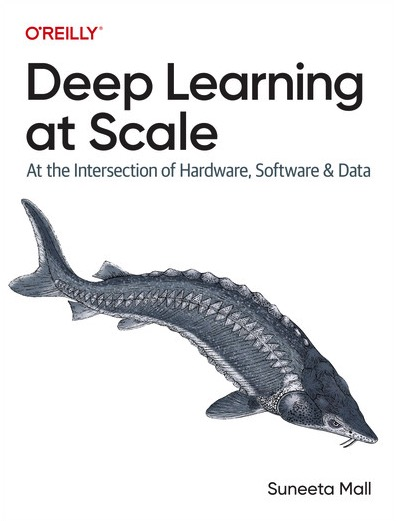

# Deep Learning at Scale - An O'reilly Book

Bringing a deep-learning project into production at scale is quite challenging. To successfully scale your project, a foundational understanding of full stack deep learning, including the knowledge that lies at the intersection of hardware, software, data, and algorithms, is required.

This book "Deep Learning at Scale: At the Intersection of Hardware, Software, and Data" illustrates complex concepts of full stack deep learning and reinforces them through hands-on exercises to arm you with tools and techniques to scale your project. A scaling effort is only beneficial when it's effective and efficient. To that end, this guide explains the intricate concepts and techniques that will help you scale effectively and efficiently.

You'll gain a thorough understanding of:

* How data flows through the deep-learning network and the role the computation graphs play in building your model
* How accelerated computing speeds up your training and how best you can utilize the resources at your disposal
* How to train your model using distributed training paradigms, i.e., data, model, and pipeline parallelism
* How to leverage PyTorch ecosystems in conjunction with NVIDIA libraries and Triton to scale your model training
* Debugging, monitoring, and investigating the undesirable bottlenecks that slow down your model training
* How to expedite the training lifecycle and streamline your feedback loop to iterate model development
* A set of data tricks and techniques and how to apply them to scale your training model
* How to select the right tools and techniques for your deep-learning project
* Options for managing the compute infrastructure when running at scale

## Github Repository

[Deep Learning At Scale](https://www.oreilly.com/library/view/deep-learning-at/9781098145279/) is an O'Reilly book that provides a wide range of hands-on examples and practice code. You can find the code base for this book on [GitHub](https://github.com/suneeta-mall/deep_learning_at_scale).

## **Order your copy today**

Deep Learning at Scale" (O'Reilly) illustrates complex concepts of full stack deep learning and reinforces them through hands-on exercises to arm you with tools and techniques to scale your project. A scaling effort is only beneficial when it's effective and efficient. To that end, this guide explains the intricate concepts and techniques that will help you scale effectively and efficiently. 

To order your copy, use the following links as per your choice of format:
!!! note Kindle
[:fontawesome-brands-aws: - Amazon](https://www.amazon.com/dp/B0D7F9KZWC) | [:fontawesome-brands-aws: - Amazon AU](https://www.amazon.com.au/dp/B0D7F9KZWC)

!!! note Paperback
[:fontawesome-brands-aws: - Amazon](https://www.amazon.com/dp/1098145283) | [:fontawesome-brands-aws: - Amazon AU](https://www.amazon.com.au/dp/1098145283)

Alternatively, you can access the book using 30 days trial link:
!!! note "30 Days trial access by O'reilly media"
[30 days trial - :fontawesome-solid-briefcase:](https://oreillymedia.pxf.io/c/5668688/2121843/15173)
