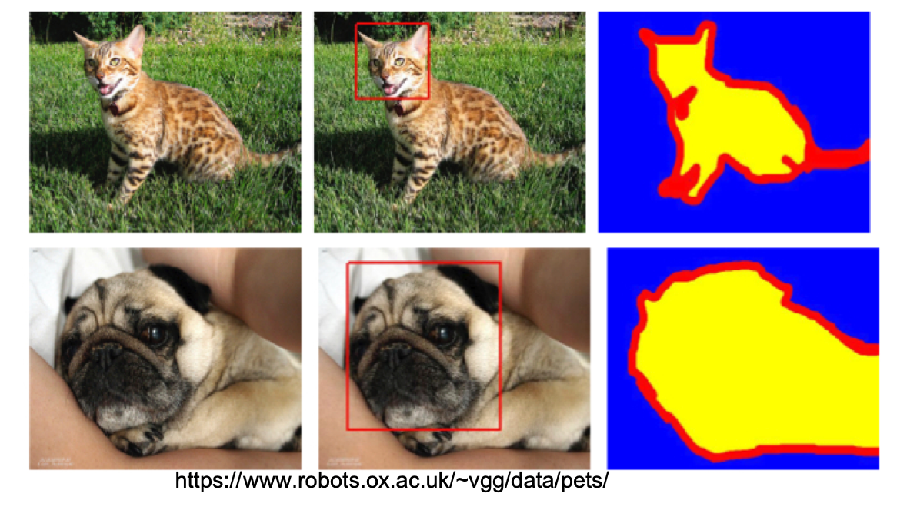

Based on [Oxford Pet dataset][oxford-petset], standard semantic segmentation example by [tensorflow][segmentation]
 is extended to demonstrate how end to end reproducible machine learning can be realized [e2e-ml-on-k8s].

>
*Oxford pet dataset*

This project was referenced in [KubeCon US 2019] talk, video available [here][kubecon_us_talk]

[e2e-ml-on-k8s]: https://github.com/suneeta-mall/e2e-ml-on-k8s 
[oxford-petset]: https://www.robots.ox.ac.uk/~vgg/data/pets/
[segmentation]: https://www.tensorflow.org/tutorials../../resources/segmentation
[KubeCon US 2019]: /talks/KubeCon_US_2019.html
[kubecon_us_talk]: https://www.youtube.com/watch?v=ZEGdSLWdrH0
