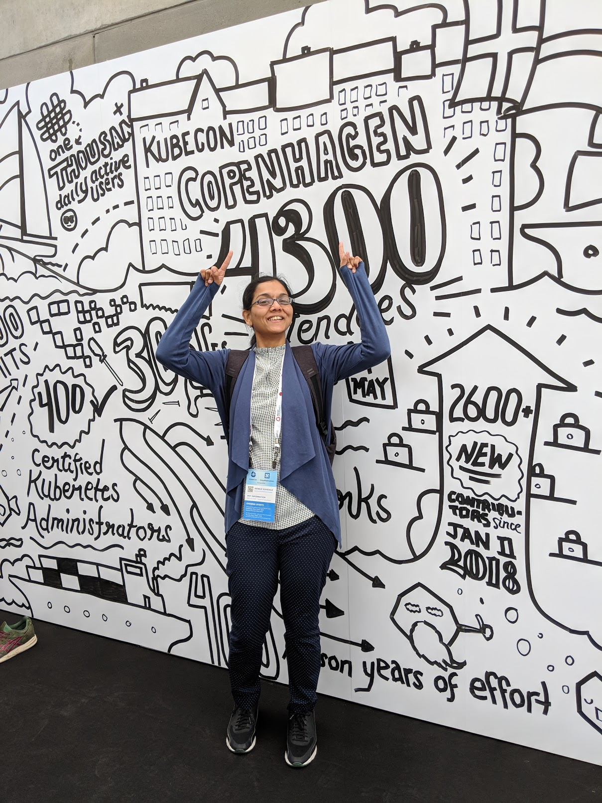

At Nearmap, we have been working on an open source CI/CD solution for Kubernetes based workload called [KCD for Kubernetes Continous Delivery][kcd] (Formally known as [CVManager (Container Version Manager)][cvmanager]). We had oppertunity to present this solution at [KubeCon EU Copenhagen, Denmark 2018][kubecon_eu_2018]. For more details of this talk see [link][kubecon_eu_kcd] and associated blog with detailed info can be found [here][nearmap_blog_kcd].

## Slides and video

Slides can be found [here][slides] and [video]: 

[#suneetamall]: https://twitter.com/search?q=suneetamall
[kcd]: https://github.com/nearmap/kcd
[cvmanager]: https://github.com/nearmap/cvmanager
[kubecon_eu_2018]: https://events.linuxfoundation.org/events/kubecon-cloudnativecon-europe-2018/
[kubecon_eu_kcd]: https://kccnceu18.sched.com/event/DquY/continuous-delivery-meets-custom-kubernetes-controller-a-declarative-configuration-approach-to-cicd-suneeta-mall-simon-cochrane-nearmap-intermediate-skill-level-slides-attached
[nearmap_blog_kcd]: https://nearmap.io/2018/04/cvmanager-intro/
[video]: https://www.youtube.com/watch?v=kBS_Wd41R8k&feature=youtu.be
[slides]: https://static.sched.com/hosted_files/kccnceu18/f2/Continuous%20Delivery%20Meets%20Custom%20Kubernetes%20Controller-%20A%20Declarative%20Configuration%20Approach%20to%20CICD.pdf