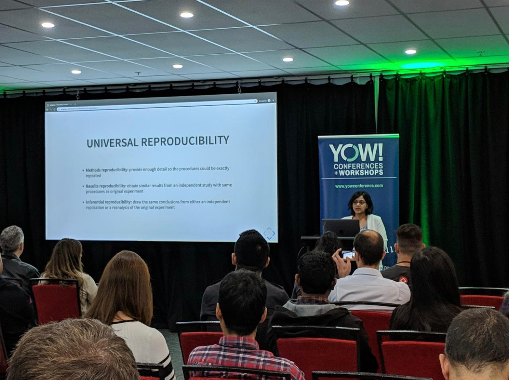

Reproducibility crisis is real in data-science. This crisis has been recognized in data-science research and several efforts e.g. [International Conference on Learning Representations][iclr_repro_challenge] has been underway in improving reproducibility in data science research. Dr. Joelle Pineau, an Associate Professor at McGill University and lead for Facebook’s Artificial Intelligence Research lab (FAIR) in [her talk][jp_utube] covered the importance of reproducibility.

Industry adoptation of data-science in last 5 years have been phenomenon. As per [KDnuggets][kdnuggets_2017], Machine Learning/data-science surpassed big data frenzy in 2017! According to a [recent survey in UK][mmcv_2016] (year 2016), *84%* of startups primarily focussed on data-science. Whats more interesting is that more than *half* of these companies preferred to build, train and use their own models as oppose to sourcing it from elsewhere. According to [Evolving Data Infrastructure - Ben Lorica and Paco Nathan (O’Reilly, Oct 2018)][OReilly_2018], 58% of industries were *seriously* building data science based solutions, with only *14%* indicating no involvement data or data-science just yet.

*The 3-R's of Data-Science - Repeatability, Reproducibility, and Replicability* is [YOW Data 2019 (Sydney)][yow_suneetamall] talk presented in May 2019. In this talk, I covered the 3-R's *Repeatability, Reproducibility, and Replicability* and tools and techniques avaialable to practice reproducible data-science. Slides can be accessed on this [link][yow_2019_slides].

So here I am at YOW Data 2019 (Sydney)!

## Slides and video

Slides can be found [here][slides] and [video]: 

[iclr_repro_challenge]: https://reproducibility-challenge.github.io/iclr_2019/
[jp_utube]: https://www.youtube.com/watch?v=Vh4H0gOwdIg
[yow_suneetamall]: https://data.yowconference.com.au/archive-2019/profile/?id=suneetamallhotmailcom

[kdnuggets_2017]: https://www.kdnuggets.com/2017/05/Machine Learning-overtaking-big-data.html
[mmcv_2016]://medium.com/mmc-writes/artificial-intelligence-in-the-uk-landscape-and-learnings-from-226-startups-70b9551f3e4c
[OReilly_2018]: https://www.oreilly.com/data/free/evolving-data-infrastructure.csp
[yow_2019_slides]: https://suneeta-mall.github.io/slides/3Rs.html#/intro

[slides]: https://suneeta-mall.github.io/slides/3Rs.html#/intro
[video]: https://www.youtube.com/watch?v=ro_iYkv9dUQ

